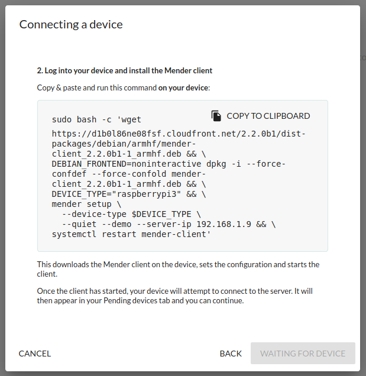
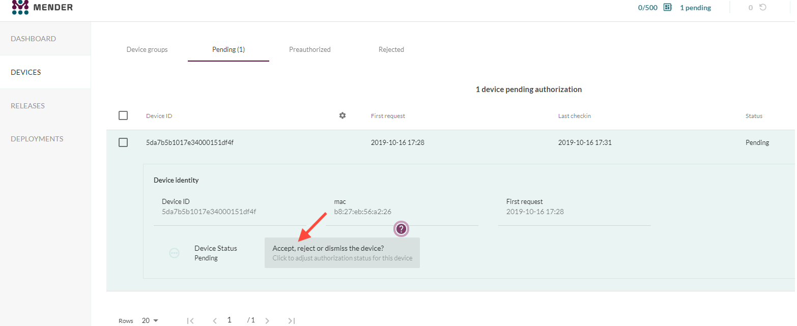
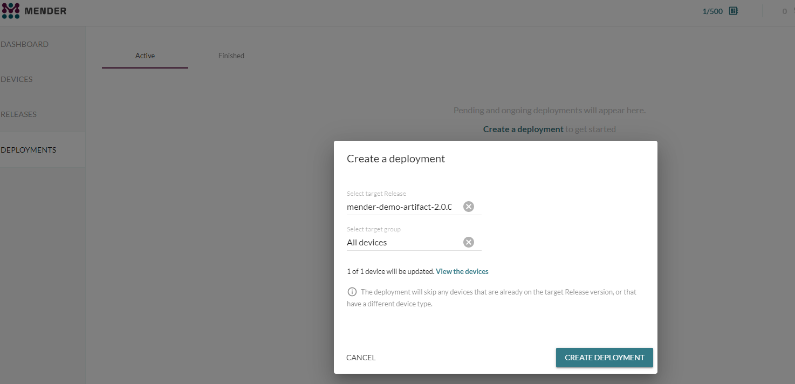
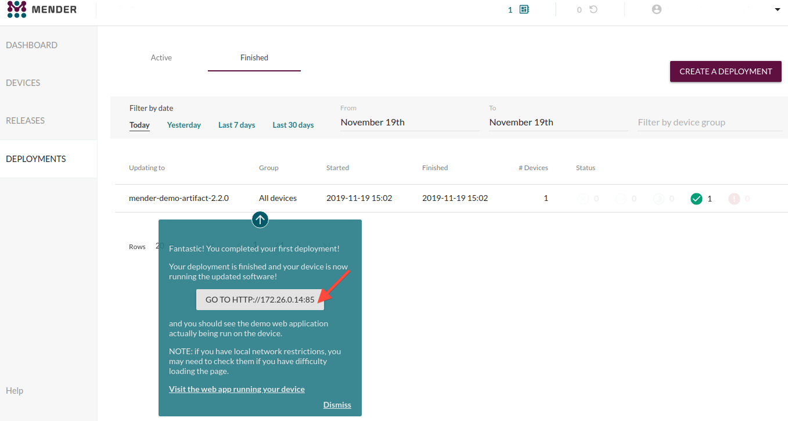

Quickly and easily deploy your first over-the-air (OTA) software update with
Mender using the hosted [Mender Services](https://mender.io/products/pricing).
This guide shows you how to install Mender on your Raspberry Pi device, and how
to deploy an [*application update*](../deploy-an-application-update) on your
Raspberry Pi running Raspbian OS.

The possibility to test Mender out in a self-hosted environment is also
[available](#Running Mender on-premise ). If Raspbian or Debian is not your cup
of tea, note that Mender also supports [Yocto](https://www.yoctoproject.org/).


## Prerequisites

In order to follow along with this guide, the following tools are needed:

* A [Raspberry Pi 3 Model B](https://www.raspberrypi.org/products/raspberry-pi-3-model-b?target=_blank) or [B+](https://www.raspberrypi.org/products/raspberry-pi-3-model-b-plus?target=_blank).
* An 8 GB or larger microSD card.
* A Raspberry Pi [universal power supply](https://www.raspberrypi.org/products/raspberry-pi-universal-power-supply?target=_blank) or a micro USB cable.
* Internet connectivity for your Raspberry Pi (either Ethernet or wifi available)
* A Mender Professional account to access the [hosted server](https://hosted.mender.io).


### Get a Mender Professional account

Get a Mender account by [signing up here](https://mender.io/signup?target=_blank).

!!! We provide $120 free credit for you to use for evaluation. You can cancel at
!!! any time without incurring a cost while your usage remains below $120.

You can also try it on-premise, but it requires more effort getting set up. See
the [on-premise instructions below](#running-mender-on-premise).


### Prepare your Raspberry Pi 3

First the device has to be flashed with an image that has Mender enabled. The
only difference from the official Raspbian image is that it has been converted
to support robust A/B system updates and the Mender client has been installed.
Note that the image will only work on *Raspberry Pi 3*. For now...

!!! If you have a different board than the Raspberry Pi 3 you can still follow
!!! the Mender product onboarding tooltips and deploy a demo application to your
!!! device. But you will not be able to do system updates without Mender integration
!!! later on.

* Download the Raspbian OS image with Mender integrated from the [Mender downloads section](../../downloads).
* [Follow the steps](https://www.raspberrypi.org/documentation/installation/installing-images?target=_blank) to flash the OS image to your device.
* [Enable SSH](https://www.raspberrypi.org/documentation/remote-access/ssh/README.md?target=_blank) on your device.

Your first application deployment is then done in five steps:


### Step 1 - SSH into your Raspberry Pi device 

SSH into your device:

```bash
ssh pi@<DEVICE-IP-ADDRESS>
```

The default password for the pi account is `raspberry`.

You should now see a command prompt similar to the following:

```bash
pi@raspberrypi:~ $
```

Keep this terminal open as we will shortly use it to install the Mender client.


### Step 2 - Login to Mender Professional

Log in to the [Mender Professional
account](https://hosted.mender.io/ui/#/login?target=_blank) that was created
previously, then enter the main page and follow the tutorial for new users in
the Mender web GUI.

Go to the **Dashboard** tab and click **Connect a device**. Then Click **Connect
my own device**. Select your Raspberry Pi model and click **Next**. Then you
should see a screen similar to the one below. Remember to keep this open as we
will use it in the next step.




### Step 3 - Install the Mender client on your device

Next we will install the Mender client on your device and connect it to the
Mender server.

In the dialog box from step 2, click **Copy to clipboard** to copy the code to
install the Mender client. Next go to the command line on your device from step
1, and **paste** the code e.g. by right-clicking in the terminal and select
*Paste*, followed by *Enter*.

This downloads the Mender client on the device, configures and starts it.

Once the client has started, the Mender client will attempt to connect to the
server and it will appear in your Pending devices tab in the server. Go ahead
and **Accept** the pending device in the server. After accepting the device, the
device appears in the Device groups as shown below.




### Step 4 - Create a Deployment 

There is already a mender-demo Artifact available under *Releases* the first
time you use Mender. It contains a small web server your device can run.

Go to the **Deployments** tab and select the target release already available
and click **Create deployment** as shown below.



After about 30 seconds you see your finished deployment in the *Finished* tab.
There should also be a tooltip to the URL of your deployed web server.



Once you access your device using the URL shown in the tooltip under the
*Finished* tab you should see a welcome page similar to the following.


**Congratulations!** You have now successfully deployed your first application
update using Mender!


### Step 5 - Modify the application

The onboarding tooltips should now take you through modifying the web page you
saw in step 4. Simply follow the tooltips to update your newly deployed
application!


### Deploy system level updates

So far, we deployed an application update. However, Mender also supports robust
system level updates with rollback that you might want to test out. If you used
the Raspberry Pi 3 image with Mender integrated, it already supports system
level updates as well!

The easiest way to create system level updates is to use the *snapshot*
functionality in Mender; follow the documentation on [Artifact from system
snapshot](../../artifacts/snapshots).


## Running Mender on-premise

For the easiest and fastest experience for your evaluation, we recommend [Hosted
Mender](https://hosted.mender.io). You can also try the same deployment above
using the on-premise version by installing a Mender demo server on a host
machine, however this will take a bit more time. The required tooling is then
[Docker
Engine](https://docs.docker.com/install/linux/docker-ce/ubuntu?target=_blank)
(on the device) and [Docker
Compose](https://docs.docker.com/compose/install?target=_blank) in your
deployment environment.

Next, you will need to download the Mender integration environment in the
working directory:

<!--AUTOVERSION: "-b % https://github.com/mendersoftware/integration.git"/integration-->
```
git clone -b 2.2.0 https://github.com/mendersoftware/integration.git integration

cd integration
```

And finally fire up the demo server environment with:

```
./demo up
```

Note that the demo up script starts the Mender services, adds a demo user with
the username mender-demo@example.com, and assigns a random password in which you
can change after you log in to the Mender web UI. The Mender UI can be found on
[https://localhost](https://localhost?target=_blank).

After you log into the UI on the localhost you can follow steps 1 through 5
listed above.

## Have any questions? 

If you need help and have any questions:

* Visit our community forum at [Mender Hub](https://hub.mender.io/) dedicated to
  OTA updates where you can discuss any issues you may be having. Share and
  learn from other Mender users.

* Learn more about Mender by reading the rest of the documentation.

[Compare plans](https://mender.io/products/pricing?target=_blank) and choose a
plan that fits your requirements.
