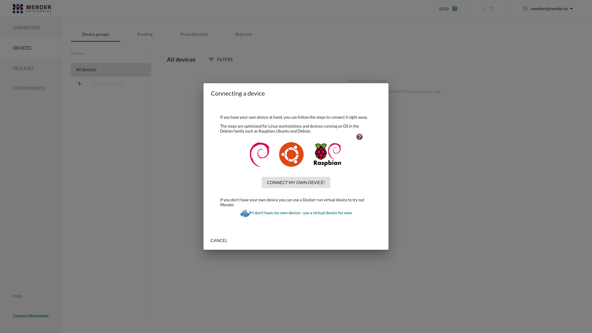

!!! If you do not have have a Raspberry Pi, please go to
!!! [Prepare a virtual device](../02.Prepare-a-virtual-device/docs.md).

In this guide we will prepare a Raspberry Pi with a custom Raspbian OS image.
The only difference from the official Raspbian image is that it has been
converted to support robust system updates with Mender.

## Prerequisites

To follow this guide, you will need the following:

* One of these Raspberry Pi models:
  * [Raspberry Pi 3 Model B](https://www.raspberrypi.org/products/raspberry-pi-3-model-b/?target=_blank)
  * [Raspberry Pi 3 Model B+](https://www.raspberrypi.org/products/raspberry-pi-3-model-b-plus/?target=_blank).
  * [Raspberry Pi 4 Model B](https://www.raspberrypi.org/products/raspberry-pi-4-model-b/?target=_blank).
* An 8 GB or larger microSD card.
* A Raspberry Pi [universal power supply](https://www.raspberrypi.org/products/raspberry-pi-universal-power-supply?target=_blank) or a micro USB cable.
* Internet connectivity for your Raspberry Pi (either Ethernet or WiFi available)

## Step 1 - Flash the Raspberry Pi

Download the Raspbian OS image with Mender integrated:
  * Download link: [Raspberry Pi 3 Model B and B+][raspbian-buster-lite-raspberrypi3-mender.img.xz]
  * Download link: [Raspberry Pi 4 Model B][raspbian-buster-lite-raspberrypi4-mender.img.xz]

<!--AUTOVERSION: "mender-%.img.xz"/mender-convert-client -->
[raspbian-buster-lite-raspberrypi3-mender.img.xz]: https://d4o6e0uccgv40.cloudfront.net/2020-02-05-raspbian-buster-lite/arm/2020-02-05-raspbian-buster-lite-raspberrypi3-mender-master.img.xz
[raspbian-buster-lite-raspberrypi4-mender.img.xz]: https://d4o6e0uccgv40.cloudfront.net/2020-02-05-raspbian-buster-lite/arm/2020-02-05-raspbian-buster-lite-raspberrypi4-mender-master.img.xz

Follow the steps outlined in the [Raspbian documentation](https://www.raspberrypi.org/documentation/installation/installing-images?target=_blank)
to flash the OS image to the device.

It is recommended to use the Raspberry Pi Imager tool, choose "Use custom" and
browse to the downloaded Mender Raspbian image.


## Step 2 - SSH into the Raspberry Pi

Boot the Raspberry Pi with the newly flashed SD card and
[Enable local SSH access](https://www.raspberrypi.org/documentation/remote-access/ssh/README.md?target=_blank).

If you do not know the IP address of your Raspberry Pi device, there are some
great resources in the
[Raspbian documentation](https://www.raspberrypi.org/documentation/remote-access/ip-address.md)
on different ways of looking this up.

SSH into your device:

```bash
ssh pi@<DEVICE-IP-ADDRESS>
```

The default password for the pi account is `raspberry`.

You should now see a command prompt similar to the following:

```bash
pi@raspberrypi:~ $
```

Keep this terminal open as we will shortly use it to install the Mender client.

## Step 3 - Login to hosted Mender

Login to [hosted Mender](https://hosted.mender.io?target=_blank). On the main
page for the first time new users will get a tutorial in the Mender web GUI.

Go to the **Dashboard** tab and click on **Connect a device**.


## Step 4 - Connect a device

Select **CONNECT MY OWN DEVICE!**.



## Step 5 - Choose device type

You need to specify one of the following:

- Raspberry Pi 3
- Raspberry Pi 4


## Step 6 - Install the Mender client on the device

Next we will install the Mender client on the device and connect it to the Mender
server.


In the dialog box from above, click **Copy to clipboard** to copy the code to
install the Mender client. Now go to the command line on your device, and
**paste** the code e.g. by right-clicking in the terminal and selecting *Paste*,
followed by *Enter*.

This downloads the Mender client on the device, configures and starts it.

## Step 7 - Accept the device

Once the client has started, the Mender client will attempt to connect to the
server and it will appear in your Pending devices tab in the server. Go ahead
and **Accept** the pending device in the server. After accepting the device, it
will appear on the Device groups tab on the left of Pending.


## Next step

Proceed to [Deploy an application update](../../02.Deploy-an-application-update/docs.md).
