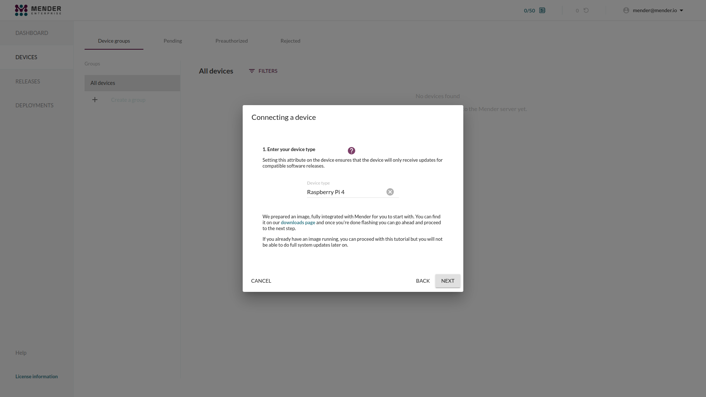

!!! If you do not have have a Raspberry Pi, please go to
!!! [Prepare a virtual device](../02.Prepare-a-virtual-device/docs.md).

In this tutorial we will prepare a Raspberry Pi with a custom Raspberry Pi OS
(previously called Raspbian) image. The only difference from the official
Raspberry Pi OS image is that it has been converted to support robust system
updates with Mender.

Completing this tutorial normally **takes less than one hour**.

## Prerequisites

To follow this tutorial, you will need the following:

* One of these Raspberry Pi models:
  * [Raspberry Pi 4 Model B](https://www.raspberrypi.com/products/raspberry-pi-4-model-b/?target=_blank).
  * [Raspberry Pi 5](https://www.raspberrypi.com/products/raspberry-pi-5/).
* An 8 GB or larger microSD card.
* A Raspberry Pi [universal power supply](https://www.raspberrypi.com/products/raspberry-pi-universal-power-supply/?target=_blank) or a compatible USB cable.
* Internet connectivity for your Raspberry Pi (either Ethernet or WiFi available)

## Step 1 - Flash the Raspberry Pi

### Option #1: Configure your Raspberry Pi in headless mode

You can take advantage of the headless configuration options of Raspberry Pi to
enable SSH or to configure the wireless network. This saves you the hassle
of connecting a monitor and keyboard after your device has booted, as it will come
up with WiFi and SSH already working and you can just SSH into it from your workstation.

#### Using `rpi-imager` (recommended)

You can use our custom content repository to download, configure and flash the image to your Raspberry Pi.

To get started, navigate to Raspberry Pi's website and download [rpi-imager](https://www.raspberrypi.com/software/).
Once `rpi-imager` is installed, specify a custom repository by navigating to `ADD OPTIONS` -> `Content Repository` -> `Use custom URL` and
add `https://docs.mender.io/releases/rpi_imager_schema.json`.

!!! You can also specify the repository when launching `rpi-imager` through the terminal with:
!!! ```bash
!!! sudo rpi-imager --repo https://docs.mender.io/releases/rpi_imager_schema.json
!!!```
Once that is done, select your Raspberry Pi version and choose the corresponding Mender image.


You can now configure and flash the image following the steps in the [Raspberry Pi OS documentation](https://www.raspberrypi.com/documentation/computers/getting-started.html#raspberry-pi-imager).
Make sure to configure your username, password, WiFi credentials, and enable SSH access during the setup.

#### Using command line

If you need to configure your device using the command line only, follow these steps.

Download the Raspberry Pi OS image ready for Mender:
  * Download link: [Raspberry Pi 4 Model B][raspios-lite-raspberrypi4_trixie_64bit-mender-convert.img.xz]
  * Download link: [Raspberry Pi 5][raspios-lite-raspberrypi5_trixie_64bit-mender-convert.img.xz]

<!--AUTOVERSION: "mender-convert-%.img.xz"/mender-convert -->
[raspios-lite-raspberrypi4_trixie_64bit-mender-convert.img.xz]: https://d4o6e0uccgv40.cloudfront.net/2025-10-01-raspios-lite/arm/2025-10-01-raspios-lite-raspberrypi4_trixie_64bit-mender-convert-5.1.0.img.xz
[raspios-lite-raspberrypi5_trixie_64bit-mender-convert.img.xz]: https://d4o6e0uccgv40.cloudfront.net/2025-10-01-raspios-lite/arm/2025-10-01-raspios-lite-raspberrypi5_trixie_64bit-mender-convert-5.1.0.img.xz

Flash the image without doing any configuration.

Then, insert the SD card you flashed above and find the `boot` partition inside it.
Open a terminal on your workstation and verify that it can be accessed in the
default location:

[ui-tabs position="top-left" active="0" theme="lite" ]
[ui-tab title="Linux"]
```bash
RPI_BOOT="$(awk '/media.*boot(fs)?/ { print $2; }' /proc/mounts)"
[ ! -d "$RPI_BOOT" ] && echo "ERROR: RPI boot directory not found"
```
[/ui-tab]
[ui-tab title="Mac OS"]
```bash
RPI_BOOT="$(find /Volumes/ -maxdepth 1 -name boot -or -name bootfs)"
[ ! -d "$RPI_BOOT" ] && echo "ERROR: RPI boot directory not found"
```
[/ui-tab]
[/ui-tabs]

If this outputs nothing you can continue. If you get the ERROR, find out where
the SD card's boot partition is accessible and change the `RPI_BOOT` variable accordingly.

With the path to the boot directory set up, we first configure the default user and password:

```bash
USERNAME='' # CHANGE: your desired username
PASSWORD="$(openssl passwd)"

cat << EOF > "$RPI_BOOT"/userconf.txt
${USERNAME}:${PASSWORD}
EOF
```

In latest RPi versions wifi network configuration has been changed from
plain `wpa_supplicant.conf` file in favor of using `rpi-imager` tool
and this is the easiest way to configure wifi.

It is strongly advised to use `rpi-imager` if possible as this is the
configurator suggested by the official RPi documentation.

Partial network configuration still can be performed from the command line
in the headless mode but it is not guaranted to always work (may
depend on country code settings).

Bellow script is extracted from the `rpi-imager` backend and mimics this
tool behavior from the command line.

```bash
RPI_ROOT="$(awk '/media.*root(fs)?/ { print $2; }' /proc/mounts)"
[ ! -d "$RPI_ROOT" ] && echo "ERROR: RPI root partition not found"

WIFI_SSID='' # CHANGE: your WiFi name
WIFI_PASS='' # CHANGE: your WiFi password

UUID=$(uuid -v4)

# Based on https://github.com/RPi-Distro/raspberrypi-sys-mods/blob/bookworm/usr/lib/raspberrypi-sys-mods/imager_custom

CONNFILE="$RPI_ROOT"/etc/NetworkManager/system-connections/preconfigured.nmconnection

cat <<- EOF >${CONNFILE}
      [connection]
      id=preconfigured
      uuid=${UUID}
      type=wifi
      [wifi]
      mode=infrastructure
      ssid=${WIFI_SSID}
      hidden=false
      [ipv4]
      method=auto
      [ipv6]
      addr-gen-mode=default
      method=auto
      [proxy]
EOF

if [ ! -z "${WIFI_PASS}" ]; then
  cat <<- EOF >>${CONNFILE}
      [wifi-security]
      key-mgmt=wpa-psk
      psk=${WIFI_PASS}
EOF
fi
```

NetworkManager will ignore nmconnection files with incorrect permissions,
to prevent Wi-Fi credentials accidentally being world-readable. It need to be
changed manually.

```bash
RPI_ROOT="$(awk '/media.*root(fs)?/ { print $2; }' /proc/mounts)"
[ ! -d "$RPI_ROOT" ] && echo "ERROR: RPI root partition not found"

CONNFILE="$RPI_ROOT"/etc/NetworkManager/system-connections/preconfigured.nmconnection

chmod 600 ${CONNFILE}
```

Finally, enable SSH by creating an empty file:

```bash
touch "$RPI_BOOT"/ssh
```

Last but not least, **unmount the boot partition** to make all the changes are synced to it safely:

```bash
umount "$RPI_BOOT"
```

Now disconnect the SD card, insert it into your Raspberry Pi and boot it.

If you have a different network setup or encounter any issues, please see [the official Raspberry Pi documentation on headless setups](https://www.raspberrypi.com/documentation/computers/configuration.html?target=_blank#setting-up-a-headless-raspberry-pi).


### Option #2: Configure your Raspberry Pi with a keyboard and monitor attached

If you did headless (*Option #1* above) skip to *Step 2* below.

Boot the Raspberry Pi with the newly flashed SD card. Attach a keyboard and
monitor.

Follow the start-up wizard to:
* Select keyboard layout
* Set up your user and password.

Then, log in with your new user and password and do the following steps to set up WiFi:

* Run `sudo raspi-config`
* Select `Localisation Options`, then `WLAN Country`. Select the correct country code.
* Select `System Options`, then `Wireless LAN`. Set the SSID and passphrase for the network
* Choose `Finish`

Check that your Raspberry Pi is connected to the Internet (e.g. `ping www.google.com`).
If this does not work, please see the official [Raspberry Pi documentation on network configuration](https://www.raspberrypi.com/documentation/computers/configuration.html?target=_blank#using-the-command-line).


Now do the following steps to set up SSH:
* Run `sudo raspi-config`
* Navigate to `Interface Options` and Select `SSH`
* Choose `Yes`, `OK` and `Finish`

If you encounter any issues, see [Enable local SSH
access](https://www.raspberrypi.com/documentation/computers/remote-access.html?target=_blank#enabling-the-server)
in the official Raspberry Pi documentation for more information.


## Step 2 - SSH into the Raspberry Pi

Your Raspberry Pi should now be booted, connected to the network and have the SSH daemon running,
regardless if you followed the headless approach (*Option 1*) or connected a keyboard and
monitor directly (*Option 2*).

If you do not know the IP address of your Raspberry Pi device, there are some
great resources in the
[Raspberry Pi OS documentation](https://www.raspberrypi.com/documentation/computers/remote-access.html?target=_blank)
on different ways of looking this up.

SSH into your device:

```bash
ssh <your-login>@<DEVICE-IP-ADDRESS>
```

You should now see a command prompt similar to the following:

```bash
<your-login>@raspberrypi:~ $
```

Keep this terminal open as we will shortly use it to install the Mender Client.

## Step 3 - Login to hosted Mender

!!! Hosted Mender is available in multiple [regions](/13.General/00.Hosted-Mender-regions/docs.md) to connect to. Make sure you select your desired one before proceeding.

Login to [hosted Mender](https://hosted.mender.io?target=_blank). On the main
page for the first time new users will get a tutorial in the Mender web GUI.

Go to the **Dashboard** tab and click on **Connect a device**.


## Step 4 - Connect a device

Select the **GET STARTED** button from the *Raspberry Pi quick start* box.


## Step 5 - Choose device type

You need to specify one of the following:

- Raspberry Pi 4
- Raspberry Pi 5



## Step 6 - Install the Mender Client on the device

Next we will install the Mender Client on the device and connect it to the Mender
server.


In the dialog box from above, click **Copy to clipboard** to copy the code to
install the Mender Client. Now go to the command line on your device, and
**paste** the code e.g. by right-clicking in the terminal and selecting *Paste*,
followed by *Enter*.

This downloads the Mender Client on the device, configures and starts it.

## Step 7 - Accept the device

Once the client has started, the Mender Client will attempt to connect to the
server and it will appear in your Pending devices tab in the server. Go ahead
and **Accept** the pending device in the server. After accepting the device, it
will appear on the Device groups tab on the left of Pending.


## Next step

Proceed to [Deploy an application update](../../02.Deploy-an-application-update/docs.md).
