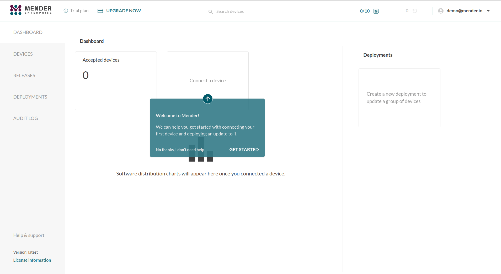
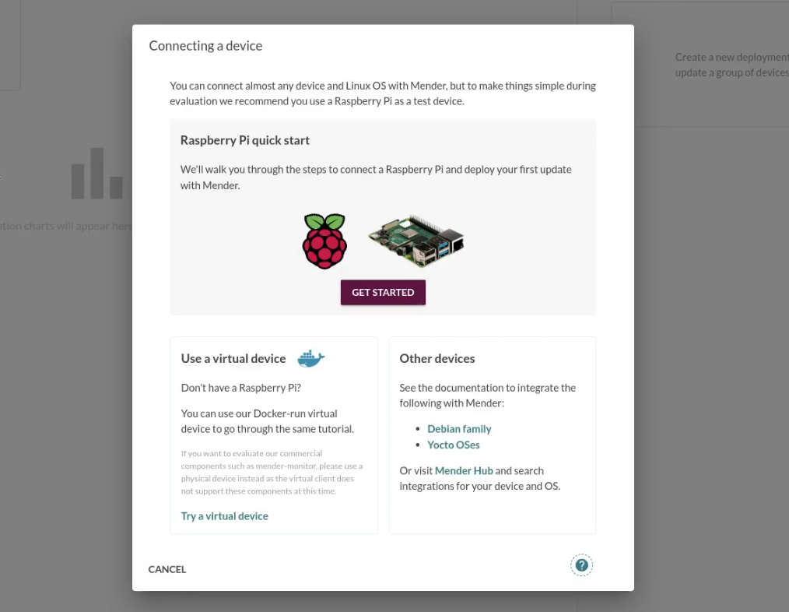
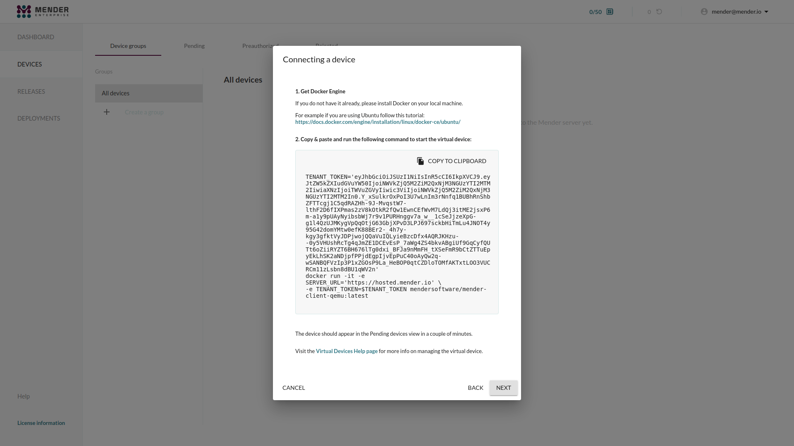

!!! Skip this section if you have already completed [Prepare a Raspberry Pi device](../01.Prepare-a-Raspberry-Pi-device/docs.md)

This tutorial we help you prepare your workstation to be able to run a virtual
device (QEMU) with Mender integrated which will connect to hosted Mender and
simulate a physical device.

## Prerequisites

To follow this tutorial, install
[Docker Engine](https://docs.docker.com/engine/install?target=_blank) on your
workstation.

## Step 1 - Login to hosted Mender

!!! Hosted Mender is available in multiple [regions](/11.General/00.Hosted-Mender-regions/docs.md) to connect to. Make sure you select your desired one before proceeding.

Login to [hosted Mender](https://hosted.mender.io?target=_blank). On the main
page for the first time new users will get a tutorial in the Mender web GUI.

Go to the **Dashboard** tab and click on **Connect a device**.



## Step 2 - Connect a device

Select **Prepare a virtual device for now**.



## Step 3 - Start the virtual device

Next we start the virtual device on your workstation.



In the dialog box from above, click **Copy to clipboard** to copy the code. Now
go to the command line on your workstation, and **paste** the code e.g. by
right-clicking in the terminal and selecting *Paste*, followed by *Enter*.

This downloads the virtual device images and starts it. 

! This process could take several minutes depending on your workstation capabilities.

## Step 4 - Accept the device

Once the client has started, the Mender client will attempt to connect to the
server and it will appear in your Pending devices tab in the server. Go ahead
and **Accept** the pending device in the server. After accepting the device, it
will appear on the Device groups tab on the left of Pending.


## Step 5 - Get the IP address of the virtual device

You will need the the IP address of the virtual device in later stages of the
documentation.

You should execute below commands in a terminal window on your workstation while
the virtual device is running.

List running containers:

```bash
docker ps
```

Example output:

>```bash
>$ docker ps
>CONTAINER ID        IMAGE                                      COMMAND             CREATED             STATUS              PORTS               NAMES
>d335f50101cb        mendersoftware/mender-client-qemu:latest   "./entrypoint.sh"   6 minutes ago       Up 6 minutes        8822/tcp            relaxed_leakey
>```

Save the `CONTAINER ID` in a shell variable:

```bash
CONTAINER_ID="d335f50101cb"
```

!!! Replace above value with actual value that you get.

Find the IP address of the virtual device (we will save it in a shell variable):

```bash
IP_ADDRESS=$(docker inspect -f '{{range .NetworkSettings.Networks}}{{.IPAddress}}{{end}}' "${CONTAINER_ID}")
```

Example output:

>```bash
>$ echo "${IP_ADDRESS}"
>172.17.0.3
>```

## Next step

Proceed to [Deploy an application update](../../02.Deploy-an-application-update/docs.md).
