To deploy an application update you should follow the UI tooltips presented on
hosted Mender.

This tutorial is only here as a reference if you need additional guidance or
would like to get an overview of the steps necessary to deploy an application
update.

## Prerequisites

You should have completed one of the following:

* [Prepare a Raspberry Pi device](../01.Preparation/01.Prepare-a-Raspberry-Pi-device/docs.md)
* [Prepare a virtual device](../01.Preparation/02.Prepare-a-virtual-device/docs.md)

## Step 1 - Create a Deployment

There is already a demo Artifact available under *Releases* the first time you
use hosted Mender. It contains a small web server you can run on your device.
Go to the **Releases** tab and select the target release already available.

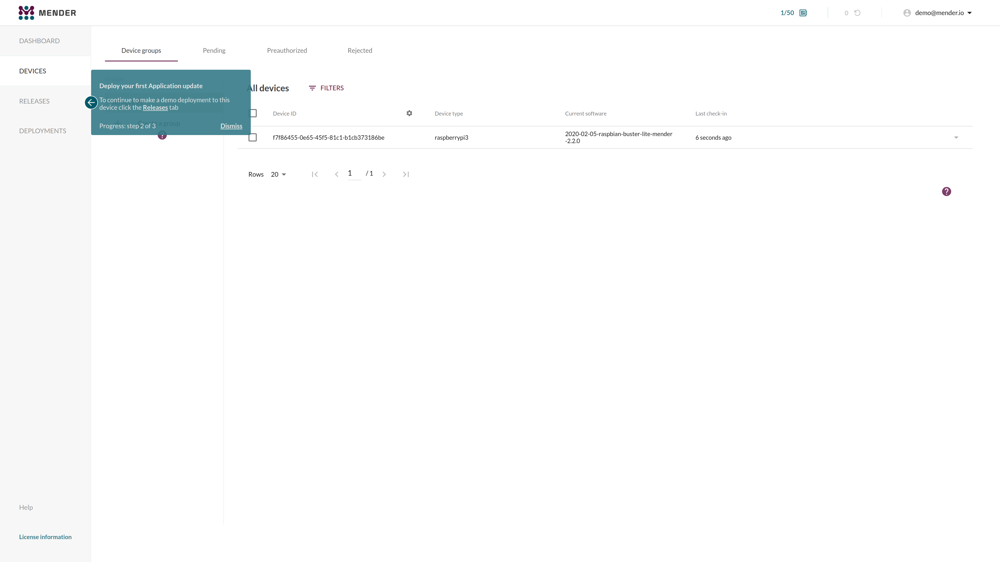

Click **CREATE DEPLOYMENT WITH THIS RELEASE** as shown below.

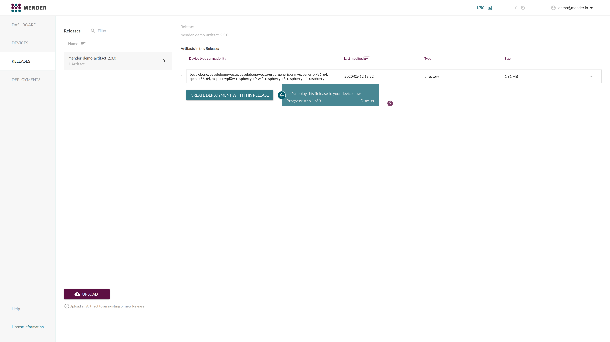

This will start the deployment wizard. The first step is to **Select target
software and devices**. As we have not yet created any specific groups the only
option presented should be **All devices**.

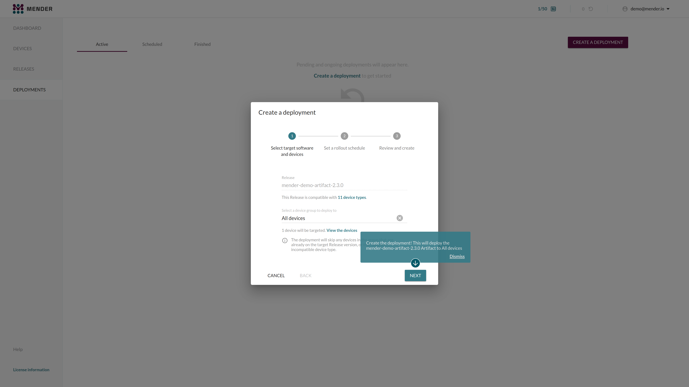

Next step is to **Select a rollout schedule**. You can use the defaults and
click the **NEXT** button.

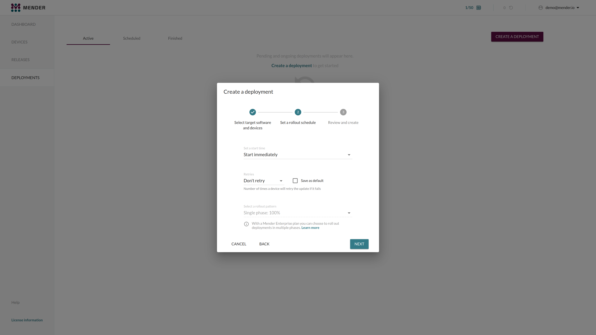

After approximately 30 seconds you will see your finished deployment in the
**Finished** tab. There should also be a tooltip to the URL of your deployed web
server.

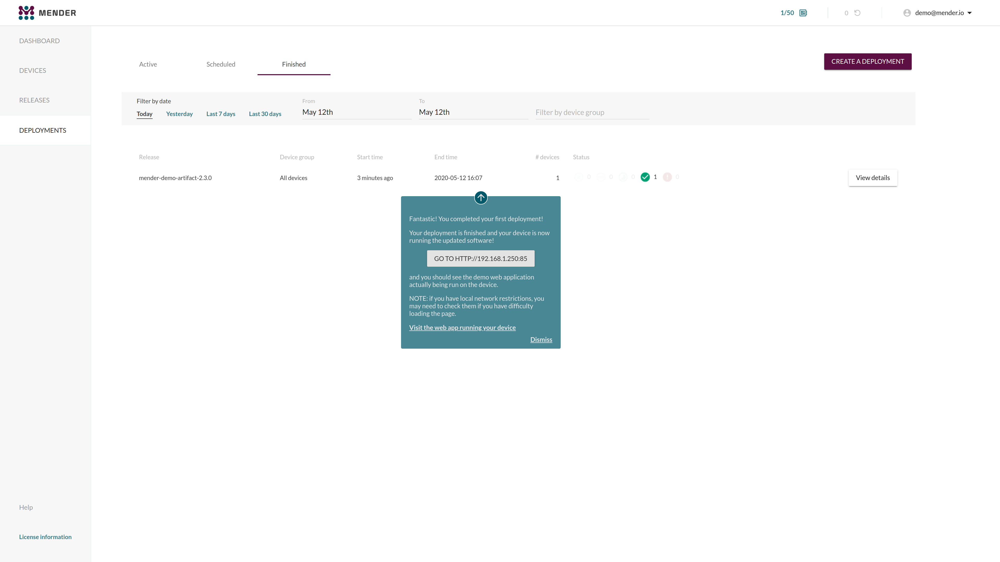

You will see a welcome page similar to the following, if you visit the presented
URL.

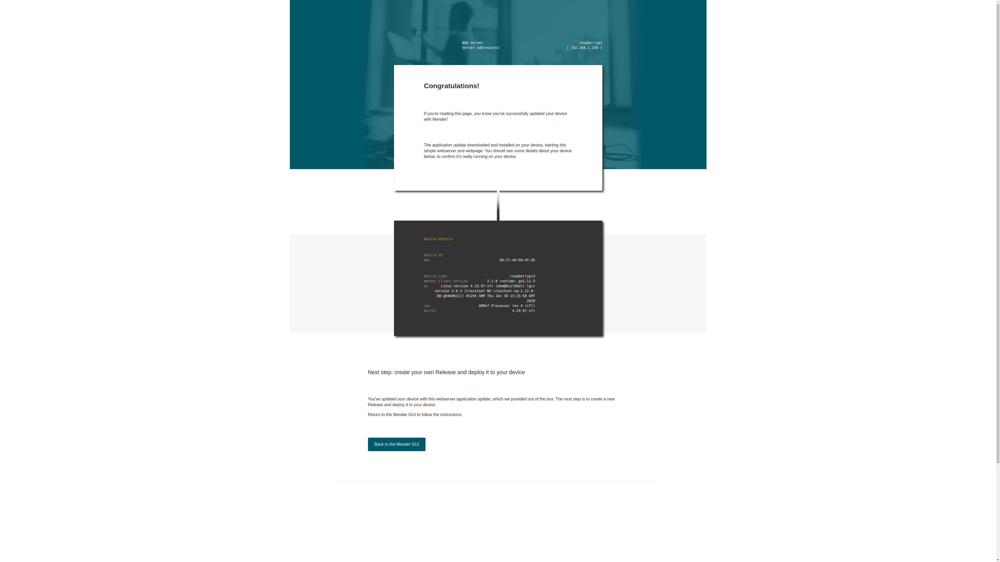

**Congratulations!** You have successfully deployed an application update
using Mender!

## Step 2 - Modify the application

The UI tooltips should now take you through modifying the web page you saw in
[Step 1 - Create a Deployment](#step-1-create-a-deployment). Follow the
instructions showed on the pop-up and click the **NEXT** button when done.

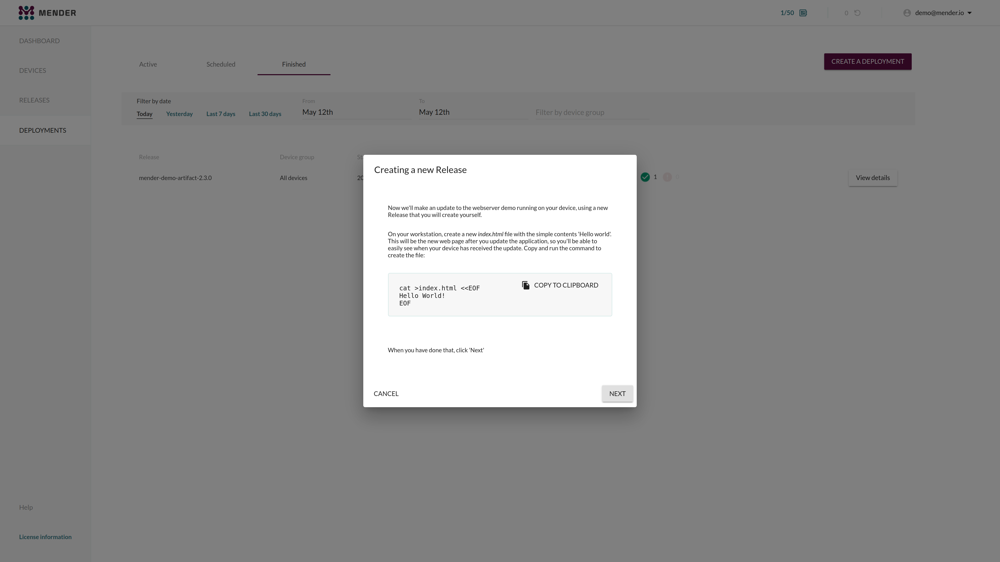

Click the **UPLOAD** button to upload the file that you created in the previous
step.

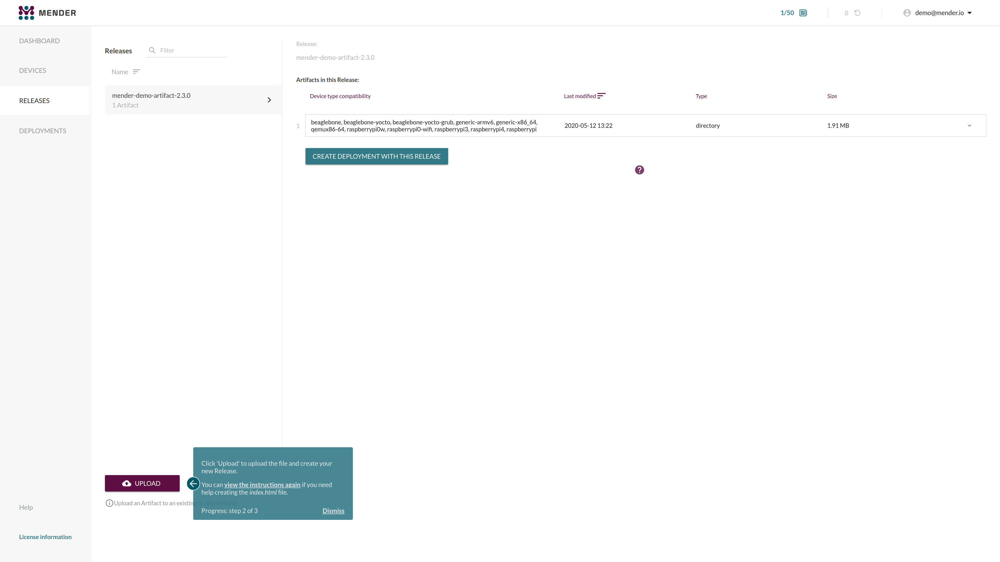

Drag-and-drop or click **browse** to select the file for upload.

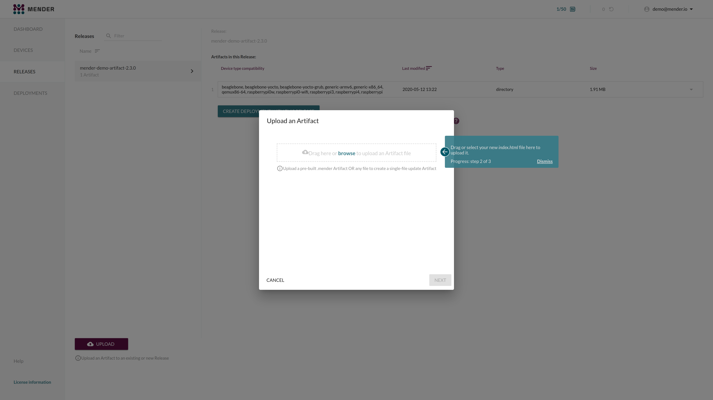

When you upload a single file to the Mender server, you will get a wizard to
create a [Mender Artifact](../../02.Overview/02.Artifact/docs.md)
of the type `file`, which allows you deploy single files to your device. You can
use the default values pre-filled by the Mender UI and click **NEXT**.

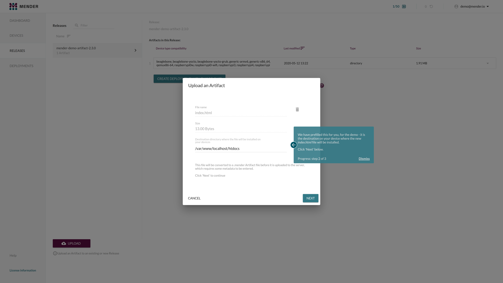

A [Mender Artifact](../../02.Overview/02.Artifact/docs.md) contains
two mandatory fields:

- **Device type** - Device types the software is compatible with, so that
  software is not deployed to incompatible hardware (e.g. CPU architecture,
  hardware floating point support, peripheral drivers).

  Depending on which device you are using you need to enter:
    - `raspberrypi3` or `raspberrypi4` if you are using a Raspberry Pi
    - `qemux64-64` if you are using a virtual device

- **Artifact name** - Name of the software build, so that software is not
  redeployed if it is already installed at the device.
  - Input is a free form string, you can use e.g `hello-world` for evaluation
    purposes

Fill out the required fields and click the **UPLOAD** button.

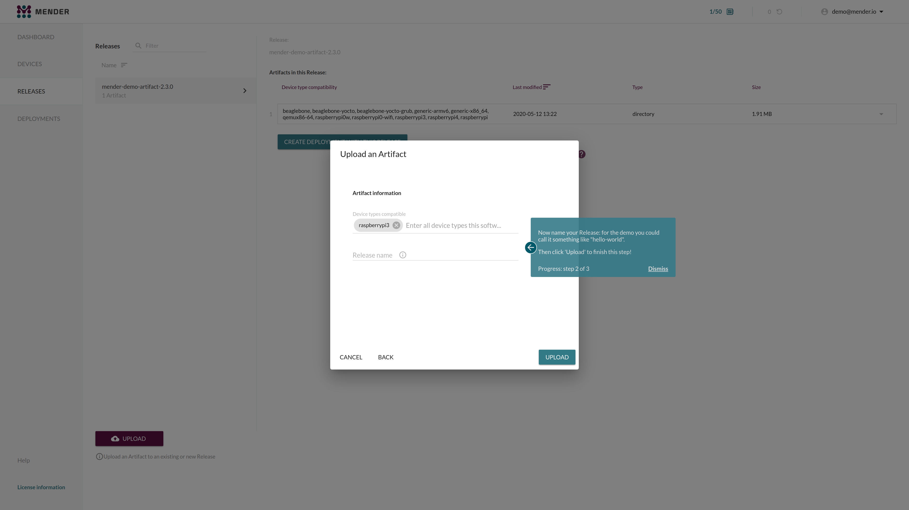

You now have a new Artifact under the **Releases** tab. Use the new Artifact
to create a deployment by clicking **CREATE DEPLOYMENT WITH THIS RELEASE** and
click trough the deployment wizard, similarly to what you did in
[Step 1 - Create a Deployment](#step-1-create-a-deployment).

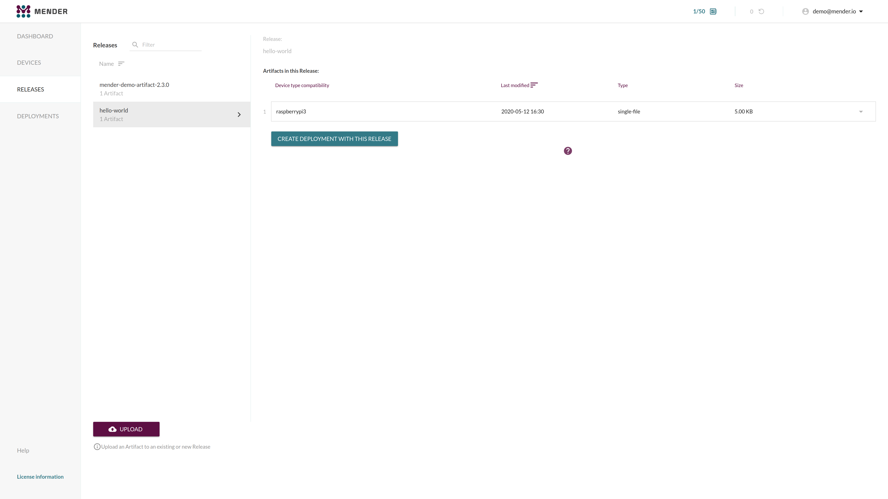

Once the deployment finishes you will once again see a link to running web
application running on your device. By following the presented link you will
see an updated landing page which you created earlier.

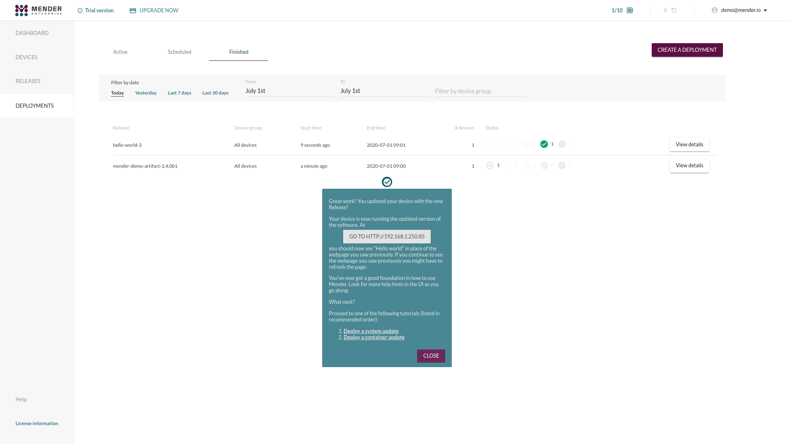

**Congratulations!** You have successfully deployed an custom application update
using Mender!

## Next steps

Proceed to one of the following tutorials (listed in recommended order):

1. [Deploy a system update](../03.Deploy-a-system-update/docs.md)
1. [Deploy a container update](../04.Deploy-a-container-update/docs.md)
