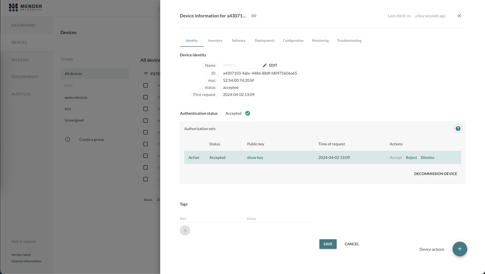
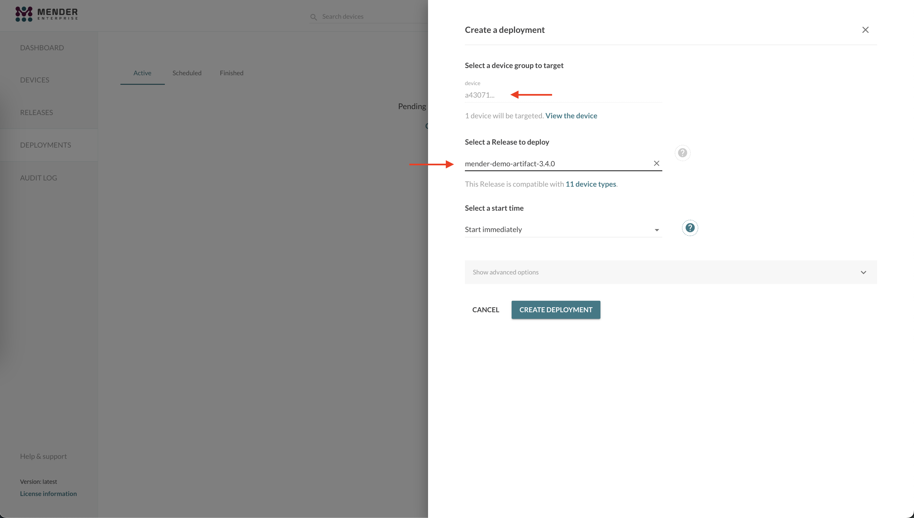
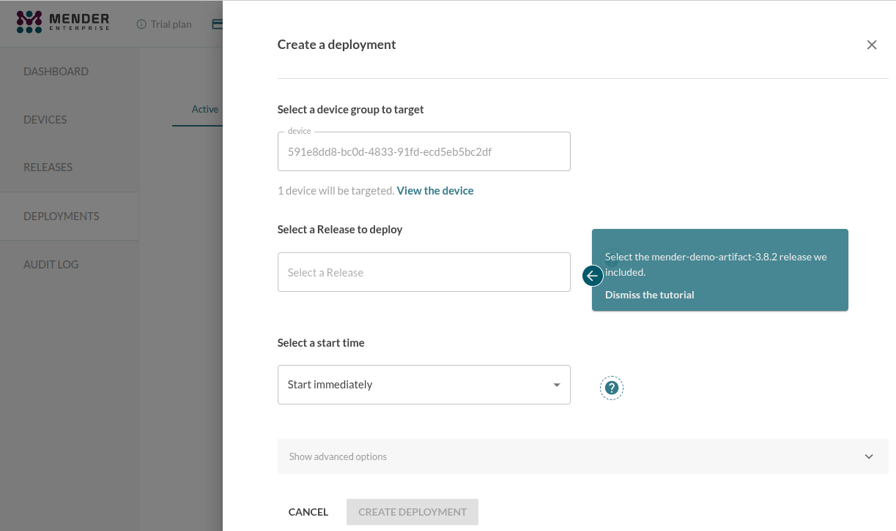
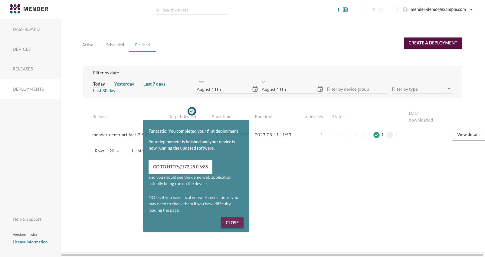
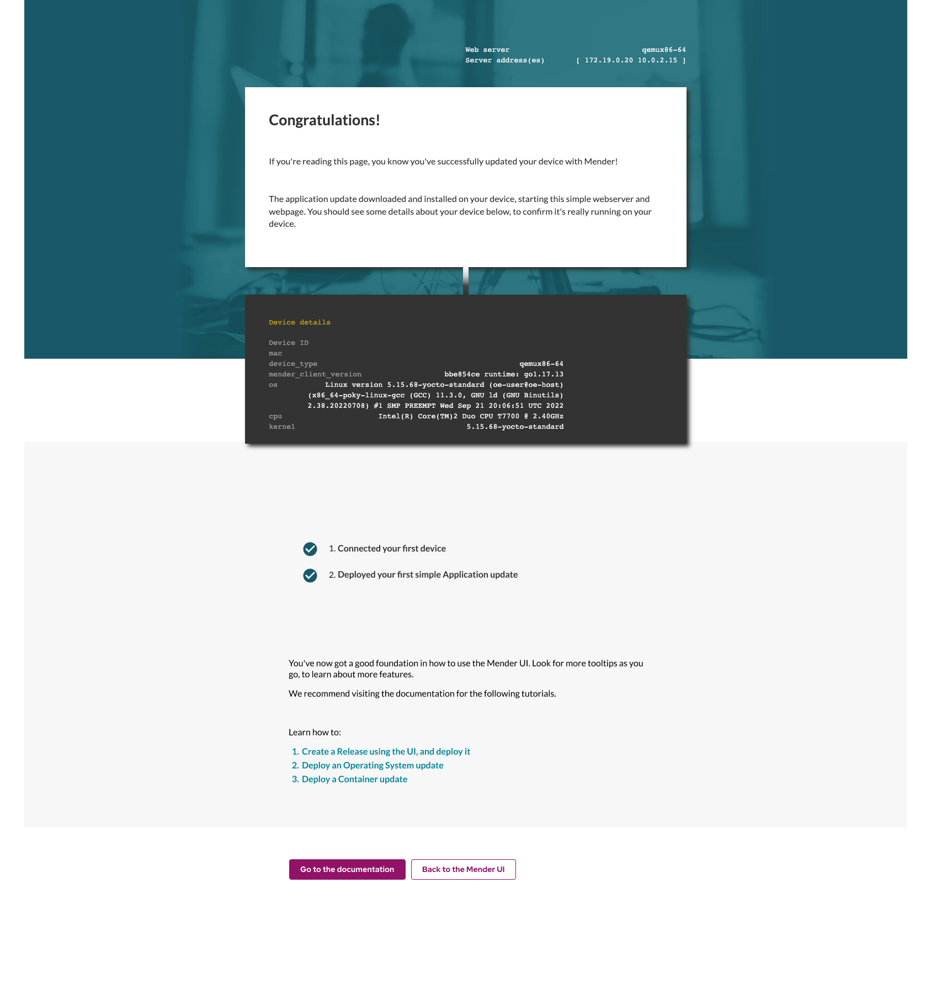
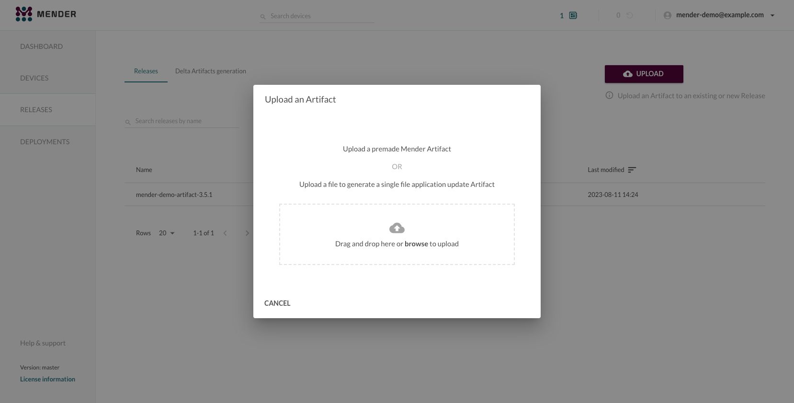
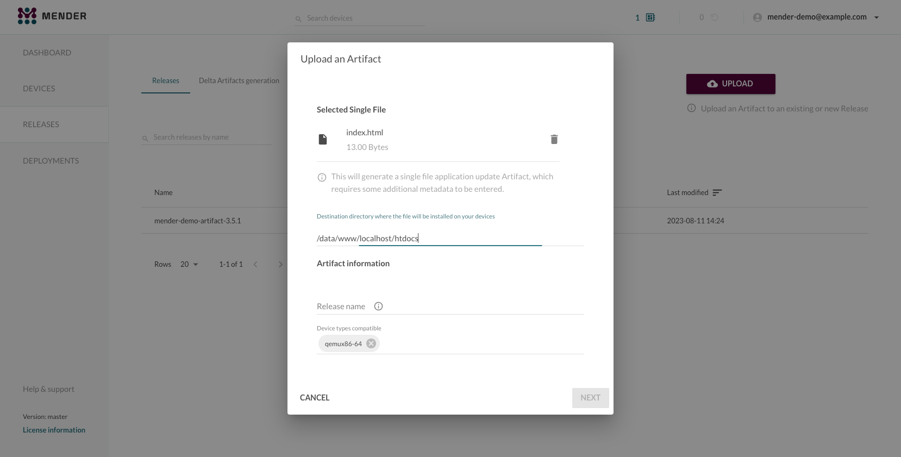

To deploy an application update you should follow the UI tooltips presented on
hosted Mender.

This tutorial is here as a reference if you need additional guidance or
would like to get an overview of the steps necessary to deploy an application
update.

## Prerequisites

You should have completed one of the following:

* [Prepare a Raspberry Pi device](../01.Preparation/01.Prepare-a-Raspberry-Pi-device/docs.md)
* [Prepare a virtual device](../01.Preparation/02.Prepare-a-virtual-device/docs.md)

## Step 1 - Create a Deployment

In the Device information view for the device you just connected, select **Create a deployment for this device** from the **Device actions**.



This will start the deployment wizard. The first step is to **Select a device group
to target**. As we have not yet created any specific groups the only
option presented should be **All devices**.



There is already a demo Artifact available the first time you
use hosted Mender, for the purposes of this tutorial. It contains a small web server you will run on your device.

Select the Release with the name beginning *mender-demo-artifact*; this will be deployed to your device.



Review your deployment configuration and click **CREATE DEPLOYMENT**.
This will take you to the overview of the deployments and you should see it
pending or in progress once your device begins the update.

After a short time you will see the finished deployment in the
**Finished** tab. There should also be a tooltip showing the URL of your deployed web
server.



!!! If you close the previous tooltip, you can still get the IP address. Then, you will need to append the port **85** to the browser's URL.
!!! For a Raspberry Pi connected by following [Prepare a Raspberry Pi device](../01.Preparation/01.Prepare-a-Raspberry-Pi-device/docs.md),
!!! you can run `$ hostname -I` inside your RaspberryPi terminal.
!!! For a virtual device, connected by following [Prepare a virtual device](../01.Preparation/02.Prepare-a-virtual-device/docs.md),
!!! you can user the `$IP_ADDRESS` variable defined in [Get the IP address of the virtual device](../01.Preparation/02.Prepare-a-virtual-device/docs.md#step-5-get-the-ip-address-of-the-virtual-device).

If you visit the presented URL, you will see a welcome page similar to the following. Your device has been updated and is now running the demo software.



**Congratulations!** You have successfully deployed an application update
using Mender!

## Step 2 - Modify the application and deploy it

Now we'll make an update to the webserver demo running on your device, using a new Release that you will create yourself.

!!! Leave the demo web page from the previous step open, you'll use it to verify the update at the end of this step.

On your workstation, create a new `index.html` file with the simple contents 'Hello World'. This will be the new web page after you update the application, so you'll be able to easily see when your device has received the update. Copy and run the following command to create the file:

```bash
cat >index.html <<EOF
Hello World!
EOF
```

Click on **RELEASES** from the left panel. Then click the **UPLOAD** button.

Drag-and-drop or click **browse** to select the `index.html` file you just created for upload.



When you upload a single file like this, you will get a wizard to
create a [Mender Artifact](../../02.Overview/03.Artifact/docs.md)
of the type `file`, which allows you deploy single files to your device.

Ensure the *Destination directory* field is filled as `/data/www/localhost/htdocs` as below, so the `index.html` gets file is placed in the correct destination on the device.



A [Mender Artifact](../../02.Overview/03.Artifact/docs.md) contains some mandatory fields:

* **Device type** - Device types the software is compatible with, to ensure the
  software is not deployed to incompatible hardware (e.g. CPU architecture,
  hardware floating point support, peripheral drivers).

  Depending on which device you are using you need to enter:
  * `raspberrypi3` or `raspberrypi4` if you are using a Raspberry Pi
  * `generic-x86_64` if you are using a virtual device

* **Release name** - Name of the software build, so that software is not
  redeployed if it is already installed at the device.
  * Input is a free form string, you can use e.g `hello-world` for evaluation
    purposes

Fill out the required fields and click the **NEXT** button.


Leave the next prefilled fields as they are and click **UPLOAD ARTIFACT** as below.


You will now see a new Release containing this Artifact under the **Releases** tab. View its details, and create a deployment by clicking **Create a deployment for this Release**.


Click through the deployment wizard to make a new deployment, similarly to what you did in
[Step 1 - Create a Deployment](#step-1-create-a-deployment); this time, use the *hello-world* Release.

Once the deployment finishes, refresh the demo web page from Step 1. If your deployment was successful, the `index.html file has updated on your device, and the page will now only show 'Hello World!'

**Congratulations!** You have successfully created and deployed a custom application update
using Mender!

## Next steps

Proceed to one of the next tutorial:

* [Deploy an Operating System update](../03.Deploy-an-operating-system-update/docs.md)
