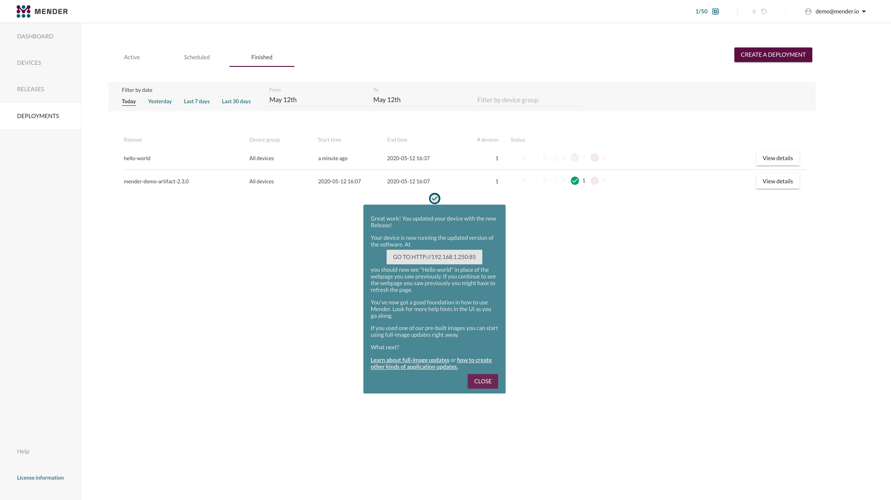

The steps necessary to deploy application updates are described in the hosted
Mender UI as tooltips and this guide is only here as a reference if you need
additional guidance or would like to get an overview of the steps.

## Prerequisites

It is assumed that you have completed one of the following:

* [Prepare a Raspberry Pi device](../01.Preparation/01.Prepare-a-Raspberry-Pi-device/docs.md)
* [Prepare a virtual device](../01.Preparation/02.Prepare-a-virtual-device/docs.md)

## Step 1 - Login to hosted Mender

Login to [hosted Mender](https://hosted.mender.io?target=_blank). On the main
page for the first time new users will get a tutorial in the Mender web GUI.

Go to the **Dashboard** tab and click on **Connect a device**.

## Step 2 - Choose between virtual or physical device

Select device type that you would like to use use during the evaluation of
deploying application updates.

The option you pick should align with the steps you completed during preparation:

1. [Prepare a Raspberry Pi device](../01.Preparation/01.Prepare-a-Raspberry-Pi-device/docs.md)
1. [Prepare a virtual device](../01.Preparation/02.Prepare-a-virtual-device/docs.md)

## Step 3 - Choose physical device type (only if you did not choose a virtual device)

This step is only applicable if you choose to use a Raspberry Pi device, and
you need to specify one of the following:

- Raspberry Pi 3
- Raspberry Pi 4

## Step 4 - Install the Mender client on the device

Next we will install the Mender client on the device and connect it to the Mender
server.

In the dialog box from above, click **Copy to clipboard** to copy the code to
install the Mender client. Now go to the command line on your device, and
**paste** the code e.g. by right-clicking in the terminal and selecting *Paste*,
followed by *Enter*.

This downloads the Mender client on the device, configures and starts it.

## Step 5 - Accept the device

Once the client has started, the Mender client will attempt to connect to the
server and it will appear in your Pending devices tab in the server. Go ahead
and **Accept** the pending device in the server. After accepting the device, it
will appear on the Device groups tab on the left of Pending.

## Step 6 - Create a Deployment

There is already a demo Artifact available under *Releases* the first time you
use hosted Mender. It contains a small web server you can run on your device.
Go to the **Releases** tab and select the target release already available.

Click **CREATE DEPLYOMENT WITH THIS RELEASE** as shown below.

This will start the deployment wizard. The first step is to **Select target
software and devices**. As we have not yet created any specific groups the only
option presented should be **All devices**.

Next step is to **Select a rollout schedule**. You can use the defaults and
click the **NEXT** button.

After approximately 30 seconds you will see your finished deployment in the
**Finished** tab. There should also be a tooltip to the URL of your deployed web
server.

You will see a welcome page similar to the following, if you visit the presented
URL.

**Congratulations!** You have successfully deployed an application update
using Mender!

## Step 7 - Modify the application

The UI tooltips should now take you through modifying the web page you saw in
[Step 6 - Create a Deployment](#step-6---create-a-deployment). Follow the
instructions showed on the pop-up and click the **NEXT** button when done.

Click the **UPLOAD** button to upload the file that was created in previous step.

Drag-and-drop or click **browse** to select the file for upload.

When you upload a single file to the Mender server, a wizard is started to
create a [Mender Artifact](../../02.Architecture/04.Mender-Artifacts/docs.md)
of the type `file`, which allows you deploy single files to your device. The
fields are prefilled by the UI during the evaluation and you can click **NEXT**.

A [Mender Artifact](../../02.Architecture/04.Mender-Artifacts/docs.md) contains
two mandatory fields:

- **Device type** - Device types the software is compatible with, so that
  software is not deployed to incompatible hardware (e.g. CPU architecture,
  hardware floating point support, peripheral drivers).

  Depending on which device you are using you need to enter:
    - `raspberrypi3` or `raspberrypi4` if you are using a Raspberry Pi
            device
    - `qemux64-64` if you are using a virtual device

- **Artifact name** - Name of the software build, so that software is not
  redeployed if it is already installed at the device.
  - Input is a free form string, you can use e.g `hello-world` for evaluation
    purposes

Once all required fields are filled, click the **UPLOAD** button.

You now have a new Artifact under the **Releases** tab. Use the new Artifact
to create a deployment by clicking **CREATE DEPLOYMENT WITH THIS RELEASE** and
click trough the deployment wizard, similarly to what was done in
[Step 5 - Create a Deployment](#step-6---create-a-deployment).

Once the deployment finishes you will once again be presented with a link to
running web application running on your device. By following the presented
link you will see an updated landing page which you created earlier.

Simply follow the tooltips to update your newly deployed application!

**Congratulations!** You have successfully deployed an custom application update
using Mender!

## Next steps

Proceed to one of the following guides (listed in recommended order):

1. [Deploy a system update](../03.Deploy-a-system-update/docs.md)
1. [Deploy a container update](../04.Deploy-a-container-update/docs.md)
