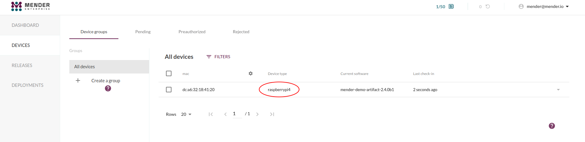

This tutorial will walk you through how to do robust system level updates with
rollback. These types of updates cover the whole system including system level
applications and the Linux kernel and ensure the device comes back in a
consistent state even if the update process is interrupted for any reason such
as power loss.


## Prerequisites

You should:

* have completed [Deploy an application update](../02.Deploy-an-application-update/docs.md)
* know the IP address of your device


### Step 1 - Download the mender-artifact utility on your workstation

!!! If you already installed `mender-artifact` on your system, you can skip this step.

Prepare destination directory:

```bash
mkdir -p ${HOME}/bin
```

Download the `mender-artifact` binary. If you're on Linux

<!--AUTOVERSION: "mender-artifact/%/"/mender-artifact -->
```bash
wget https://downloads.mender.io/mender-artifact/master/linux/mender-artifact -O ${HOME}/bin/mender-artifact
```

On MacOS

<!--AUTOVERSION: "mender-artifact/%/"/mender-artifact -->
```bash
wget https://downloads.mender.io/mender-artifact/master/darwin/mender-artifact -O ${HOME}/bin/mender-artifact
```


Make the `mender-artifact` binary executable:

```bash
chmod +x ${HOME}/bin/mender-artifact
```

Add `${HOME}/bin` to `PATH`:

```bash
export PATH="${PATH}:${HOME}/bin"
```

!!! Add above to `~/.bashrc` or equivalent to make it persistent across multiple
!!! terminal sessions.

## Step 2 - Setup shell variables on your workstation

Setup the `IP_ADDRESS` shell variable with correct IP address of your device:

```bash
IP_ADDRESS="<DEVICE-IP-ADDRESS>"
```
[ui-tabs position="top-left" active="0" theme="lite" ]
[ui-tab title="Raspberry Pi"]
On Mender, check `ipv4_eth0` or `ipv4_wlan0` inventory attributes of your
Raspberry Pi device
[/ui-tab]
[ui-tab title="Virtual device"]
On Mender, check `ipv4_docker` inventory attribute of your Virtual device
[/ui-tab]
[/ui-tabs]

Setup `USER` environment variable to match an existing user on the device, e.g:

[ui-tabs position="top-left" active="0" theme="lite" ]
[ui-tab title="Raspberry Pi"]
```bash
USER="<your-user>"
```
[/ui-tab]
[ui-tab title="Virtual device"]
```bash
USER="root"
```
[/ui-tab]
[/ui-tabs]

[Mender Artifacts](../../02.Overview/03.Artifact/docs.md) require
a device compatibility value as input, which **must** match what the device is
reporting to the Mender server or it will refuse to install it. This is a safety
mechanism to avoid installing software to incompatible hardware.

If you are unsure, you can check what the device is reporting on the server:



Use the result from above to assign that value to `DEVICE_TYPE` shell variable:

```bash
DEVICE_TYPE="raspberrypi4"
```

!!! Make sure to replace `raspberrypi4` with the specific value that you are
!!! seeing in your setup

Set `SSH_ARG` shell variable to specify the SSH access port:

[ui-tabs position="top-left" active="0" theme="lite" ]
[ui-tab title="Raspberry Pi"]
```bash
SSH_ARG="-p 22"
```
[/ui-tab]
[ui-tab title="Virtual device"]
```bash
SSH_ARG="-p 8822"
```
[/ui-tab]
[/ui-tabs]

## Step 3 - Create a Mender Artifact using the snapshot feature

The easiest way to create system level updates is to use the **snapshot**
functionality in Mender, which will create a snapshot of the full system on a
currently running device and package it as a
[Mender Artifact](../../02.Overview/03.Artifact/docs.md) that you
can deploy to other devices.

Run the following command on your workstation to generate a **snapshot**
[Mender Artifact](../../02.Overview/03.Artifact/docs.md) from your
device:

```bash
mender-artifact write rootfs-image \
    -f ssh://"${USER}@${IP_ADDRESS}" \
    -t "${DEVICE_TYPE}" \
    -n system-v1 \
    -o system-v1.mender \
    -S "${SSH_ARG}"
```

! Your device is not usable while the snapshot operation is in progress. Mender
! will freeze the storage device during this operation in order to create a
! consistent snapshot.

Depending on your local network and storage speed, this will take up to
10-20 minutes to finish. You will see a progress indicator, and when it
reaches 100% it will package the Mender Artifact which will take a few more
minutes because it will need to compress the snapshot image.

The end result is a file called `system-v1.mender`. Upload this file to
hosted Mender. You can do that using the UI under the **Releases** tab, as
demonstrated below.


## Step 4 - Modify the device software

While your Artifact is uploading, we make some modifications to the device
so we can see the effect of the deployment later.

On your device, run the following command to create a file:

```bash
echo "hello world" | sudo tee /greetings.txt
```

If the file system is read-only, you can remount it in read-write mode before creating the file:

```bash
sudo mount -o remount,rw /
```

You can now check the `/greetings.txt` file to verify it exists, as you would expect.

```bash
ls -lah /greetings.txt
```

Note that this modification *is not part of your system snapshot* created above.


## Step 5 - Deploy the snapshot and experiment

Once the Artifact upload in Step 3 has finished,
go to the **DEPLOYMENTS** tab and click **CREATE DEPLOYMENT** in
order to deploy it to your device.

Once this deployment finishes it will have the effect of restoring your full
device root file system to the same state as when you created the snapshot in Step 3.
You can verify this by checking if `/greetings.txt` eists after the deployment has finished.
It is gone! This is because your device file system did not have this file
at the time you created the snapshot. This works for any change in the file system,
including removing or installing software and changing any configuration.

Please take a moment to experiment at this stage to familiarize yourself with
robust system updates with Mender.

As an example you can iterate this flow:

1. Make a change on the device, e.g change a configuration file or install an
application.
2. Create a **snapshot** of the device changes you made

    !!! Mender will skip a deployment to a device if the Artifact is already
    !!! installed, in order to limit resource usage, downtime and ensure consistency
    !!! across the fleet. Make sure to use different names for new Artifacts you
    !!! generate (instead of the two instances of `system-v1` above).

3. Upload the generated Artifact (`.mender`) to hosted Mender and deploy it.
4. Once you have two or more Artifacts uploaded you can switch between the
   software you have on your devices by deploying the respective Artifacts.

Deploy to many devices in order to effectively replicate the device software
and configuration.

To read more about system snapshots, see the documentation on
[Artifact from system snapshot](../../06.Artifact-creation/02.Create-an-Artifact-with-system-snapshot/docs.md).

Using the **snapshot** feature is one way to create system updates and additional
resources on more advanced ways you will find here:

1. [Building a Mender Yocto Project image](../../05.System-updates-Yocto-Project/03.Build-for-demo/docs.md)
2. [Building a Mender Debian image](../../04.System-updates-Debian-family/02.Convert-a-Mender-Debian-image/docs.md)

## Next step

Proceed to [Deploy a Docker container update](../04.Deploy-a-container-update/docs.md).
