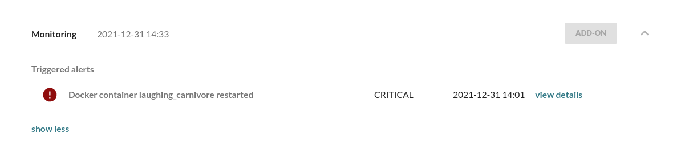

!!!!! Requires the Mender Monitor add-on package.
!!!!! See [the Mender features page](https://mender.io/plans/features?target=_blank)
!!!!! for an overview of all Mender plans and features.

This tutorial will walk you through how to monitor your device and its application with
Mender. We will be using the [Monitor Add-on](../../09.Add-ons/20.Monitor/docs.md) which
allows you to monitor various parts of your system.

## Prerequisites

To follow this tutorial, you will need to [install the Monitor
Add-on on your device](../../09.Add-ons/20.Monitor/10.Installation/docs.md). If
you have followed the [get started tutorial to prepare your
device](../01.Preparation/docs.md), the Monitor Add-on should already be
installed.

### Demo alerts

 A set of Alerts to demo key use cases is provided out of the box with the
 Mender Monitor Add-on. This is meant as a starting point to try it out. You can
 also [customize and define your own
 alerts](../../09.Add-ons/20.Monitor/20.Monitoring-subsystems/docs.md) once you
 are ready.

 Email notifications are automatically generated in addition to UI notifications
 shown in the screenshots below. While going through the examples in this
 tutorial, watch the email inbox of your Mender user to see that you get
 notified about Alerts triggered and cleared on the device.

!!! Note: In the default configuration mender-monitorctl command requires
!!! read-write access to the /etc/mender-monitor directory, which on most systems
!!! means the need to switch to super user, or run with sudo.

#### USB disconnect

Peripherals such as keypads and displays are in many cases required to be
connected in order for an IoT product to function properly. This demo Alert
shows how to detect that a USB-connected peripheral gets disconnected.

First enable the alert through running:

```bash
sudo mender-monitorctl enable log usb_disconnect
```

Now remove a USB device from the device (you can insert it first, e.g. a
thumbdrive or mouse, if you don't have any USB devices inserted). Once you remove
the USB device, the log subsystem triggers an alert which you can inspect in the
device details in the Mender UI:


#### Disk usage

If key device resources such as disk space runs out, e.g. due to ever-growing
log files, the product will typically stop functioning properly. It is therefore
good practice to enable a disk space Alert to detect high disk space usage and
remediate it before it causes any downtime.

First enable the diskusage alert for the root space partition.

```bash
sudo mender-monitorctl enable diskusage root_space
```

Then check the current disk usage.

```bash
df -h

Filesystem                 Size  Used Avail Use% Mounted on
...
/dev/mapper/homedisk-root   49G   31G  15.9G  68% /
...

```

The disk usage monitor is already running, and will send an alert, as soon as
the root partition goes above 75%.

To trigger the alert fill up the filesystem with a large file:

```bash
fallocate -l 10G ~/large-file
```

And the disk usage goes above the 75% treshold

```bash
df -h

Filesystem                 Size  Used Avail Use% Mounted on
...
/dev/mapper/homedisk-root   49G   41G  5.9G  88% /
...

```
And an alert shows up in the UI.


An OK alert will appear if you remove this file:

```bash
rm ~/large-file
```

#### Connectivity

Ongoing connectivity issues may cause the device application to hang or
malfunction, disrupting the user experience or function of the product. This
Alert is one example how to detect connectivity issues. Note that Mender stores
triggered Alerts on the device. Therefore, even if Mender cannot send the Alerts
to the server immediately you will get notified about triggered Alerts later on,
once the device regains connectivity. This means that even during offline
periods, Alerts are triggered.

First enable the alert through:

```bash
sudo mender-monitorctl enable connectivity example
```

This will enable a connectivity alert, which sends HTTP HEAD requests to
`example.com`, making sure that it is responding.

Let us trigger the alert through stopping the traffic to `example.com` through
redirecting the dns resolver to localhost in `/etc/hosts`.

```bash
echo ‘127.0.0.1 example.com’ | sudo tee -a /etc/hosts
```

Which then triggers the alert:


And when re-enabling the route to `example.com` in `/etc/hosts`:

```bash
sudo sed -i '/example/d' /etc/hosts 
```

And soon the alert will show up as fixed in the UI:


#### Docker container restart

!!!!!  NOTE: Docker needs to be [installed](https://docs.docker.com/engine/install/debian/) on the device

Applications may restart sporadically when they encounter new situations like
intermittent connectivity. As they are often automatically started again the
root cause of this condition may be difficult to detect, and even harder to
diagnose solely based on customer reports. Still, this situation and even what
led to it can be fairly easy to discover if you look at the log or output from
the application itself. This Alert detects a restart from the Docker daemon
events and notifies you in the event that a container was restarted.

First spin up the container to monitor:

```bash
sudo docker run --name demo --rm -d alpine sleep infinity
```

Create the file `/etc/mender-monitor/monitor.d/available/dockerevents_testcontainer.sh` running the following command:

```bash
sudo tee /etc/mender-monitor/monitor.d/available/dockerevents_testcontainer.sh <<EOF
DOCKEREVENTS_CONTAINER_NAME=demo
DOCKEREVENTS_CONTAINER_ACTION=restart
EOF
```

Enable the alert:

```bash
sudo mender-monitorctl enable dockerevents testcontainer
```

Then restart the container

```bash
sudo docker container restart demo
```

And an alert will show up in the UI.



## Check if the mender-connect systemd service is running

Assume you want to monitor the state of the `mender-connect` systemd service,
and you want to receive _CRITICAL_ alerts if the service is not running,
and _OK_ alerts when it is back up. To get this working, we need to create
a systemd service checker using `mender-monitorctl`:

```bash
sudo mender-monitorctl create service mender-connect systemd
```

This command creates a file in `/etc/mender-monitor/monitor.d/available`
with the details of the server name and type to check:

```bash
cat /etc/mender-monitor/monitor.d/available/service_mender-connect.sh
```
> ```bash
> # This file was autogenerated by Monitoring Utilities based on the configuration
> SERVICE_NAME="mender-connect"
> SERVICE_TYPE="systemd"
> ```

You can now enable the check running:

```bash
sudo mender-monitorctl enable service mender-connect
```

This command links the file in `/etc/mender-monitor/monitor.d/available` to
`/etc/mender-monitor/monitor.d/enabled`, as you can verify running:

```bash
readlink /etc/mender-monitor/monitor.d/enabled/service_mender-connect.sh
```
> ```bash
> /etc/mender-monitor/monitor.d/available/service_mender-connect.sh
> ```

The `mender-monitor` daemon will automatically reload the configuration files and start the checks.

## Monitor systemd services logs

You can trigger alerts when a given pattern shows in the logs of your `systemd` service. To this end you
need to create a check pointing to the `journalctl` command as a source for log data:

```bash
sudo mender-monitorctl create log my_service_logs "Exited with code \d+" "@journalctl -u my-service -f" 255
```

The above will create a check:

```bash
cat /etc/mender-monitor/monitor.d/available/log_my_service_logs.sh
```
> ```bash
> # This file was autogenerated by Monitoring Utilities based on the configuration
> SERVICE_NAME="my_service_logs"
> LOG_PATTERN="Exited with code \d+"
> LOG_FILE="@journalctl -u my-service -f"
> LOG_PATTERN_EXPIRATION=255
> ```

Which will trigger a critical alert every time _Exited with code n_ (where n is any decimal number) shows up
in the logs for `my-service` systemd service. In the above example there is going to be an automatic cancellation of the critical
condition (sending of an "OK" alert) after 255 consecutive seconds during which the pattern does not appear in the logs.
This is what the last and optional argument to `mender-monitorctl` stands for.

For more information please refer
to the [Monitoring subsystems](../../09.Add-ons/20.Monitor/20.Monitoring-subsystems/docs.md) section.

## Receive alerts on new sessions for the root user

To receive alerts on new sessions on the device for the root user, we can check for
the pattern `Started User Manager for UID 0` in the `/var/log/auth.log` file, defining
a new check named `auth_root_session`:

```bash
sudo mender-monitorctl create log auth_root_session "Started User Manager for UID 0" /var/log/auth.log
```

This command creates a file in `/etc/mender-monitor/monitor.d/available`
with the details of the log file and pattern to check:

```bash
cat /etc/mender-monitor/monitor.d/available/log_auth_root_session.sh
```
> ```bash
> # This file was autogenerated by Monitoring Utilities based on the configuration
> SERVICE_NAME="auth_root_session"
> LOG_PATTERN="Started User Manager for UID 0"
> LOG_FILE="/var/log/auth.log"
> ```

You can now enable the check running:

```bash
sudo mender-monitorctl enable log auth_root_session
```sudo 

This command links the file in `/etc/mender-monitor/monitor.d/available` to
`/etc/mender-monitor/monitor.d/enabled`, as you can verify running:

```bash
readlink /etc/mender-monitor/monitor.d/enabled/log_auth_root_session.sh
```
> ```bash
> /etc/mender-monitor/monitor.d/available/log_auth_root_session.sh
> ```

The `mender-monitor` daemon will automatically reload the configuration files and start the checks.

!!! You can also do Perl-compatible regular expressions (PCRE) pattern matching for the UID to catch users other than root, using for instance:
!!! `LOG_PATTERN='Started User Manager for UID \d+'`
!!! If your device does not support PCRE, it falls back to -E if available or plain grep if not.
