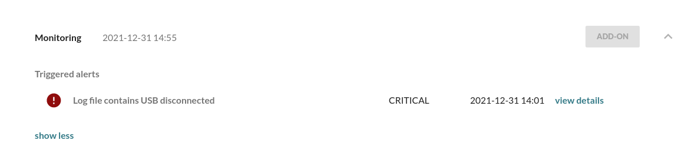
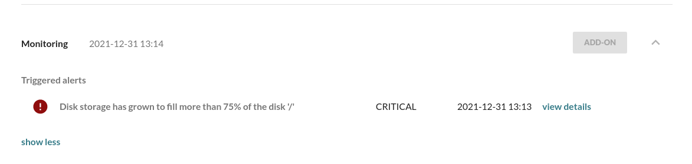
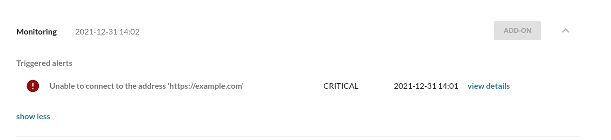
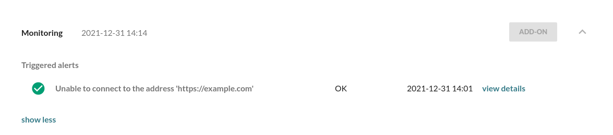

!!!!! Requires the Mender Monitor add-on package.
!!!!! See [the Mender plans page](https://mender.io/pricing/plans?target=_blank)
!!!!! for an overview of all Mender plans and features.

!!! This tutorial is not supported by the virtual device because it does not come
!!! with a package manager to install the needed dependencies.

This tutorial will walk you through how to monitor your device and its applications with
Mender. We will be using the [Monitor Add-on](../../09.Add-ons/20.Monitor/docs.md), allowing you to monitor various system parts.

## Prerequisites

To follow this tutorial and perform the examples, you will need to install the [Monitor Add-on package](../../09.Add-ons/20.Monitor/10.Installation/docs.md) and the [Demo monitors package](../../10.Downloads/docs.md#demo-monitors) on your device. 
If you have followed the [get started tutorial](../01.Preparation/docs.md) to prepare your device, the Monitor Add-on, and Demo packages should already be installed.

Verify installed dependencies on your device with:

```bash
sudo mender-update --version && sudo mender-monitorctl --version
```

The output should give no errors and print the version of both tools.


Check installed monitoring subsystems with:

```bash
 ls -lAh /etc/mender-monitor/monitor.d | grep -v '^d'
```
>```text
> -rwxr-xr-x 1 root root 2669 Aug 17 20:09 connectivity.sh
> -rwxr-xr-x 1 root root 2298 Mar 10 09:37 dbus.sh
> -rwxr-xr-x 1 root root 2498 Aug 18 01:14 diskusage.sh
> -rwxr-xr-x 1 root root 3738 Mar 10 09:37 log.sh
> -rwxr-xr-x 1 root root 3016 Mar 10 09:37 service.sh
>```

Verify existence of check definitions with:

```bash
 ls -lAh /etc/mender-monitor/monitor.d/available/ | grep -v '^d'
```

> ```bash
> -rwxr-xr-x 1 root root 176 Aug 17 20:09 connectivity_example.sh
> -rwxr-xr-x 1 root root 173 Aug 18 01:14 diskusage_root_space.sh
> -rwxr-xr-x 1 root root 201 Aug 17 20:09 log_mender_client.sh
> -rwxr-xr-x 1 root root 203 Aug 17 20:09 log_mender_connect.sh
> -rwxr-xr-x 1 root root 297 Aug 17 20:09 log_usb_disconnect.sh
> ```

## Demo Checks


Demo Checks for the Mender Monitor Add-on, found in the [Demo monitors package](../../10.Downloads/docs.md#demo-monitors) (Debian package) or in the `examples` directory for [Yocto](../../05.Operating-System-updates-Yocto-Project/05.Customize-Mender/docs.md#monitor) serve as a starting point for quick evaluation.
Once ready, you can customize and define your own [Checks](../../09.Add-ons/20.Monitor/20.Concepts/docs.md#creating-custom-checks).

By default both mail notifications and UI alerts occur once an monitored event happens. 
While going through the examples in this tutorial, watch the email inbox of your Mender user to see that you get notified about Alerts triggered and cleared on the device. 

The default configuration for `mender-monitorctl` command requires read-write access to the `/etc/mender-monitor` directory, which on most systems means switching to super user or running with `sudo`. 
For a read-only filesystem, it is essential to establish a symbolic link to a writable directory. This symlink is required to create, modify, and enable alert checks.

### Monitor USB disconnects

This demo shows detecting USB disconnects, alerting you to potential device tampering and preventing unauthorized access

Enable the check by running:


```bash
sudo mender-monitorctl enable log usb_disconnect
```

Now remove a USB device from the device (you can insert it first, e.g., a thumb drive or mouse, if you don't have any USB devices inserted). 
Once you remove the USB device, the log subsystem triggers an alert, which you can inspect in the device details in the Mender UI:



!!! Note: This Alert will remain unless a manual [alert cleaning](../../09.Add-ons/20.Monitor/50.Advanced-use-cases/docs.md#alert-cleaning ) is performed:
!!! ```bash
!!! sudo su
!!! cd /usr/share/mender-monitor
!!! source lib/monitor-lib.sh
!!! monitor_send_alert OK "Log file contains \[.*\] +usb [\w\-\.]+: USB disconnect" "\[.*\] +usb [\w\-\.]+: USB disconnect present in /var/log/kern.log" "log_usb_disconnect" LOGCONTAINS "log" "\[.*\] +usb [\w\-\.]+: USB disconnect" "/var/log/kern.log" 
!!! ```

### Monitor disk usage

Running low on essential device resources like disk space, often due to growing log files, can disrupt the product's functionality. 
This example shows you how to monitor for high disk usage, allowing timely action to avoid downtime.

Enable the `diskusage` check for the root space partition called `root_space` by running the following command:

```bash
sudo mender-monitorctl enable diskusage root_space
```

Check the current disk usage.

```bash
df -h /

# Output:
# Filesystem      Size  Used Avail Use% Mounted on
# /dev/root       3.4G  1.4G  1.9G  42% /
```

With the check enabled an alert will be triggered when the root partition exceeds 75% (predefined threshold).
To trigger the Alert, fill up the filesystem with a large file:

```bash
fallocate -l 10G ~/large-file
```

as the disk usage goes above the 75% threshold

```bash
df -h /

# Output:
# Filesystem      Size  Used Avail Use% Mounted on
# /dev/root       3.4G  3.4G     0 100% /
```

an alert shows up in the UI.



An _OK_ alert will be sent by the `diskusage` monitoring subsystem if this 
file is removed, and the disk space is less than the threshold.

```bash
rm ~/large-file
```


### Monitor connectivity

Ongoing connectivity issues may cause the device application to hang or malfunction, disrupting the user experience or function of the product. 
This Alert is one example of how to detect connectivity issues. 

Mender stores triggered Checks on the device. 
Therefore, even if Mender cannot send the Checks to the server immediately, you will be notified about triggered Checks once the device regains connectivity. 
This means that even during offline periods, Alterts are triggered.

Enable the `connectivity` check called `example`:

```bash
sudo mender-monitorctl enable connectivity example
```

This enabled a Check using the demo `connectivity` monitoring subsystem, which sends HTTP HEAD
requests to `example.com,` ensuring it is responding.

To trigger the Alert, let us stop the traffic to `example.com` by
redirecting the DNS resolver to localhost in `/etc/hosts`.

```bash
echo 127.0.0.1 example.com | sudo tee -a /etc/hosts
```

Which then triggers the Alert:



And when re-enabling the route to `example.com` in `/etc/hosts`:

```bash
sudo sed -i '/example/d' /etc/hosts
```

After connection to `example.com` is restored, an _OK_ Alert will show up in the UI:




### Monitor a systemd service 

Assume you want to monitor the state of a systemd service,
and you wish to receive _CRITICAL_ alerts if the service is not running,
and _OK_ alerts when it is back up. 

Create a service that will count some seconds and then fail.

```bash
cat > countdown.sh << "EOF"
#!/bin/sh
i=30
while [ $i -gt 0 ]; do
    echo "INFO: $i seconds remaining"
    i=$((i-1))
    sleep 1
done
echo "ERROR: Exiting with return 1"
exit 1
EOF

PATH_TO_SCRIPT=$(realpath countdown.sh)
chmod +x $PATH_TO_SCRIPT


cat > /etc/systemd/system/countdown.service << EOF
[Unit]
Description=Countdown Service

[Service]
Type=simple
ExecStart=$PATH_TO_SCRIPT

[Install]
WantedBy=default.target
EOF

systemctl daemon-reload
systemctl start countdown.service
```

You can confirm the countdown with `journalctl -fu countdown.service`.

Now create and enable the check for the systemd `service` monitoring subsystem:

```bash
sudo mender-monitorctl create service countdown systemd
sudo mender-monitorctl enable service countdown
```

Once the service exits, an alert is sent.

Restarting the service will send an ok Alert.

```bash
systemctl restart countdown
```

To stop the monitoring, disable and delete the check

```bash
sudo mender-monitorctl disable service countdown
sudo mender-monitorctl delete service countdown systemd
```

!!! If you want to examine the low-level architecture of mender-monitor using this example [follow this link](../../09.Add-ons/20.Monitor/50.Advanced-use-cases/docs.md#example).


### Monitor new root sessions

The root account has complete control over the server, making it a target for unauthorized access.
Monitoring these sessions helps in the early detection of security breaches, ensuring that any unauthorized access is quickly identified and addressed. 

First, create a check for the `log` monitoring subsystem named `auth_root_session` by running
the following command:

```bash
sudo mender-monitorctl create log auth_root_session "Started User Manager for UID 0" /var/log/auth.log
sudo mender-monitorctl enable log auth_root_session
```

Not that the check is in place, change your user to `root`:
```
sudo su
```

this will trigger an alert notifying you of the event that took place.
