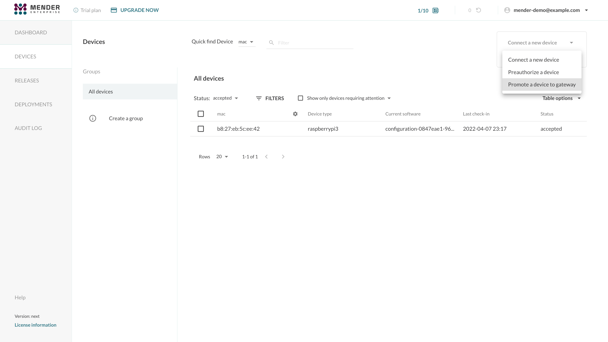
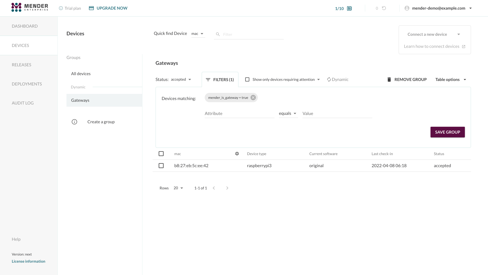
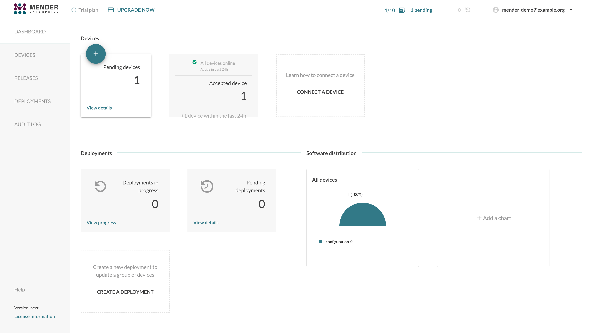
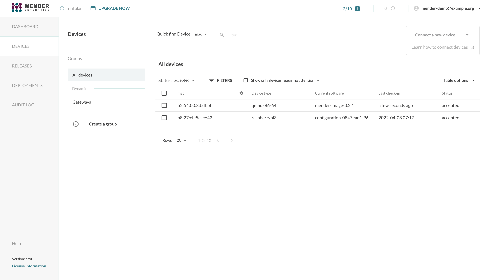
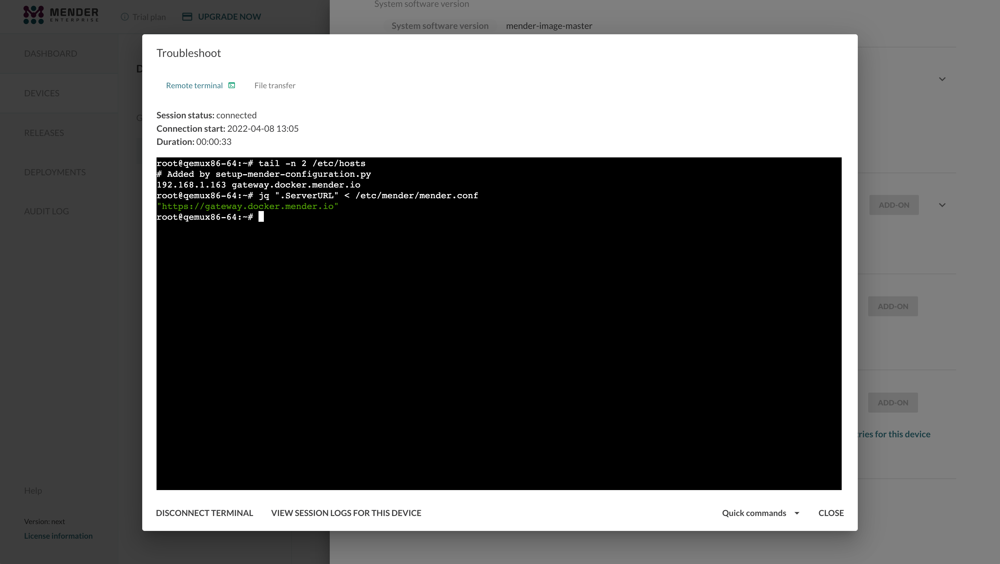

!!!!! Mender Gateway is only available in the Mender Enterprise plan.
!!!!! See [the Mender plans page](https://mender.io/pricing/plans?target=_blank)
!!!!! for an overview of all Mender plans and features.

This tutorial will walk you through setting up a
[Mender Gateway](../../10.Server-integration/04.Mender-Gateway/) in your local network
to connect one local device running Mender to an upstream Mender Server. To simulate a
segregated network and demonstrate the use-case we will make it impossible for the
local device to connect to the Mender Server directly.


## Prerequisites

To follow this tutorial you will need to
[prepare a Raspberry Pi device](../01.Preparation/01.Prepare-a-Raspberry-Pi-device/)
and connect it to hosted Mender or your Mender Server.

This tutorial assumes that your device is running the Raspbian OS. If you are
running a Yocto distribution the commands to install the Mender Gateway will
fail as they won't be able to recognize your distribution.

You will also need Docker installed on your workstation to start the virtual device
you will connect to the Mender Gateway.


## Installation

The first step is installing the Mender Gateway into your Raspberry Pi device.

[ui-tabs position="top-left" active="0" theme="lite" ]
[ui-tab title="hosted"]

You can use the "Connect a device" dropdown in the Mender UI and select the
"Promote a device to gateway" menu item to generate a snippet to install easily
the Mender Gateway package into your device.



An example snippet follows:

```bash
JWT_TOKEN='eyJhbGciOiJS...'

wget -O- https://get.mender.io | sudo bash -s -- --jwt-token "$JWT_TOKEN" mender-gateway --demo
```

The `JWT_TOKEN` environment variable contains a valid hosted Mender JWT token which the script
will use to authenticate to the server when downloading the Mender Gateway binaries.

[/ui-tab]
[ui-tab title="enterprise"]

You can find download and installation instructions for on-premise environments on [downloads](../../12.Downloads/02.Device-components/docs.md#mender-gateway) page.

[/ui-tab]
[/ui-tabs]

## Configuration

When installing the Mender Gateway in demo mode (see the `--demo` flag in the snippet above),
the package automatically configures it to connect to hosted Mender (i.e. hosted.mender.io, see
the note below if you are using eu.hosted.mender.io), forwarding both device APIs and the
Artifacts. It also ships with an example HTTPS certificate that you will have to add to the
list of trusted certificates in your devices connecting to the Mender Gateway.

You can inspect the configuration file `/etc/mender/mender-gateway.conf`:

!!! When using eu.hosted.mender.io, the configuration file needs to be modified by setting the
!!! value of the `URL` object (inside `UpstreamServer`) to `"https://eu.hosted.mender.io"`.

```
{
	"HTTPS": {
		"Enabled": true,
		"Listen": ":443",
		"ServerCertificate": "/usr/share/doc/mender-gateway/examples/cert/cert.crt",
		"ServerKey": "/usr/share/doc/mender-gateway/examples/cert/private.key"
	},
	"Features": {
		"ArtifactsProxy": {
			"Enabled": true,
			"GatewayURL": "https://gateway.docker.mender.io",
			"DomainWhitelist": ["s3.amazonaws.com"]
		}
	},
	"UpstreamServer": {
		"URL": "https://hosted.mender.io"
	}
}
```

Please refer to the [Mender Gateway's configuration file](../../10.Server-integration/04.Mender-Gateway/99.Configuration-file/)
documentation for detailed information about the various settings.


## Manage the Mender Gateways in the UI

The Mender Gateway devices have a special inventory attribute `mender_is_gateway` set to
`true`. This attribute is reported by the Mender Client together with the rest of the inventory
data at the next `InventoryPollIntervalSeconds` interval (set in the [Mender Client
configuration](../../03.Client-installation/07.Configuration/01.Polling-intervals/)) after
converting a device into a Gateway.


Leveraging this, you can filter these devices and eventually create a dynamic group, as shown below:




## Run the service and inspect the logs

The Mender Gateway package runs as a systemd service.

You can check the status of the service running:

```bash
sudo systemctl status mender-gateway
```

> ```
> ● mender-gateway.service - Mender Gateway service
>	Loaded: loaded (/lib/systemd/system/mender-gateway.service; enabled; vendor preset: enabled)
>	Active: active (running) since Fri 2022-04-08 06:10:44 CEST; 6min ago
>  Main PID: 12374 (mender-gateway)
>	 Tasks: 5 (limit: 877)
>	CGroup: /system.slice/mender-gateway.service
>			└─12374 /usr/bin/mender-gateway
> 
> Apr 08 06:10:44 raspberrypi systemd[1]: Started Mender Gateway service.
> Apr 08 06:10:44 raspberrypi mender-gateway[12374]: time="2022-04-08T06:10:44+02:00" level=info msg="loaded configuration file: /etc/mender/mender-gateway.conf" file=config.go func=config.loadConfigFile line=143
> Apr 08 06:10:44 raspberrypi mender-gateway[12374]: time="2022-04-08T06:10:44+02:00" level=info msg="starting mender-gateway" file=main.go func=main.doMain line=96
> Apr 08 06:10:44 raspberrypi mender-gateway[12374]: time="2022-04-08T06:10:44+02:00" level=info msg="creating proxy with url https://hosted.mender.io, insecure skip verify: false" file=proxy.go func=proxy.NewProxy line=47
> Apr 08 06:10:44 raspberrypi mender-gateway[12374]: time="2022-04-08T06:10:44+02:00" level=info msg="proxy scheme: https, host: hosted.mender.io" file=proxy.go func=proxy.NewProxy line=54
> Apr 08 06:10:44 raspberrypi mender-gateway[12374]: time="2022-04-08T06:10:44+02:00" level=info msg="created client with base url https://hosted.mender.io, insecure skip verify: false" file=client.go func=mender.NewClient line=49
> Apr 08 06:10:44 raspberrypi mender-gateway[12374]: time="2022-04-08T06:10:44+02:00" level=info msg=running... file=server.go func="server.(*Server).Run" line=75
> ```

You can start, stop, or restart the service using `systemctl`:

```bash
sudo systemctl restart mender-gateway
```

To inspect the logs you can use `journalctl`:

```bash
sudo journalctl -u mender-gateway -f
```

> ```
> -- Logs begin at Thu 2022-04-07 22:32:20 CEST. --
> Apr 08 06:21:26 raspberrypi systemd[1]: mender-gateway.service: Main process exited, code=killed, status=15/TERM
> Apr 08 06:21:26 raspberrypi systemd[1]: mender-gateway.service: Succeeded.
> Apr 08 06:21:26 raspberrypi systemd[1]: Stopped Mender Gateway service.
> Apr 08 06:21:26 raspberrypi systemd[1]: Started Mender Gateway service.
> Apr 08 06:21:27 raspberrypi mender-gateway[17155]: time="2022-04-08T06:21:26+02:00" level=info msg="loaded configuration file: /etc/mender/mender-gateway.conf" file=config.go func=config.loadConfigFile line=143
> Apr 08 06:21:27 raspberrypi mender-gateway[17155]: time="2022-04-08T06:21:27+02:00" level=info msg="starting mender-gateway" file=main.go func=main.doMain line=96
> Apr 08 06:21:27 raspberrypi mender-gateway[17155]: time="2022-04-08T06:21:27+02:00" level=info msg="creating proxy with url https://hosted.mender.io, insecure skip verify: false" file=proxy.go func=proxy.NewProxy line=47
> Apr 08 06:21:27 raspberrypi mender-gateway[17155]: time="2022-04-08T06:21:27+02:00" level=info msg="proxy scheme: https, host: hosted.mender.io" file=proxy.go func=proxy.NewProxy line=54
> Apr 08 06:21:27 raspberrypi mender-gateway[17155]: time="2022-04-08T06:21:27+02:00" level=info msg="created client with base url https://hosted.mender.io, insecure skip verify: false" file=client.go func=mender.NewClient line=49
> Apr 08 06:21:27 raspberrypi mender-gateway[17155]: time="2022-04-08T06:21:27+02:00" level=info msg=running... file=server.go func="server.(*Server).Run" line=75
> ```


## Obtain the Mender Gateway's IP address 

To connect other devices to the Mender Gateway, we need to obtain its IP address.
On the Raspberry PI, run the following command:

```bash
export SERVER_IP=$(sudo hostname -I)
echo $SERVER_IP
```

> ```
> 192.168.1.163
> ```

Note this IP address as we'll use it later in the tutorial.

## Connect a device to the Mender Gateway

To simulate a device running in a segregated network, we'll launch a virtual device using Docker and connect it
to the Mender Gateway running on the Raspberry PI device.

First of all, you need to obtain and export your tenant token. You can copy the value of the tenant token either
from the _Connecting a device_ modal window or the _My organization_ view in the settings.

```bash
export TENANT_TOKEN='eyJhbGciOiJS...'
```

At this point, you can start a virtual device running:

```bash
docker run -it -p 85:85 --pull=always \
	-e SERVER_IP="$SERVER_IP" \
	-e SERVER_URL='https://gateway.docker.mender.io' \
	-e TENANT_TOKEN="$TENANT_TOKEN" \
	mendersoftware/mender-client-qemu
```

!!! Be aware that the environment variable `SERVER_IP` must be set to the Raspberry PI's local network
!!! IP address. The Docker container running the Mender Client will automatically add a line in `/etc/hosts`
!!! to make `gateway.docker.mender.io` point to the specified IP address.



The device will connect to the Mender Gateway which will forward the API calls to hosted Mender or
your upstream Mender Server. The virtual device will show up in the Mender UI as a new pending device.
You can accept your devices as usual to authorize the connection to the Mender Server.



The device will act as if the communication between it and the Mender Server is direct. You can
schedule deployments, apply configurations, and list the device and its inventory attributes as
usual. All the Mender features on the device will work transparently, including the Troubleshoot
add-on.

For instance, you will be able to launch a Remote Terminal session and access the device's shell:



To prove the device has no direct connection to the Mender Server, you could add an entry
in your `/etc/hosts` file to point the Mender Server's domain name to a wrong IP address:

```bash
echo "0.1.1.1 hosted.mender.io" | sudo tee -a /etc/hosts
curl hosted.mender.io
```

Which outputs:

> ```
> 0.1.1.1 hosted.mender.io
> curl: (7) Failed to connect to hosted.mender.io port 80: Connection refused
> ```

Communication between the device and the Mender Server will continue normally through the
Mender Gateway despite it.

## Enable the Artifacts Cache

The Mender Gateway can cache the Artifacts locally to reduce the bandwidth consumption when
multiple devices connected to it need to download the same file from the Mender Server. You can
enable the feature by setting the configuration option `ArtifactsCache` to `true` in the
configuration file:

```
{
	"HTTPS": {
		"Enabled": true,
		"Listen": ":443",
		"ServerCertificate": "/usr/share/doc/mender-gateway/examples/cert/cert.crt",
		"ServerKey": "/usr/share/doc/mender-gateway/examples/cert/private.key"
	},
	"Features": {
		"ArtifactsProxy": {
			"Enabled": true,
			"GatewayURL": "https://gateway.docker.mender.io",
			"DomainWhitelist": ["s3.amazonaws.com"],
			"ArtifactsCache": {
				"Enabled": true,
				"Path": "/var/cache/mender-gateway"
			}
		}
	},
	"UpstreamServer": {
		"URL": "https://hosted.mender.io"
	}
}
```

The Mender Gateway will automatically manage the cache eviction when the
Artifacts cache is enabled if there is no more free space on the path specified
in the configuration file. Freeing up disk space will remove cached Artifacts
that are not being served anymore to clients starting from the oldest one.
Therefore, we highly suggest using a dedicated partition or volume to store
the artifacts on the device to avoid the Mender Gateway filling up the root file
system or the data partition. One option is mounting a loop device dedicated to
the Mender Gateway Artifacts cache feature.

```
sudo mkdir /var/cache/mender-gateway
sudo fallocate -l 1G /mender-gateway.cache
sudo mkfs.ext4 /mender-gateway.cache
echo "/mender-gateway.cache /var/cache/mender-gateway ext4 loop 0 0" | sudo tee -a /etc/fstab
sudo mount /var/cache/mender-gateway
```
<!--AUTOVERSION: "mke2fs %"/ignore-->
> ```
> mke2fs 1.44.5 (15-Dec-2018)
> Discarding device blocks: done
> Creating filesystem with 262144 4k blocks and 65536 inodes
> Filesystem UUID: a6ce3bd4-e354-47e3-9469-b8402a2cc58a
> Superblock backups stored on blocks:
> 	32768, 98304, 163840, 229376
> 
> Allocating group tables: done
> Writing inode tables: done
> Creating journal (8192 blocks): done
> Writing superblocks and filesystem accounting information: done
> ```

The Mender Gateway will store the cached Artifacts in the loop device `/mender-gateway.cache`,
mounted in `/var/cache/mender-gateway` and limited to `1 GB`:

```
df -h /var/cache/mender-gateway
```
> ```
> Filesystem	  Size  Used Avail Use% Mounted on
> /dev/loop0	  976M  2.6M  907M   1% /var/cache/mender-gateway
> ```

## Final considerations

The device will trust the HTTPS certificate used by the Mender Gateway because it is the same demo
certificate used in the Mender Server demo setup. It supports both `docker.mender.io` and the
wildcard `*.docker.mender.io` domain names.

In a production setup, you want to replace the demo certificate in the Mender Gateway device with
your own certificate. In this case, make sure the devices connecting to the Mender Gateway will
consider such a certificate as trusted.
