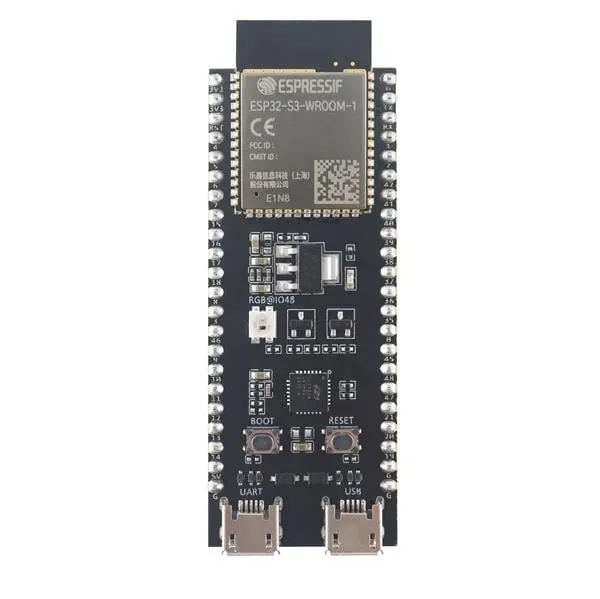
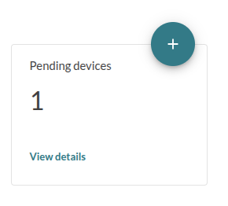
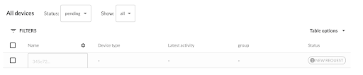
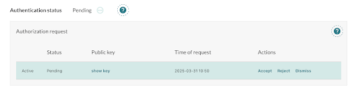
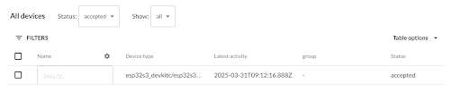

We will build and flash a Zephyr firmware for an ESP32-S3-DevKitC board. By the end of this section, your device will boot and show up as **pending** in your Mender server (hosted Mender), ready to be accepted.

## Prerequisites

* **ESP32-S3-DevKitC board** and a USB cable to connect it to your computer.
* **Zephyr development environment** installed on your workstation (including west, CMake, ESP32 toolchain, etc.). Follow the [Zephyr getting started guide for your hardware](https://docs.zephyrproject.org/latest/boards/espressif/esp32s3_devkitc/doc/index.html) to set up the build tools.
* **Tenant token** in your hosted Mender account: Sign in to [hosted Mender](https://hosted.mender.io). Find your **Organization token (aka. Tenant token)** in the hosted [Mender UI](https://eu.hosted.mender.io/ui/settings/organization-and-billing) (go to your user menu → **My organization** → **Organization token**). Copy this token, and we will insert it into the firmware build.
* **WiFi network credentials:** Since the ESP32-S3 board will use WiFi to connect to the internet, have your WiFi SSID and password ready.
* **Mender Artifact tool:** Install the **mender-artifact** tool on your workstation. This is used to create Artifact (.mender) files that contain the software for deployment.  Download and install `mender-artifact` by [following the instructions here](https://docs.mender.io/downloads#mender-artifact).





## Step 1 – Set up the project and code

First, we'll obtain the reference Zephyr application that integrates Mender. We will use the official **mender-mcu integration example** for this tutorial, which already has Mender support and sample code for the ESP32-S3.

**mender-mcu** is the core library that implements Mender’s OTA update functionality designed for devices running Zephyr. It provides the essential client APIs, state machine, and Update Module support needed to perform firmware updates. **mender-mcu-integration** is a Zephyr workspace that incorporates the mender-mcu library along with example application code and configuration. It serves as a reference implementation, showing you a complete example on how to integrate the Mender MCU client into your own Zephyr projects.

**Initialize a west workspace** for the Mender MCU integration project. Open a terminal and run:

```bash
west init mender-mcu-workspace --manifest-url https://github.com/mendersoftware/mender-mcu-integration
cd mender-mcu-workspace
west update
```

This will pull all necessary repositories, including the mender-mcu module and the example application. The workspace will contain a Zephyr project configured for the ESP32-S3 (among other boards).

**Configure network credentials and Mender tenant token:** We will set the WiFi SSID, WiFi password, and Mender tenant token via build arguments for simplicity. Prepare the following environment variables (replace the first three with your actual values):

```bash
export WIFI_SSID="YourWiFiSSID"
export WIFI_PASS="YourWiFiPassword"
export TENANT_TOKEN="paste-your-Hosted-Mender-token-here"
export ARTIFACT_NAME="release-1"
```

These will be passed into the build to configure the device's WiFi connection and authentication with hosted Mender. The example uses these to configure the Zephyr WiFi driver and the Mender client token.

**Prepare the Espressif firmware blobs:** We will use WiFi, which requires firmware blobs to be prepared. Do so by running:

```bash
west blobs fetch hal_espressif
```

## Step 2 – Build and flash the firmware

Now we will compile the Zephyr application with Mender support and flash it to the board. The mender-mcu integration repository comes with build presets for our board, including MCUboot. We will use a single west command to build both the bootloader and application, then flash them.

**Build the firmware** using west. In the same terminal (ensure the environment variables from above are still set), run:

```bash
west build --sysbuild mender-mcu-integration -- \
  "-DCONFIG_MENDER_APP_WIFI_SSID=\"${WIFI_SSID}\"" \
  "-DCONFIG_MENDER_APP_WIFI_PSK=\"${WIFI_PASS}\"" \
  "-DCONFIG_MENDER_SERVER_TENANT_TOKEN=\"${TENANT_TOKEN}\"" \
  "-DCONFIG_MENDER_ARTIFACT_NAME=\"${ARTIFACT_NAME}\""
```

!!! Note: This build may take a few minutes the first time as it fetches and compiles Zephyr, MCUboot, and the Mender MCU client.

Let's break down this command:
* `west build --sysbuild mender-mcu-integration` tells west to build the project (located in the mender-mcu-integration directory) using [Zephyr's system build](https://docs.zephyrproject.org/latest/build/sysbuild/index.html) (which will compile MCUboot and the app together).
* The `--` and subsequent `-D...` options pass CMake cache values to the build. Here, we set the WiFi SSID (`CONFIG_MENDER_APP_WIFI_SSID`), WiFi password (`CONFIG_MENDER_APP_WIFI_PSK`), and the Mender tenant token (`CONFIG_MENDER_SERVER_TENANT_TOKEN`) to the values we set earlier. These correspond to Kconfig options used in the project's `prj.conf` for configuring WiFi and Mender.


The command will produce two binaries: one for MCUboot (the bootloader) and one for the application firmware. Zephyr will also automatically sign the application with a default key to make it compatible with MCUboot.

**Flash the device:** If the build succeeds, flash the firmware to the ESP32-S3 board. Ensure your board is connected via USB to the **port labeled "UART"** and in the appropriate programming mode if required (ESP32-S3 typically enters programming mode automatically via DTR/RTS signals). Once this is done, run:

```bash
west flash
```

This will reset the board and upload the bootloader and the application to the correct flash partitions (using the esptool backend for ESP32).

**Monitor the serial output (optional):** You can open a serial monitor to watch the device boot. For ESP32, west provides a monitor integration. Run this in a separate terminal:

```bash
west espressif monitor
```

You should see log output from MCUboot and then the Zephyr application. On first boot, the logs may show the device connecting to WiFi and attempting to authorize with the Mender server (using the provided tenant token). If all goes well, it will log something like `<err> mender: [401] Unauthorized: dev auth: unauthorized`. Those authentication errors are expected at this step as the device is not yet authorized in the Mender server.

## Step 3 – Authorize the device in Mender

When the device starts up with the Mender client, it will automatically try to connect to the Mender server. Because this is a new device, it will appear as **pending** in your hosted Mender account. We must accept the device to become authorized and receive deployments.

1. **Log in to hosted Mender**. On the **Dashboard** tab you should see one device pending authorization. Click **View details** and you should see an entry for your ESP32-S3 device. It will be identified by its **identity** which by default is the MAC address: `mac=XX:XX:...` and have a status "pending."



2. **Accept the device:** Select the pending device and **Accept** it. After accepting, the device will appear on the Device groups tab on the left of Pending.





After accepting, the device is fully provisioned in Mender. The Mender client on the device will be informed that it's authorized and will proceed to report inventory and listen for deployment instructions.



## Done\!

At this point, your ESP32-S3 board is connected to hosted Mender – it is running Zephyr firmware with Mender enabled and is recognized by the server. In the Mender UI, you can click on the device to inspect its inventory. You are now ready to deploy an update to this device.
