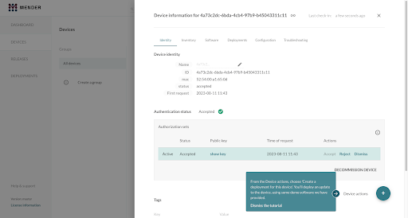

## Deploy a firmware update

Now that Mender is running on your device, let's deploy new firmware. We will make a simple change to the Zephyr application by modifying the “Hello World” message, build a new firmware image, and use Mender to deliver this update OTA to the ESP32-S3 board.

We will increment the "version" of our firmware by changing the Artifact name, create a Mender *Artifact* for the new firmware, upload it to the server, and create a deployment for our device. The device will download the update, install it, and reboot into the new firmware. MCUboot will swap the new image into place, the device will run the new firmware and mark the update as successful.

### Step 1 – Modify the firmware

Let's introduce a simple change to the firmware to recognize the new version. The example mender-mcu-integration project prints a “Hello World” message upon startup, which we will change.

Open the source code of the application. In the workspace, open `mender-mcu-integration/src/main.c` in a text editor. Change the line

```bash
printf(”Hello World! %s\n”, CONFIG_BOARD_TARGET);
```

to

```bash
printf(”Hello updated World! %s\n”, CONFIG_BOARD_TARGET);
```

Ensure you save your changes to the source code.

### Step 2 – Rebuild the firmware

Now, compile the modified firmware. We will use the same build directory for simplicity. In the terminal, set the new version and rerun the west build:

```bash
export ARTIFACT_NAME="release-2"
west build --sysbuild --domain mender-mcu-integration -- -DCONFIG_MENDER_ARTIFACT_NAME=\"$ARTIFACT_NAME\"
```

!!! Note: We don’t need to pass any extra parameters to the `west build` command since they were cached from the last build. We use `--domain` parameter to rebuild only the application (not the bootloader).

The build system will recompile any changed source files and produce a new `zephyr.signed.bin` and generate the Mender Artifact together with the binary. Since we changed the code and the artifact name setting, both the binary and the Artifact will represent "version 2" of our firmware.

**Do not flash the device manually.** We will let Mender deliver this update. The new binary image is in the build directory (e.g., `build/mender-mcu-integration/zephyr/zephyr.signed.bin`).

### Step 3 – Upload and deploy the update from Mender

With our *Artifact* ready, we'll now use the Mender server to deploy it to the device. We'll do this using the hosted Mender web interface:

1. **Upload the *Artifact*:** In the [hosted Mender UI](https://hosted.mender.io/ui/), go to the **Releases** tab. Click the **Upload** button. In the dialog, either drag and drop the `demo-v2.mender` file or click to browse and select it. You can give the release a name when prompted, but sticking with the default is fine. After uploading, you should see a new release entry (e.g., "demo-v2") in the Releases list.
2. **Create a deployment:** Now navigate to the **Devices** section and find your device (it should be in the Accepted Devices list). In the Device information view for the device you just connected, select **Create a deployment for this device** from the **Device actions**.



3. This will start the deployment wizard. Since we create a deployment for the specific device, the **Select a device group to target** should be filled in. Choose the release you uploaded: "release-v2". Review the configuration and start the deployment.
4. **Monitor the deployment:** You should see the new deployment listed with the status "Pending" or "In progress." After a short time, it should change as the device downloads and installs the update:
   * The device will download the Artifact. You might see its LED flicker as it writes flash, or you can watch the serial console, which will show logs of download progress.
   * Once downloaded, the client will instruct MCUboot to prepare for an update and reboot the device.
   * The deployment status on the server might show as "Rebooting" then "In progress."
   * The device reboots into MCUboot, which swaps in the new image and boots it as a test image.
   * The Mender client on the device starts up in the new firmware and reports to the server that it's running the new artifact "release-v2". Assuming no issues, it then marks the update as successful.
   * The server's deployment status should eventually become **Finished** (successful). If using hosted Mender, you'll see the deployment move to the "Finished" tab with a status of "Success."
5. **Verify the new firmware on the device:** You can now check that the device is indeed running the updated firmware:
   * In the hosted Mender UI, under the Devices tab, look at the device's inventory or details. Once the device reports inventory after the update, the current **Software** (artifact name) should update to "release-v2".
   * If you have the serial monitor running, you would have seen the new log message `"Hello updated World!"` appear after the reboot, confirming the code change.

### Done\!

Congratulations – you have successfully deployed a new firmware to your microcontroller via Mender\! 🎉
After the deployment finishes, your device will run the new application code you provided. The update was applied in a robust manner: if the new firmware had failed to start, MCUboot would have rolled back to the previous version automatically on reboot. The new firmware is now permanent because everything went well and the client confirmed the update.

You can repeat the process to iterate on your firmware. For example, try changing the message again or toggling an LED, then create a new artifact (e.g. "release-v3") and deploy it. Each time, ensure the Artifact name and device type are set correctly.

## Summary and next steps

In this get started guide, we prepared a Zephyr-based microcontroller for OTA updates with Mender and successfully performed an update. We covered:
* Integrating the Mender MCU client and MCUboot into a Zephyr project.
* Connecting an MCU device to hosted Mender and authorizing it.
* Creating and deploying a firmware update using Mender Artifacts of type zephyr-image.

For now, you can continue exploring by:
* Trying [different boards](https://github.com/mendersoftware/mender-mcu-integration?tab=readme-ov-file#build-the-project-for-other-boards) (ensure they have MCUboot support; you may use the same project and build for a different board if supported).
* Diving into the code: examine how the Mender client is initialized in the Zephyr app (the integration example provides insight into the API usage).
* Providing feedback on the preview via [Mender Hub](https://hub.mender.io/) if you encounter issues or have suggestions.

With microcontroller support, Mender extends robust OTA updates to a new class of devices, enabling unified update management across both Linux and constrained edge devices. Happy updating\!
