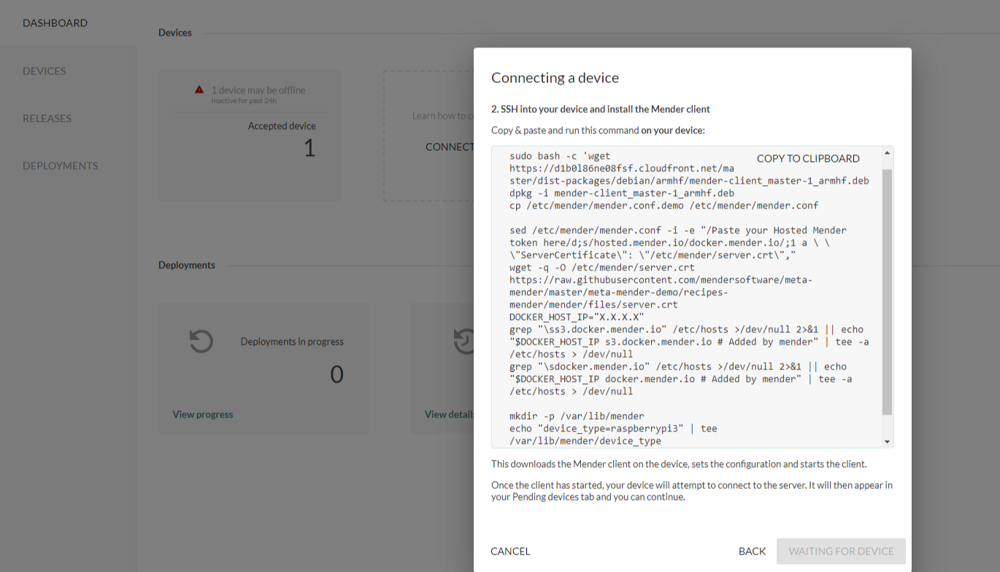
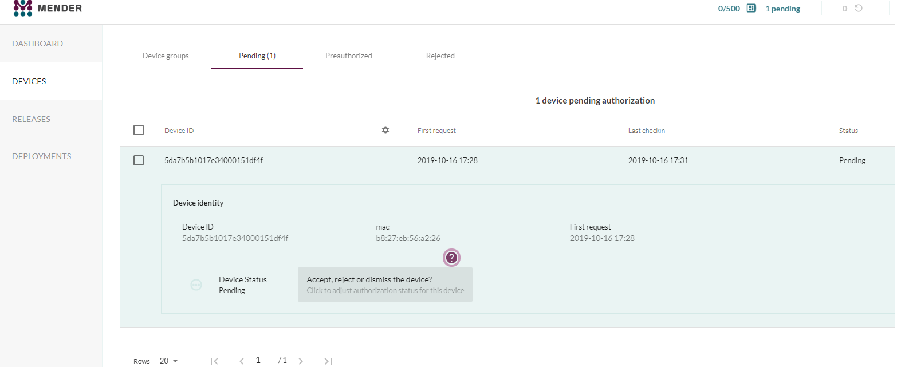
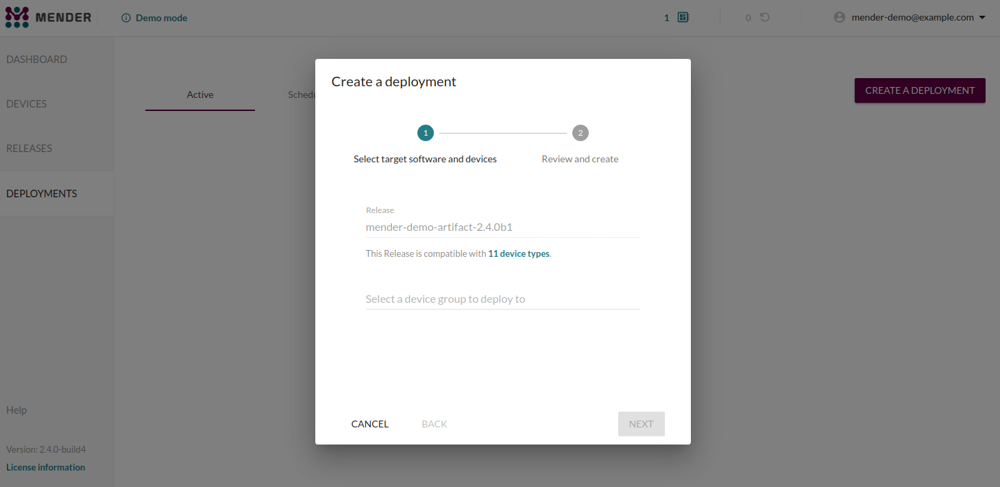
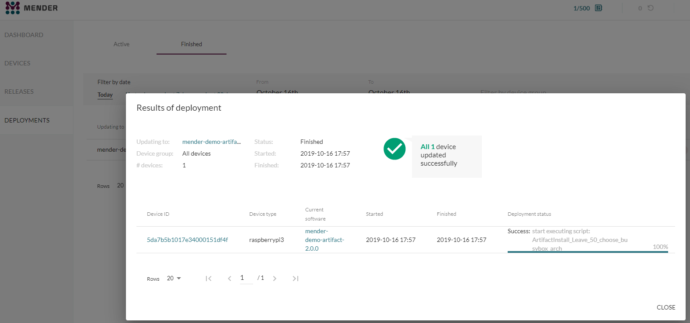
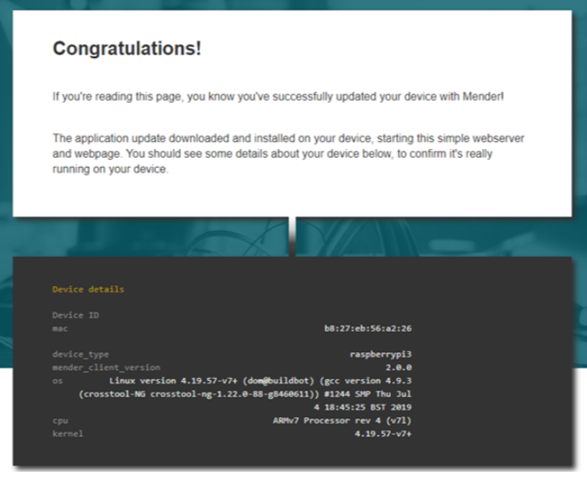
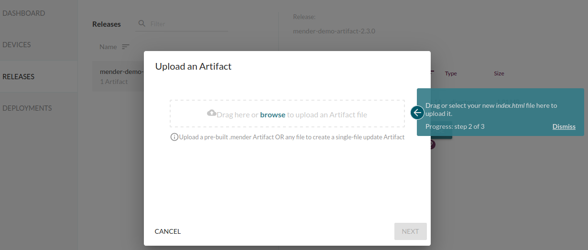

Quickly and easily deploy your first over-the-air (OTA) software update with Mender using a secure server we host for you. We will take you through installing Mender on your device and deploying a simple *application* update on your Raspberry Pi and Raspbian OS. We also outline the easiest way to do a full *system* update.


## Prerequisites

To follow this guide, you will need the following:

* A [Raspberry Pi 3 Model B](https://www.raspberrypi.org/products/raspberry-pi-3-model-b?target=_blank) or [B+](https://www.raspberrypi.org/products/raspberry-pi-3-model-b-plus?target=_blank).
* An 8 GB or larger microSD card.
* A Raspberry Pi [universal power supply](https://www.raspberrypi.org/products/raspberry-pi-universal-power-supply?target=_blank) or a micro USB cable.
* Internet connectivity for your Raspberry Pi (either Ethernet or wifi available)
* A [hosted Mender](https://hosted.mender.io?target=_blank) account

### Get a hosted Mender account

Get a hosted Mender account by [signing up here](https://mender.io/signup?target=_blank).

!!! We provide $120 free credit for you to use for evaluation. You can cancel at any time without incurring a cost while your usage remains under $120.

You can also try it on-premise, but it requires more effort getting setup. See the [on-premise instructions below](#running-mender-on-premise).


### Prepare your Raspberry Pi 3

First we flash a Raspbian image that has Mender integrated to the SD card and configure it. This should take less than 15 minutes.

The only difference from the official Raspbian image is that it has been converted to support robust A/B system updates and the Mender client has been installed. Note that the image will only work on *Raspberry Pi 3*, for now.

!!! If you have a different board than the Raspberry Pi 3 you can still follow the Mender product onboarding tooltips and deploy a demo application to your device. But you will not be able to do system updates without Mender integration later on.

* Download the [Raspbian OS image with Mender integrated][raspbian-buster-lite-mender.img.xz].
* [Follow the steps](https://www.raspberrypi.org/documentation/installation/installing-images?target=_blank) to flash the OS image to your device (e.g. choose "Use custom" and browse to the downloaded Mender Raspbian image if using the Raspberry Pi Imager).

<!--AUTOVERSION: "mender-%.img.xz"/mender-convert-client -->
[raspbian-buster-lite-mender.img.xz]: https://d4o6e0uccgv40.cloudfront.net/2020-02-05-raspbian-buster-lite/arm/2020-02-05-raspbian-buster-lite-mender-master.img.xz

Boot the device with the newly flashed SD card, then:
* Connect your device to the Internet, e.g. [using WiFi](https://www.raspberrypi.org/documentation/configuration/wireless/wireless-cli.md?target=_blank).
* [Enable local SSH access](https://www.raspberrypi.org/documentation/remote-access/ssh/README.md?target=_blank) on your device. You may instead attach a keyboard and monitor to the device directly, but then you can not easily copy and paste the following instructions.


Your first application deployment is easy with 5 short steps:


### Step 1 - SSH into your Raspberry Pi device

SSH into your device:

```bash
ssh pi@<DEVICE-IP-ADDRESS>
```

The default password for the pi account is `raspberry`.

You should now see a command prompt similar to the following:

```bash
pi@raspberrypi:~ $
```

Keep this terminal open as we will shortly use it to install the Mender client.

### Step 2 - Login to hosted Mender

Login to your [hosted Mender](https://hosted.mender.io?target=_blank) account, and when on the main page for the first time new users will get a tutorial in the Mender web GUI.

Go to the **Dashboard** tab and click on **Connect a device**. Then Click on **Connect my own device**. Select your Raspberry Pi model and click **Next**. You should see a screen similar to the one below. Keep this open as we will use it in the next step.




### Step 3 - Install the Mender client on your device

Next we will install the Mender client on your device and connect it to the Mender server.

In the dialog box from step 2, click **Copy to clipboard** to copy the code to install the Mender client. Now go to the command line on your device from step 1, and **paste** the code e.g. by right-clicking in the terminal and selecting *Paste*, followed by *Enter*.

This downloads the Mender client on the device, configures and starts it.

!!! If you get a file conflict warning for `/etc/mender/artifact_info` during this step, type *N* and *Enter*.

Once the client has started, the Mender client will attempt to connect to the server and it will appear in your Pending devices tab in the server. Go ahead and **Accept** the pending device in the server. After accepting the device, it will appear on the Device groups tab on the left of Pending.




### Step 4 - Create a Deployment

There is already a mender-demo Artifact available under *Releases* the first time you use Mender. It contains a small web server your device can run.

Go to the **Deployments** tab and select the target release already available and click **Create deployment** as shown below.



After about 30 seconds you see your finished deployment in the *Finished* tab. There should also be a tooltip to the URL of your deployed web server.



Once you access your device using the URL shown in the tooltip under the *Finished* tab you should see a welcome page similar to the following.



**Congratulations!** You have successfully deployed an application update using Mender!


### Step 5 - Modify the application

The onboarding tooltips should now take you through modifying the web page you saw in step 4.
You should be asked to upload your modified web page as shown below.



Simply follow the tooltips to update your newly deployed application!

!!! If the device type for the update is not filled in automatically, type `raspberrypi3`.


### Step 6 - Take system snapshots and deploy system level updates

So far we have deployed application updates. However, Mender also supports robust system level updates with rollback that you can test out. If you used the Raspberry Pi 3 image with Mender integrated, it already supports system level updates as well!

The easiest way to create system level updates is to use the *snapshot* functionality in Mender, which will create a snapshot of the full system on a currently running device and package it as a Mender Artifact (.mender file) that you can deploy to other devices.

To try it out, first follow the steps to [download and install the mender-artifact tool](../../downloads#mender-artifact) on your workstation (e.g. laptop).
Then run the following command on your workstation:

```bash
USER="pi"
ADDR="<DEVICE-IP-ADDRESS>"  # replace with the local IP address of your Raspberry Pi (same as in step 1 above)

mender-artifact write rootfs-image -f ssh://$USER@$ADDR \
                                   -n system-v1 \
                                   -o system-v1.mender \
                                   -t raspberrypi3  # adjust if you are using a different device
```

! Your device is not usable while the snapshot operation is in progress. Mender will freeze the storage device during this operation in order to create a consistent snapshot.

Depending on your local network and storage speed, this may take 10-15 minutes to finish. You should see a progress indicator, and when it reaches 100% it will package the Mender Artifact which could take a few minutes.

Once complete, you should see a file `system-v1.mender` on your workstation. Upload this on your Mender server, under Releases.
Now make local modifications to the device, e.g. install packages. To revert your device back to the original state,
simply deploy this snapshot to your device again from the Mender server! A full system deployment could take 15-20 minutes, depending on network and storage speed.

You can make arbitrary modifications to the system, take another snapshot and deploy this to groups of devices, and this way deploy robust system updates with rollback support.

To read more about system snapshots see the documentation on [Artifact from system snapshot](../../artifacts/snapshots).


## Running Mender on-premise

For the easiest and fastest experience, we recommend using the hosted version of Mender for your first evaluation. You can also try the same deployment above using the on-premise version by installing a Mender demo server on a host machine, however this will take you a bit longer. You will need to install [Docker Engine](https://docs.docker.com/install/linux/docker-ce/ubuntu?target=_blank) (on device) and [Docker Compose](https://docs.docker.com/compose/install?target=_blank) in your deployment environment.

Next, you will need to download the Mender integration environment in the working directory:

<!--AUTOVERSION: "-b % https://github.com/mendersoftware/integration.git"/integration-->
```
git clone -b 2.3.0 https://github.com/mendersoftware/integration.git integration

cd integration
```

And finally fire up the demo server environment with:

```
./demo up
```

Note that the demo up script starts the Mender services, adds a demo user with the username mender-demo@example.com, and assigns a random password in which you can change after you log in to the Mender web UI. The Mender UI can be found on [https://localhost](https://localhost?target=_blank).

After you log into the UI on the localhost you can follow steps 1 through 6 listed above.

## Have any questions?

If you need help and have any questions:

* Visit our community forum at [Mender Hub](https://hub.mender.io/) dedicated to OTA updates where you can discuss any issues you may be having. Share and learn from other Mender users.

* Learn more about Mender by reading the rest of the documentation.

[Compare plans](https://mender.io/products/pricing?target=_blank) and choose a plan that fits your requirements.
