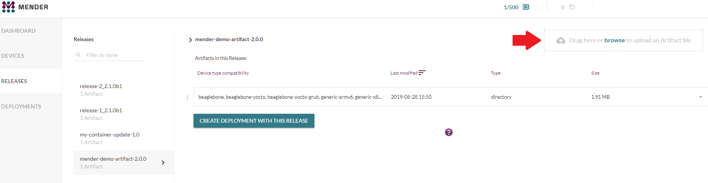

Quickly and easily deploy your first over-the-air (OTA) software update with Mender using a secure server we host for you. We will take you through installing Mender and deploying a simple* application* *update* on your Raspberry Pi and Raspbian OS.

## What you will need

To follow this guide, you will need the following:

* A [Raspberry Pi 3 Model B](https://www.raspberrypi.org/products/raspberry-pi-3-model-b?target=_blank) or [B+](https://www.raspberrypi.org/products/raspberry-pi-3-model-b-plus?target=_blank), or a [Raspberry Pi 4 Model B](https://www.raspberrypi.org/products/raspberry-pi-4-model-b?target=_blank).
* An 8 GB or larger microSD card.
* A Raspberry Pi [universal power supply](https://www.raspberrypi.org/products/raspberry-pi-universal-power-supply?target=_blank) or a micro USB cable.
* An ethernet cable for wired connectivity to the internet (optional).
* A Mender Professional account to access the hosted server.

### Get a Mender Professional account

Get a Mender account by [signing up here](https://mender.io/signup?target=_blank).

!!! We provide $120 free credit for you to use for evaluation. You can cancel at any time without incurring a cost while your usage remains under $120.

You can also try it on-premise, but it requires more effort getting setup. See the [on-premise instructions below](#running-mender-on-premise).

### Prep your device

Make sure your Raspberry Pi has Raspbian OS installed. 

* Download Raspbian OS image from [here](https://www.raspberrypi.org/downloads/raspbian?target=_blank).
* [Follow their steps](https://www.raspberrypi.org/documentation/installation/installing-images?target=_blank) to install the OS image to your device and [enable SSH](https://www.raspberrypi.org/documentation/remote-access/ssh/README.md) on your board. This should take less than 15 minutes.

Let’s get you on your way to your first deployment in as easy as 5 short steps:

### Step 1 - SSH into your Raspberry Pi device 

SSH to access the device and check the latest release of Raspbian OS you’ve installed in the pre-work section as a checkpoint:

```
pi@raspberrypi:~ $ cat /etc/os-release
```

### Step 2 - Login to Mender Professional

Login to your [Mender Professional account](https://hosted.mender.io/ui/#/login?target=_blank), and when on the main page for the first time *new* users will get a tutorial in the Mender web GUI. Existing users will not get the tutorial.

Go to the DASHBOARD tab and click on CONNECT A DEVICE. Then Click on CONNECT MY OWN DEVICE, select your Raspberry Pi model and click NEXT. 


### Step 3 - Install Mender client on your device 

Now the next step is to install the Mender client on your device so that it can talk to the Mender server (hosted version). 

You will need to copy and paste the code from the clipboard into your command line prompt of your environment after you’ve accessed the device (step 1). This downloads the Mender client on the device, sets the configuration and starts the client.

Once the client has started, your device will attempt to connect to the server. It will then appear in your Pending devices tab. Go ahead and Accept the pending device. After accepting the device, it will appear on the Devices group tab on the left of Pending. 


### Step 4 - Upload Mender Artifact file

New users will get a mender-demo artifact containing a mini web app when they sign up for the first time. 

If you don’t see the demo artifact you can download it manually here:

```
wget https://dgsbl4vditpls.cloudfront.net/mender-demo-artifact.mender

```

After downloading the `mender-demo-artifact.mender` file, you will need to upload it to the RELEASES tab by dragging and dropping or by browsing to the location of the file in the top right corner. 



### Step 5 - Create a Deployment 

You can either create a deployment in the RELEASES tab or go to the DEPLOYMENTS tab to do your OTA update. We will go to the DEPLOYMENTS tab and select the target release Artifact file we uploaded in step 4 and click CREATE DEPLOYMENT. After a few seconds you see your finished update in the Finished tab. 


**Congratulations!** You have successfully deployed your simple web application using Mender. You should see the below images. 


## Running Mender on-premise

For the easiest and fastest experience, we recommend using the hosted version of Mender for your first evaluation. You can also try the same deployment above using the on-premise version by installing a Mender demo server on a host machine, however this will take you a bit longer. You will need to install [Docker Engine](https://docs.docker.com/install/linux/docker-ce/ubuntu?target=_blank) (on device) and [Docker Compose](https://docs.docker.com/compose/install?target=_blank) in your deployment environment. 

Next, you will need to download the Mender integration environment in the working directory:

<!--AUTOVERSION: "-b % https://github.com/mendersoftware/integration.git"/integration-->
```
git clone -b 2.2.0 https://github.com/mendersoftware/integration.git integration

cd integration
```

And finally fire up the demo server environment with:

```
./demo up
```

Note that the demo up script starts the Mender services, adds a demo user with the username mender-demo@example.com, and assigns a random password in which you can change after you log in to the Mender web UI. The Mender UI can be found on [https://localhost](https://localhost?target=_blank).

After you log into the UI on the ‘localhost’ you can follow steps 1 through 5 listed above. 

## Have any questions? 

If you need help and have any questions:

* Visit our community forum at [Mender Hub](https://hub.mender.io/) dedicated to OTA updates where you can discuss any issues you may be having. Share and learn from other Mender users.

* Learn more about Mender by reading the rest of the documentation. 

[Compare plans](https://mender.io/products/pricing?target=_blank) and choose a plan that fits your requirements. 

