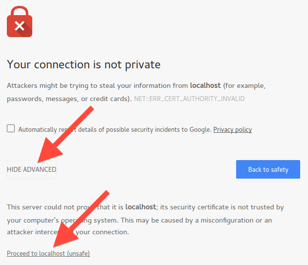

! Following this tutorial will create a demo installation of the Mender, appropriate for testing and experimenting. When you are ready to install for production, please follow the [Production installation documentation](../../administration/production-installation).


## Bring up the environment with Docker Compose

! Make sure you satisfy the [server requirements](../requirements#demo-server-requirements) before proceeding.

In a working directory, download the Mender integration
environment:

[start_autoupdate_integration_archive_x.x.x.tar.gz]: #

```bash
git clone -b master https://github.com/mendersoftware/integration.git integration-master
```

[end_autoupdate_integration_archive_x.x.x.tar.gz]: #

[start_autoupdate_integration-x.x.x]: #

```bash
cd integration-master
```

[end_autoupdate_integration-x.x.x]: #

! Mender currently requires two entries in your `/etc/hosts` file to work with the Docker networking (typically `127.0.0.1 s3.docker.mender.io` and `127.0.0.1 docker.mender.io`). If these entries do not exist as you run the `up` script (below), it will create them for you and thus might ask for your administrative password. If you want to avoid automatic creation, you can create the entries in advance; look inside the script for the details how it is created on your host.

Mender comes with a wrapper script that brings up the environment with
Docker Compose. Running this script will pull down the images and start them:


```bash
./up
```

!!! If this is the first time you start the Mender server, several gigabytes of Docker images may need to be downloaded. On a 100Mbit Internet connection this may take 5 minutes.

After the Docker images have been downloaded, the Mender services start up and you will see a lot of log messages from them in your terminal.
This includes output from the Mender virtual device.
A few minutes later, the logs will stop coming except for some periodic log messages
from the Mender `mender-device-auth` and `mender-api-gateway` services.


## Create the initial user

! Wait until the Mender server has started before proceeding.

The UI requires you to log in with a valid username and password. You must first create a Mender user via a CLI provided by the User Administration Service. The service's binary is embedded in a Docker container, so to execute it you will issue the **exec** subcommand of docker-compose, e.g.:

```bash
sudo ./demo exec mender-useradm /usr/bin/useradm create-user --username=myusername@example.com --password=mysecretpassword
```

!!! For Mender on-premise installations, your email and password are currently only used to log in to the Mender server. You will not receive any email from Mender. However, this might change in future versions so we recommend to input your real email address.


## Open the Mender UI

For security reasons, the Mender gateway only allows secure connections using TLS,
both for communicating with devices and end users.
Your web browser will communicate directly with the gateway while using the
Mender UI and therefore the certificate the gateway is using needs to be trusted
by your web browser.

The Mender UI can now be found on [https://localhost/](https://localhost/?target=_blank) -
simply open it in your web browser and **accept the certificate**. In Chrome it should look
like the following:



Log in with your email and password you created above.

**Congratulations!** You have the Mender server and a virtual Mender client successfully running!
Please proceed to [Deploying to virtual devices](../deploy-to-virtual-devices).
