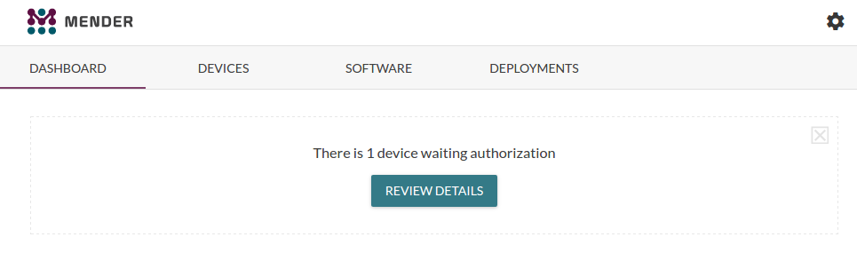

!! This tutorial should only used in an internal environment (e.g. on your workstation) for testing purposes. Several important security features need to be implemented before using the Mender server in production, including random generation of keys, user authentication for managing deployments and more.

Mender consists of a [server and updater client](../../Architecture/overview).
The Mender server is using the microservices design pattern, meaning that
multiple small, isolated services make up the server. The Mender updater client
is designed to run on embedded Linux devices and connects to the server
so that deployments can be managed across many devices.

In order to make it easy to test Mender as a whole, we have created a
docker compose environment that brings all of these components up
and connects them together. It even includes a service that runs a
virtual device using [Quick Emulator (QEMU)](http://qemu.org?target=_blank),
which is handy because it means that you can test the client without
having to configure any hardware.


## Prerequisites

#### OS and web browser

We assume you are using **Ubuntu 16.04** with **Google Chrome** as web browser
and at least **5 GB disk** and **2 GB RAM** available.

#### Docker Engine 1.10

Follow the [documentation to install Docker Engine](https://docs.docker.com/engine/installation/linux/ubuntulinux/?target=_blank),
version **1.10 or later**.


#### Docker Compose 1.7

Follow the [documentation to install Docker Compose](https://docs.docker.com/compose/install/?target=_blank),
version **1.7 or later**.

#### Fast Internet connection

While bringing up the environment, several hundred megabytes of docker
images may be downloaded. We recommend using a fast Internet
connection in order to avoid long wait times.

! Currently, the web browser you use to interact with the Mender UI needs to have internet connectivity because the Mender UI uses some fonts and icons obtained from Google APIs. This internet dependency will be removed very soon.

!!! It is very likely possible to use the test environment on other platforms, versions, or with less resources. We recommend using this exact environment for testing Mender because it is known to work and you will thus avoid any issues specific to your test environment if you use this reference.


## Bring up the environment with docker compose

In a working directory, clone the Mender integration
environment:

```
git clone -b stable git://github.com/mendersoftware/integration
```

```
cd integration
```

You should see a file `docker-compose.yml` inside it, which defines the
Mender test environment.

!!! This terminal will be locked while Mender is running as it will output logs from all the services.

! Mender currently requires two entries in your `/etc/hosts` file to work with the docker networking (typically `127.0.0.1 s3.docker.mender.io` and `127.0.0.1 docker.mender.io`). If these entries do not exist as you run the `up` script (below), it will create them for you and thus might ask for your administrative password. If you want to avoid automatic creation, you can create the entries in advance; look inside the script for the details how it is created on your host.

Mender comes with a wrapper script that brings up the environment with
docker compose. Running this script will pull down the images and start them:


```
./up
```

As the Mender services start up, you will see a lot of log messages from them in your terminal.
This includes output from the Mender virtual QEMU device, similar to the following:

> ...  
> mender-client_1             | Hit any key to stop autoboot:  0   
> mender-client_1             | 3485592 bytes read in 579 ms (5.7 MiB/s)  
> mender-client_1             | 14249 bytes read in 169 ms (82 KiB/s)  
> mender-client_1             | Kernel image @ 0x70000000 [ 0x000000 - 0x352f98 ]  
> mender-client_1             | ## Flattened Device Tree blob at 6fc00000  
> mender-client_1             |    Booting using the fdt blob at 0x6fc00000  
> mender-client_1             |    Loading Device Tree to 7fed9000, end 7fedf7a8 ... OK  
> mender-client_1             |   
> mender-client_1             | Starting kernel ...  
> mender-client_1             |   
> mender-client_1             | Booting Linux on physical CPU 0x0  
> mender-client_1             | Initializing cgroup subsys cpuset  
> ...  
> mender-client_1             | Poky (Yocto Project Reference Distro) 2.1.1 vexpress-qemu ttyAMA0

After a few minutes, the logs will stop coming except for some periodic log messages
from the Mender authentication service similar to the following:

> mender-api-gateway_1        | 172.18.0.4 - - [07/Oct/2016:03:59:50 +0000] "POST /api/devices/0.1/authentication/auth_requests HTTP/2.0" 401 150 "-" "Go-http-client/2.0" "-"  
> mender-device-auth_1        | time="2016-10-07T03:59:55Z" level=error msg="unauthorized: dev auth: unauthorized" file="api_devauth.go" func="main.(*DevAuthHandler).SubmitAuthRequestHandler" http_code=401 line=142 request_id=df3bc374-060b-4b15-af89-76c85975ab25  
> mender-device-auth_1        | time="2016-10-07T03:59:55Z" level=info msg="401 4438μs POST /api/0.1.0/auth_requests HTTP/1.0 - Go-http-client/2.0" file=middleware.go func="accesslog.(*AccessLogMiddleware).MiddlewareFunc.func1" line=58 request_id=df3bc374-060b-4b15-af89-76c85975ab25

These messages show that the Mender client running inside the virtual QEMU device
is asking to be authorized to join the server. We will come back to this shortly.


## Open the Mender UI

For security reasons, the Mender gateway only allows secure connections using TLS,
both for communicating with devices and end users.
Your web browser will communicate directly with the gateway while using the
Mender UI and therefore the certificate the gateway is using needs to be trusted
by your web browser.

!! Currently Mender uses a default certificate for its gateway. This is insecure because anyone can gain access to the private key corresponding to the certificate (it is stored on the gateway and the same for all installations). This will shortly be remediated by auto-generating keys as Mender is installed.

The Mender UI can now be found on [https://localhost:8080/](https://localhost:8080/?target=_blank) -
simply open it in your web browser and **accept the certificate**. In Chrome it should look
like the following:


After accepting the certificate, you should see a page similar to the following:



**Congratulations!** You have the Mender server and a virtual Mender client successfully running!
Please proceed to [Deploy to virtual devices](../Deploy-to-virtual-devices).

You can find some steps for maintaining your test environment below.


## Stop the Mender services

When you are done testing Mender, simply press **Ctrl-C** in the terminal
you started Mender in, where the log output is shown. Stopping all the
services may take about a minute.

Mender can be started again with the same steps as above.


## Clean up the environment and get the latest version

!! You will lose all state data in your Mender environment by running the commands below, which includes devices you have authorized, software uploaded, logs, deployment reports and any other changes you have made.

If you want to remove any state in your Mender environment and start clean
with the latest version of Mender, you can stop Mender and run the following
commands in the `integration` directory:

```
docker-compose rm -v
```

```
git pull
```

```
docker-compose pull
```

After doing this, you can start the latest version of Mender
by following the same steps as above.
