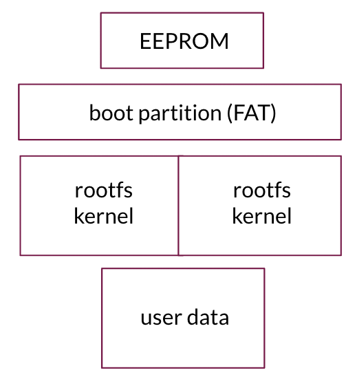

Mender is a client-server solution. Current version enables image based updates with automatic rollback if the update fails.

## Client requirements

The client needs to run on every device that you want to manage with Mender. 

###Yocto project
Although possible to compile and install Mender independently, we have optimized the installation experience for those who build their Linux images using <a href="https://www.yoctoproject.org" target="_blank">Yocto</a>.

###Device capacity
The client binaries, which are written in Go, are around 7 mb in size. 

Our reference board, the <a href="http://beagleboard.org/bone" target="_blank">Beaglebone Black</a> comes with an ARM Cortex-A8 processor, 720 MHz processor. Boards in our continous integration process have 512mb of memory installed.

###Bootloader support
Mender integrates with the bootloader of the device. Currently we support the popular <a href="http://www.denx.de/wiki/view/DULG/UBootBootCountLimit" target="_blank">U-Boot</a>. Besides any special configuration to support the device, U-Boot needs to be compiled and used with a feature known as as <a href="http://www.denx.de/wiki/view/DULG/UBootBootCountLimit" target="_blank">Boot Count Limit</a>. It enables specific actions to be triggered when the boot process fails a certain amount of attempts.

Support for modifying U-Boot variables from userspace is also required so that fw_printenv/fw_setenv utilities are available in userspace. These utilities can be 
<a href="http://www.denx.de/wiki/view/DULG/HowCanIAccessUBootEnvironmentVariablesInLinux" target="_blank">compiled from U-Boot sources </a>and are part of U-Boot.

###Device partitioning
<table border="0">
<tr><td>At least three different partitions are required, one of which is the boot partition, and the remaining two partitions are where both the kernel and rootfs are stored. One of the partitions will be used as active partition, from which the kernel and rootfs will be booted, the second one will be used by the update mechanism to write the updated image. The second partition will be referred to as "inactive" later in this document.

It is also possible to use yet another partition to store persistent user data, so this does not get overwritten during an update.

A sample partition layout is shown below:
</td>
<td>

</td>
</tr>
</table>

## Server requirements

The server consists of various backend services to be installed locally. These services have not yet been released, but they are designed as micro-services with a polling mechinism so the server requirements will depend greatly on the number of devices that is managed.