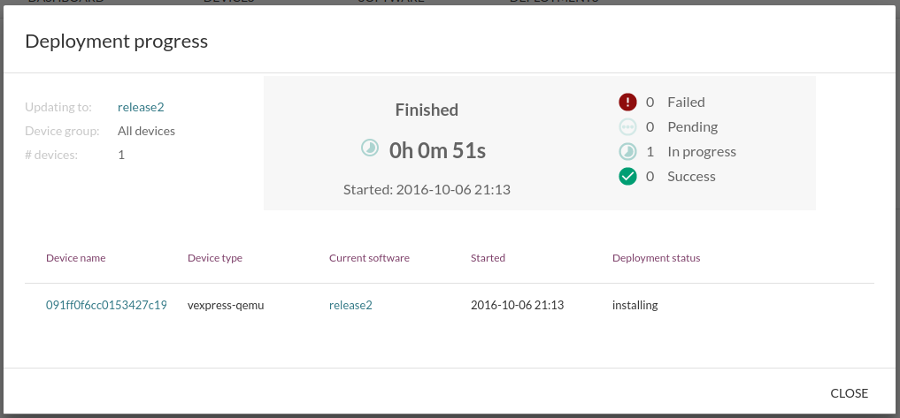

In this tutorial we will show how to use the intuitive Mender server UI
to deploy a full rootfs image update to a virtual device which is
connected to the server. The virtual device is bundled with the
Mender server to make it easy to test Mender.

A Mender Artifact is a file format that includes metadata like the
checksum and name, as well as the actual root file system that is
deployed. See [Mender Artifacts](../../Architecture/Mender-Artifacts) for
a complete description of this format.

## Prerequisites

The test environment should be set up and working successfully
as described in [Create a test environment](../Create-a-test-environment).

## Authorize the device

Open the Mender UI in the same browser as you accepted the certificate
in as part of [Create a test environment](../Create-a-test-environment).
It is available at [https://localhost:8080/](https://localhost:8080/?target=_blank).

There should be a virtual device that is waiting authorization.
This means that the Mender client, which runs as a daemon on the device,
is asking to join the Mender server so that the server can manage
its deployments. You can also see these requests
in the server access logs in the terminal where you started the
Mender server.

You can review the device before authorizing it to join the server.
When you are ready, simply click the **Authorize** button
in the **Devices** tab.

! There are security implications to connecting a client and server for the first time, also known as *bootstrapping*. If a client and server have not exchanged any information in advance, they need to accept each other on trust this first time, with the risk that the information the other party presents is spoofed. To mitigate this risk, the Mender client preinstalls the TLS certificate of the server when it is provisioned, as part of the Yocto Project image build. So it is not possible for a rogue server to intercept the connection from a client or pretend to be a different server, assuming server's private TLS key is securely managed. A rogue device can still spoof the information it sends to the server in order to be authorized, and this is why Mender asks you to make the authorization decision. However, the risk of letting the server manage a rogue device is much lower than the risk of a rogue server managing devices.

## See information about the device

Mender automatically collects identity and inventory information
about the connected devices. You can view this information by
clicking on a device. It should look similar to the following:

!!! Which information is collected about devices is fully configurable; see the documentation on [Identity](../../Client-configuration/Identity) and [Inventory](../../Client-configuration/Inventory) for more information.

You can also see that the `artifact_name` is `mender-image-1.0`.

After deploying the update below, you can verify that this `artifact_name` has changed.

!!! The device console can be seen by running `sudo docker logs $(sudo docker ps | grep mender-client | cut -f1 -d' ')`.

## Upload a new Mender Artifact to the server

Before we can deploy a new Artifact to devices, it needs
to be uploaded to the server. Any Artifact that
can be used, and steps to build one are provided at
[Building a Mender Yocto Project image](../../Artifacts/Building-Mender-Yocto-image).

To make testing easier, a Mender Artifact that can be used with
the virtual device is provided for download at
[https://d1b0l86ne08fsf.cloudfront.net/stable/vexpress-qemu/vexpress_release_2.mender](https://d1b0l86ne08fsf.cloudfront.net/stable/vexpress-qemu/vexpress_release_2.mender).

After the download finishes, go back to the Mender server UI,
click the **Artifacs** tab and upload this Mender Artifact.

Please fill in the following:

* Name: `release-2`
* Description: `My test build`

!!! Both these fields are just informational, to make it is easier to recognize Artifacts after they have been uploaded. Their contents do not affect deployments.

In the UI it should look something like this:

!!! All devices report which *Device type* they are as part of their inventory information, for example `vexpress-qemu` or `beaglebone`. In adition, Mender Artifacts have *Device types compatible* as part of their metadata. During a deployment, Mender makes sure that a device will only get and install an Artifact it is compatible with. This increases the robustness of Mender as it avoids situations like deploying software that is not supported by the device hardware.

## Deploy the Mender Artifact to the device

Now that we have the device connected and the Artifact
uploaded to the server, all that remains is to go to the
**Deployments** tab and click **Create a deployment**.

You will be asked which Artifact to deploy and which
group of devices to deploy it to. Since we have just
one Artifact and no custom groups right now, we simply select
the Artifact we just uploaded and **All devices**, then
**Create deployment**.

!!! It may take a few seconds until the deployment shows up. You can also refresh your browser to see it immediately.

## See the progress of the deployment

As the deployment progresses, you can click on it to view more details about the current status across all devices.
In the example below, we can see that the device is in process of installing the Artifact.

!!! The deployment to the virtual device should take about 2-3 minutes to complete and report success or failure.

## Verify the deployment

Once the deployment completes, you should see it in *Past deployments*.
If the deployment fails you can view the deployment log,
which is obtained from the device, to diagnose the issue.
You can also see the state of deployments on the Dashboard.
In **Devices** you can see that `artifact_name` has now changed to `release-2`.

This shows your virtual device runs the new rootfs!

## Deploy another update

For robustness and avoiding unnecessary deployments, Mender
will not deploy an Artifact that is already installed on a device.
Thus, if you create another deployment with the Artifact you already
uploaded, Mender will see that it contains the same rootfs
that is already installed and skip the deployment. It will
immediately be marked as successful and moved to *Past deployments*.

For this reason, we provide another Artifact that you can use
to deploy with at [https://d1b0l86ne08fsf.cloudfront.net/stable/vexpress-qemu/vexpress_release_1.mender](https://d1b0l86ne08fsf.cloudfront.net/stable/vexpress-qemu/vexpress_release_1.mender).

Go to **Artifacts** again and upload with the following fields:

* Name: `release-1`
* Description: `My original build`

After the Artifact has been uploaded, you can deploy it to your device,
as you did earlier.

Following this, you can deploy the `release-2` Artifact again, and so forth.

## Deploy to custom groups

As you might have noticed, it is possible to create
groups in the **Devices** tab. Once you have created a
group and added one or more devices to it, you can deploy
an Artifact to that group by selecting the group instead
of *All devices* when you create a deployment.

This can be very useful in order to deploy to test devices
before production, or only deploy to devices owned by a specific customer.

! To avoid accidents, Mender only allows **a device to be in one group at the time**. If a device could be in several groups, for example test *and* production, unintended deployments and downtime could occur. Therefore, as a safety measure, Mender does not allow this.

## Deploy to physical devices

**Congratulations!** You have used the Mender server to deploy your first managed update!
If you have a BeagleBone Black, you can proceed to
[Deploy to physical devices](../Deploy-to-physical-devices) to try out deploying to a
real-world device!
