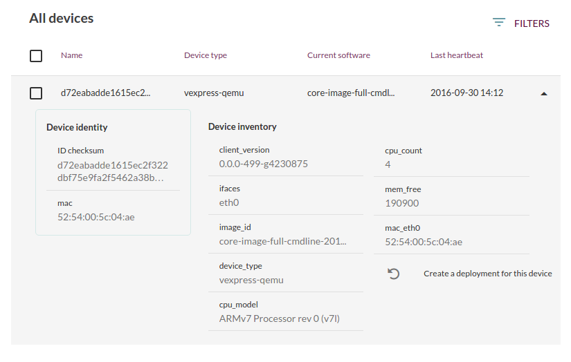

In this tutorial we will show how to use the intuitive Mender server UI
to deploy a full rootfs image update to devices which are
connected to the server.

## Prerequisites

The test environment should be set up and working successfully
as described in [Create a test environment](../Create-a-test-environment).

## Authorize the device

Open the Mender UI in the same browser as you accepted the certificate
in as part of [Create a test environment](../Create-a-test-environment).
It is available at [http://localhost:8080/](http://localhost:8080/?target=_blank).

There should be a virtual device that is waiting authorization.
This means that the Mender client, which runs as a daemon on the device,
is asking to join the Mender server so that the server can manage
its deployments. You can also see these requests
in the server access logs in the terminal where you started the
Mender server.

You can review the device before authorizing it to join the server.
When you are ready, simply click the **Authorize** button
in the **Devices** tab.

! There are security implications to connecting a client and server for the first time, also known as *bootstrapping*. If a client and server have not exchanged any information in advance, they need to accept each other on trust this first time, with the risk that the information the other party presents is spoofed. To mitigate this risk, the Mender client preinstalls the TLS certificate of the server when it is provisioned, as part of the Yocto Project image build. So it is not possible for a rogue server to intercept the connection from a client or pretend to be a different server, assuming server's private TLS key is securely managed. A rogue device can still spoof the information it sends to the server in order to be authorized, and this is why Mender asks you to make the authorization decision. However, the risk of letting the server manage a rogue device is much lower than the risk of a rogue server managing devices.

## See information about the device

Mender automatically collects identity and inventory information
about the connected devices. You can view this information by
clicking on a device. It should look similar to the following:

!!! Which information is collected about devices is fully configurable; see the documentation on [Identity](../../Client-configuration/Identity) and [Inventory](../../Client-configuration/Inventory) for more information.

## Upload a new rootfs image to the server

Before we can deploy a new image to devices, it needs
to be uploaded to the server. Any rootfs image that
includes Mender support can be used, as described in
[Building a Mender Yocto Project image](../../Artifacts/Building-Mender-Yocto-image).

To make testing easier, a demo image that can be used with
the virtual device is provided at
[https://mender.s3.amazonaws.com/latest/demo/vexpress-qemu/core-image-full-cmdline-vexpress-qemu.ext4](https://mender.s3.amazonaws.com/latest/demo/vexpress-qemu/core-image-full-cmdline-vexpress-qemu.ext4).

Now go back to the Mender server UI, click the **Software** tab and
upload the image.

!!! Currently there are quite a few fields to fill out, but this will very soon be simplified to just *Name* and *Description*, the rest being auto-detected.

Please fill in the following:

* Name: `release2` (or choose your own)
* Yocto ID: `test` (required)
* Checksum: `test` (unused for now)
* Device type compatibility: `vexpress-qemu` (required)
* Description: `My first deployment` (or choose your own)

In the end, it should look something like this:

!!! Mender keeps track of which *Device type* an image supports as part of the metadata of an image. In addition, a device reports which Device type it is as part of its inventory information. During a deployment, the Mender server makes sure that a device will only get a image it supports. This increases the robustness of Mender as it avoids situations like deploying images that are not supported by the device hardware.

## Deploy the rootfs image to the device

Now that we have the device connected and the image
uploaded to the server, all that remains is to go to the
**Deployments** tab and click **Create a deployment**.

You will be asked which image to deploy and which
group of devices to deploy it to. Since we have just
one image and no custom groups right now, we simply select
the image we just uploaded and **All devices**, then
**Create deployment**.

## See the progress of the deployment

As the deployment progresses, you can click on it to view more details about the current status across all devices.
In the example below, we can see that the device is in process of installing the new image.

!!! The deployment to the virtual device should take about 2-3 minutes to complete and report success or failure.

## Verify the deployment

Once the deployment completes, you should see it in *Past deployments*.
If the deployment fails you can view the deployment log,
which is obtained from the device, to diagnose the issue.
You can also see the state of deployments on the Dashboard.

**TODO**: Verify update, e.g. in QEMU client console (/etc/issue).
**TODO**: Link to proceed with reference BBB update below.

**Congratulations!** You have used the Mender server to deploy your first managed update!
Now that you have seen how Mender works with a virtual device, you might be wondering what
it would take to port it to your own platform. The first place to go is
[Device integration](../../Devices), where you will find out how to integrate
the Mender client with your device software, and then look at
[Creating artifacts](../../Artifacts) to see how to build images ready to be
deployed over the network to your devices.

## Deploying to custom groups

As you might have noticed, it is possible to create
groups in the **Devices** tab. Once you have created a
group and added one or more devices to it, you can deploy
an image to that group.

This can be very useful in order to deploy to a test environment
before production, or only deploy to devices owned by a specific customer.

! To avoid accidents, Mender only allows **a device to be in one group at the time**. If a device could be in several groups, for example test *and* production, unintended deployments and downtime could occur. Therefore, as a safety measure, Mender does not allow this.
