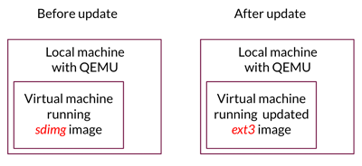

This page will show you how to deploy an image update onto a QEMU virtual machine and verify that the update was successful after reboot. We will use pre-made images, so you don't have to compile or build Mender.




## Prerequisuites

The local machine needs [QEMU](http://wiki.qemu.org/?target=_blank) with ARM processor support installed and minimum 2gb free memory. QEMU runs on various plattforms, but if yours is Linux QEMU can easily be installed on Debian and Ubuntu systems with:

```
$ apt-get install qemu-system-arm
```
... or on Fedora and Redhat systems</a> with:

```
$ yum install qemu-system-arm
```

To verify that QEMU is correctly installed, check its version with:

```
$ qemu-system-arm -version
```

##1. Download and unpack pre-made images 
Download our automatic builds which will contain the neccessary images for this exercise. It will also contain files and images for Beaglebone.

```
$ wget https://goo.gl/mmJoxs
```

Unpack the files from the download above

```
$ tar -zxvf mmJoxs
```

##2. Install *sdimg* image on new virtual machine
Start a virtual machine based on one of the images downloaded. The following commands will do so:

```
$ cd vexpress-qemu
$ /bin/bash mender-qemu.sh
```

This will take you to the login prompt. Above the prompt you should see a welcome message like:

*Poky (Yocto Project Reference Distro) 2.0.1 vexpress...*

You can login with user *root*. No password is required. 

##3. Make new *ext3* image available for virtual machine 

To be able to deploy a new update to the virtual machine, we need to serve it with the new image. You can use your local machine for this. Go to your local machine where you downloaded all the images above. Find and copy the ip-address:

```
$ ifconfig
```

While you are still in the *vexpress-qemu* directory on the local machine start a simple Python webserver that will serve your new image to the virtual machine.

```
$ python -m SimpleHTTPServer
```

##4. Deploy and update *ext3* image on virtual machine
To deploy the new image to your virtual machine, go to your virtual machine and run the following Mender command where &lt;ip-adress&gt; is the one you found previously:

```
$ mender -rootfs <ip-address>:8000/core-image-full-cmdline-vexpress-qemu.ext3
```

This will download the new image and tell the bootloader to boot into it on the next reboot. Reboot your virtual machine to see that the update was successful:

```
$ reboot
```

Your device should boot into the updated image, and a welcome message like this should greet you:

*This system has been updated by Mender build 294 compiled on ......*

***Congratulations!*** You have just deployed your first image based update with Mender! If you are happy with the new update, you can make it permanent by logging in to the virtual machine, as *root*, and type:


```
$ mender commit
```

From now on, every time you boot your virtual machine, it will boot into your updated ext3 image.
