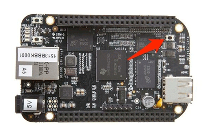
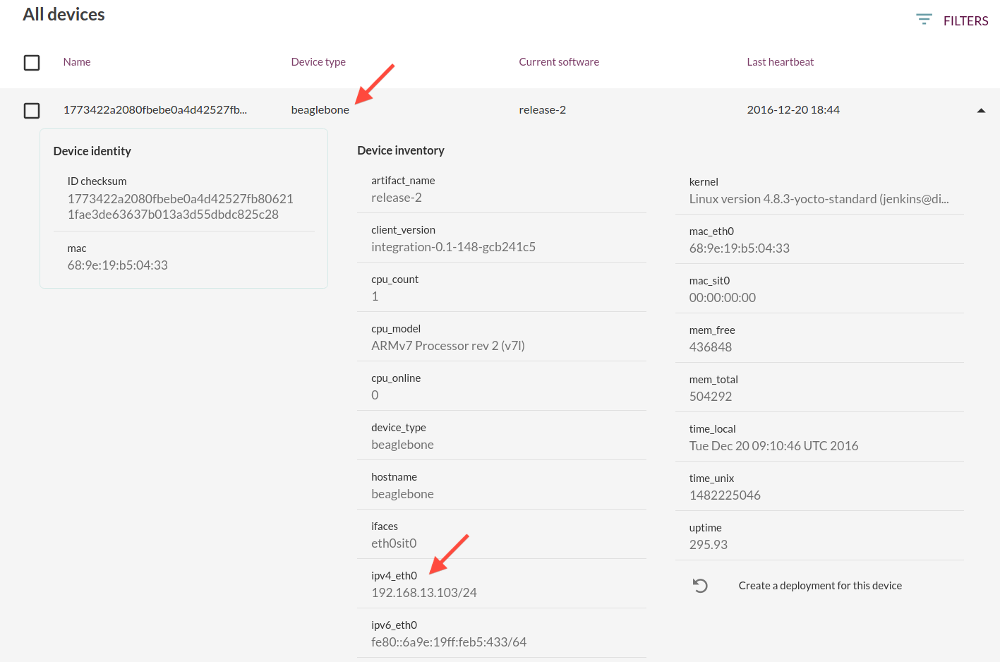
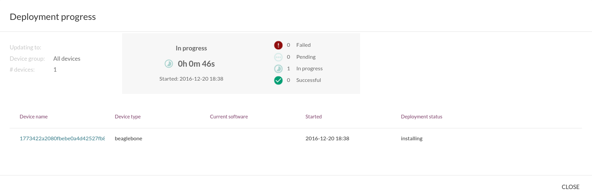

In this tutorial we will deploy a full rootfs update to
a physical device, the Raspberry Pi 3 or BeagleBone Black, using the
Mender server.

## Prerequisites

The test environment should be set up and working successfully
as described in [Install a Mender demo server](../create-a-test-environment).

We also strongly recommend that you complete the tutorial
[Deploy to virtual devices](../deploy-to-virtual-devices) so
that you have a basic understanding of how Mender works
before moving on to connecting a physical device.


### A device to test with
You need one or more BeagleBone Black or Raspberry Pi 3.
To make it easy to provision the device we will use
a SD card to store the OS, so you will need one SD card
(1 GB or larger) per device.

### Disk image and Artifacts

Get the disk image and Artifacts for your device(s) from [Download demo images](../download-test-images).

!!! It is possible to use this tutorial with *any* physical device, as long as you have integrated Mender with it. In this case you cannot use the demo Artifacts we provide in this tutorial, but you need to build your own artifacts as described in [Building a Mender Yocto Project image](../../artifacts/building-mender-yocto-image).

### Mender-Artifact tool
Download [the prebuilt mender-artifact tool][x.x.x_mender-artifact] available
for Linux, or [compile it from source](../../artifacts/modifying-a-mender-artifact#compiling-mender-artifact). In both cases remember to add execute permission (e.g. with `chmod +x mender-artifact`).

<!--AUTOVERSION: "mender-artifact/%/"/mender-artifact -->
[x.x.x_mender-artifact]: https://d1b0l86ne08fsf.cloudfront.net/mender-artifact/master/mender-artifact

Please see [Modifying a Mender Artifact](../../artifacts/modifying-a-mender-artifact)
for a more detailed overview.


### Network connectivity

The device needs to have network set up
so it can connect directly to your workstation
(where you have the Mender server running).

! By default the Mender client will use ports **443** and **9000** to connect to the server. You can test the connection from your client later with networking tools like `telnet`.

If you have just one device, you could connect your
workstation and the device using a direct
Ethernet cable and use static IP addresses at both ends.
For multiple devices, you need a router or switch.

For the rest of the tutorial we will assume
`$IP_OF_MENDER_SERVER_FROM_DEVICE` will expand to the IP address
that your device(s) can connect to the Mender server.

!!! If you are using `bash`, you can set a variable to make the rest of the tutorial easier, for example `IP_OF_MENDER_SERVER_FROM_DEVICE="192.168.10.1"`.

! Using static IP addresses with one device and workstation is quite easy. If you are using several devices, we strongly recommend using a setup with dynamic IP assignment like a router with DHCP support. Otherwise you need to take care to preserve the unique IP address configuration of each device when provisioning the storage and deploying rootfs updates.


## Prepare the disk image

! Please make sure to set a shell variable that expands correctly with `$IP_OF_MENDER_SERVER_FROM_DEVICE` or edit the commands below accordingly.

Locate the demo *disk image* (`*.sdimg`) you downloaded for your device.
This image contains *all the partitions* of the storage device, as described in [Partition
layout](../../devices/partition-layout).


You can decompress it like the following:

```bash
gunzip <PATH-TO-YOUR-DISK-IMAGE>.sdimg.gz
```

!!! Mender blocks free space in the disk image so that your root file system is allowed to grow over time. If you are building your own disk image by following [Building a Mender Yocto Project image](../../artifacts/building-mender-image/building-yocto-image), you can configure the desired space usage with the Yocto Project variable [MENDER_STORAGE_TOTAL_SIZE_MB](../../artifacts/variables#mender_storage_total_size_mb).

We need to change some configuration settings in this image so that
the Mender client successfully connects to your Mender
server when it starts.


### Insert the address of Mender server

```bash
mender-artifact cat IMGNAME.sdimg:/etc/hosts | sed "\$a ${IP_OF_MENDER_SERVER_FROM_DEVICE} docker.mender.io s3.docker.mender.io" > tmpf; mender-artifact cp tmpf IMGNAME.sdimg:/etc/hosts && rm tmpf
```

Then you can check the contents of your 'etc/hosts' file by

```bash
mender-artifact cat IMGNAME.sdimg:/etc/hosts
```

You should see output similar to the following:

> 192.168.10.1 docker.mender.io s3.docker.mender.io


### Set a static device IP address and subnet

This section assumes you use a static IP setup. If your device uses a DHCP setup, this section can be skipped.
In this section, we assume that `$IP_OF_MENDER_CLIENT` is
the IP address you assign to your device.

!!! If you are using `bash`, you can set a variable before running the command below, for example `IP_OF_MENDER_CLIENT="192.168.10.2"`.

Run the command below to fill the `systemd`
networking configuration files of the rootfs partitions:

```bash
echo -n "\
[Match]
Name=eth0

[Network]
Address=$IP_OF_MENDER_CLIENT
Gateway=$IP_OF_MENDER_SERVER_FROM_DEVICE
" | mender-artifact cp IMGNAME.sdimg:/etc/systemd/network/eth.network
```

! If you have a static IP address setup for several devices, you need several disk images so each get different IP addresses.

## Wifi connectivity

The raspberrypi demo image comes with Wifi connectivity enabled by default, thus the only thing needed in order for your device to connect to your network is setting the correct `<ssid>` and `<password>` in the `wpa_supplicant-nl80211@wlan0.conf` file on your device. First set your `<password>` and `<ssid>`, and `<sdimg>` path as shell variables:
```bash
NW_SSID=<ssid>
NW_PASSWORD=<password>
MENDER_IMGPATH=<sdimg>
```
And then running:
```bash
mender-artifact cat "$MENDER_IMGPATH":/etc/wpa_supplicant/wpa_supplicant-nl80211-wlan0.conf | sed "s#[@]MENDER_DEMO_WIFI_PASSKEY[@]#$NW_PASSWORD#" | sed "s#[@]MENDER_DEMO_WIFI_SSID[@]#$NW_SSID#" > tmpf; mender-artifact cp tmpf "$MENDER_IMGPATH":/etc/wpa_supplicant/wpa_supplicant-nl80211-wlan0.conf && rm tmpf
```
should have your wpa configuration set up correctly on start up.

## Write the disk image to the SD card

Please see [Write the disk image to the SD card](../../artifacts/provisioning-a-new-device#write-the-disk-image-to-the-sd-card)
for steps how to provision the device disk using the `*.sdimg`
image you downloaded and modified above.

If you have several devices, please write the disk image to all their SD cards.


## Boot the device

! Make sure that the Mender server is running as described in [Install a Mender demo server](../create-a-test-environment) and that the device can reach it on the IP address you configured above (`$IP_OF_MENDER_SERVER_FROM_DEVICE`). You might need to set a static IP address where the Mender server runs and disable any firewalls.

First, insert the SD card you just provisioned into the device.

For the **BeagleBone Black only** (N/A to Raspberry Pi 3): Before powering on the BeagleBone Black, press the
*S2 button* (as shown below) and keep the button pressed for about 5 seconds while booting (power is connected). This will make the BeagleBone
Black boot from the SD card instead of internal storage.



!! If the BeagleBone Black boots from internal storage, the rollback mechanism of Mender will not work properly. However, the device will still boot so this condition is hard to detect.

!!! There is no need to press the S2 button when rebooting, just when power is lost and it is powered on again.

Now **connect the device to power**.

## See the device in the Mender UI

If you refresh the Mender server UI (by default found at [https://localhost/](https://localhost/?target=_blank)),
you should see one or more devices pending authorization. If you do not see your device listed in the UI, please review [troubleshooting steps.](../../troubleshooting/device-runtime#mender-server-connection-issues)

Once you **authorize** these devices, Mender will auto-discover
inventory about the devices, including the device type (e.g. beaglebone)
and the IP addresses, as shown in the example with a BeagleBone Black below.
Which information is collected about devices is fully configurable; see the documentation on [Identity](../../client-configuration/identity) and [Inventory](../../client-configuration/inventory) for more information.




!!! If your device does not show up for authorization in the UI, you need to diagnose what went wrong. Most commonly this is due to problems with the network. You can test if your workstation can reach the device by trying to ping it, e.g. with `ping 192.168.10.2` (replace with the IP address of your device). If you can reach the device, you can ssh into it, e.g. `ssh root@192.168.10.2`. Otherwise, if you have a serial cable, you can log in to the device to diagnose. The `root` user is present and has an empty password in this test image. Check the log output from Mender with `journalctl -u mender`. If you get stuck, please feel free to reach out on the [Mender community mailing list](https://groups.google.com/a/lists.mender.io/forum?target=_blank/#!forum/mender)!


## Prepare the Mender Artifact to update to

! Please make sure to set shell variables that expand correctly with `$IP_OF_MENDER_SERVER_FROM_DEVICE` (always) and `$IP_OF_MENDER_CLIENT` (if you are using static IP addressing) or edit the commands below accordingly.

In order to deploy an update, we need a Mender Artifact to update to.
A Mender Artifact is a file format that includes metadata like the
checksum and name, as well as the actual root file system that is
deployed. See [Mender Artifacts](../../architecture/mender-artifacts) for
a complete description of this format.

Locate the `release_1` demo Artifact file (`.mender`) for your device that you [downloaded earlier](../download-test-images).

Using the BeagleBone Black as an example below (adjust the directory and file names if you are using the Raspberry Pi 3),
we carry out exactly the same configuration steps for the Mender Artifact as we did for the disk image above:

```bash
echo "$IP_OF_MENDER_SERVER_FROM_DEVICE docker.mender.io s3.docker.mender.io" | mender-artifact cp beaglebone_release_1.mender:/etc/hosts
```

Then check the contents of the file
```bash
mender-artifact cat beaglebone_release_1.mender:/etc/hosts
```

You should see output similar to the following:

> 192.168.10.1 docker.mender.io s3.docker.mender.io

Finally, **only if you are using static IP addressing**, you need to set the
device IP address, as shown below (otherwise skip this step). Please note that the same
constraints as described in [Set a static device IP address and subnet](#set-a-static-device-ip-address-and-subnet)
for the disk image apply here.

```bash
echo -n "\
[Match]
Name=eth0

[Network]
Address=$IP_OF_MENDER_CLIENT
Gateway=$IP_OF_MENDER_SERVER_FROM_DEVICE
" | mender-artifact cp beaglebone_release_1.mender:/etc/systemd/network/eth.network
```

!!! The Mender client will roll back the deployment if it is not able to report the final update status to the server when it boots from the updated partition. This helps ensure that you can always deploy a new update to your device, even when fatal conditions like network misconfiguration occur.

You can also make any other modifications you wish in this image
prior to deploying it.

!!! NOTE if you are running the raspberrypi pi demo image, with Wifi enabled and setup as per [Wifi connectivity](#Wifi-connectivity), the network id and password will have to be set in the same way as done for the sdimg.

## Upload the artifact to the server

Before we can deploy the Artifact we prepared above, it needs
to be uploaded to the server.

Go to the Mender server UI, click the **Artifacts** tab and upload this Artifact.

## Deploy the Artifact

Now that we have the device connected and the Artifact
uploaded to the server, all that remains is to go to the
**Deployments** tab and click **Create a deployment**.

Select the Artifact you just uploaded and **All devices**, then
**Create deployment**.

!!! If you deploy across several device types (e.g. `beaglebone` and `qemux86-64`), the Mender server will skip these if no compatible artifact is available. This condition is indicated by the *noartifact* status in the deployment report. Mender does this to avoid deployments of incompatible rootfs images. However, if you have Artifacts for these other device types, identified by the same Artifact name, then Mender will deploy to all the devices there are compatible Artifacts for.


## See the progress of the deployment

As the deployment progresses, you can click on it to view more details about the current status across all devices.
In the example below, we can see that a BeagleBone is installing the update.



Once the deployment completes, you should see its report in *Past deployments*.

**Congratulations!** You have used the Mender server to deploy your first physical device update!


## Deploy another update

In order to deploy another update, we need to create another Artifact
with a different Artifact Name (than the one already installed at the devices).
This is because Mender *skips a deployment* for a device if it detects that
the Artifact is already installed, in order to avoid unnecessary deployments.

To change the name of our existing Artifact, we can simply use `modify` and the `-n` option
of the `mender-artifact` tool, first making a copy of the original. To do this,
run these two commands (adjust the Artifact file name accordingly):


<!--AUTOVERSION: "release-2_%"/mender -->
```bash
cp beaglebone_release_1.mender beaglebone_release_2.mender
mender-artifact modify beaglebone_release_2.mender -n release-2_master
```


!!! Using`mender-artifact modify`, you can easily modify several configuration settings in existing disk image (`.sdimg`) and Mender Artifact (`.mender`) files, such as the server URI and certificate. See `mender-artifact help modify` for more options.

Upload this modified Artifact file to your Mender server and deploy it to your device.
You should see that the Artifact Name has changed after the deployment.
Now that you have two Mender Artifact files that are configured for your
network with different names, you can deploy updates back and forth between them.


## Integrate Mender with your device

If you want to build your own artifact for the Raspberry Pi 3 or BeagleBone Black,
head over to the tutorial [Building a Mender Yocto Project image](../../artifacts/building-mender-yocto-image).

Development devices like the Raspberry Pi 3 and BeagleBone Black
are rarely used in production due to the cost of scaling and specific
needs of custom applications.

Now that you have seen how Mender works with a reference device, you might be wondering what
it would take to port it to your own platform. The first place to go is
[Device integration](../../devices), where you will find out how to integrate
the Mender client with your device software, and then look at
[Creating Artifacts](../../artifacts) to see how to build images ready to be
deployed over the network to your devices.
