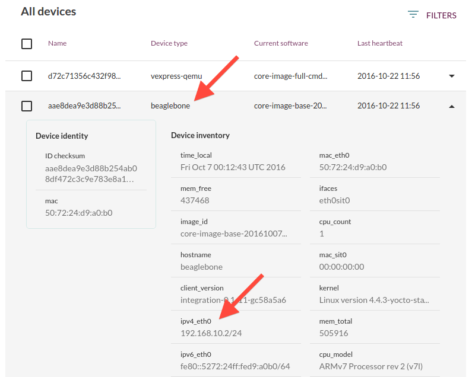
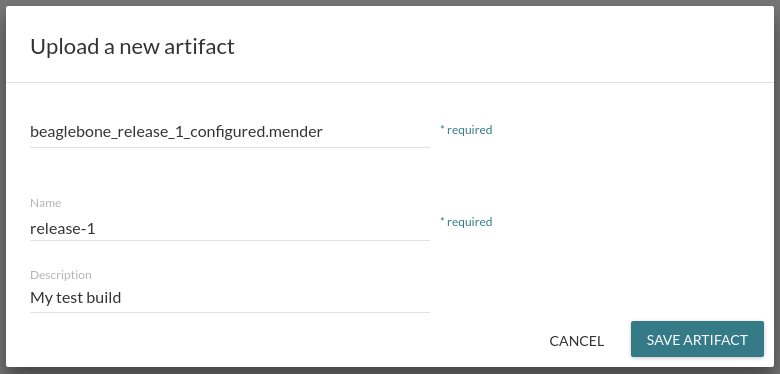

In this tutorial we will deploy a full rootfs update to
a physical device, the BeagleBone Black, using the
Mender server.

## Prerequisites

The test environment should be set up and working successfully
as described in [Create a test environment](../Create-a-test-environment).

We also strongly recommend that you complete the tutorial
[Deploy to virtual devices](../Deploy-to-virtual-devices) so
that you have a basic understanding of how Mender works
before moving on to connecting a physical device.


### BeagleBone Black

You need one or more BeagleBone Black devices to deploy
updates to. To make it easy to provision the device we will use
a SD card to store the OS, so you will need one SD card
(1 GB or larger) per BeagleBone Black.

!!! It is possible to use this tutorial with any physical device, as long as you have integrated Mender with it. In this case you cannot use the test artifacts we provide in this tutorial, but you need to build your own artifacts as described in [Building a Mender Yocto Project image](../../Artifacts/Building-Mender-Yocto-image).


### Network connectivity

The BeagleBone Black needs to have network set up
so it can connect directly to your workstation
(where you have the Mender server running).

! By default the Mender client will use ports **443** and **9000** to connect to the server. You can test the connection from your client later with networking tools like `telnet`.

If you have one BeagleBone Black, you could connect your
workstation and the device using a direct
Ethernet cable and use static IP addresses at both ends.
For multiple devices, you need a router or switch.

For the rest of the tutorial we will assume
`$IP_OF_MENDER_SERVER_FROM_DEVICE` will expand to the IP address
that your device(s) can connect to the Mender server.

!!! If you are using `bash`, you can set a variable to make the rest of the tutorial easier, for example `IP_OF_MENDER_SERVER_FROM_DEVICE="192.168.10.1"`.

! Using static IP addresses with one device and workstation is quite easy. If you are using several devices, we strongly recommend using a setup with dynamic IP assignment like a router with DHCP support. Otherwise you need to take care to preserve the unique IP address configuration of each device when provisioning the storage and deploying rootfs updates.


## Prepare the disk image

! Please make sure to set a shell variable that expands correctly with `$IP_OF_MENDER_SERVER_FROM_DEVICE` or edit the commands below accordingly.

Download the test *disk* image with Mender support for the BeagleBone Black
at [https://d1b0l86ne08fsf.cloudfront.net/master/beaglebone/mender-beaglebone.sdimg.gz](https://d1b0l86ne08fsf.cloudfront.net/master/beaglebone/mender-beaglebone.sdimg.gz).
This image contains *all the partitions* of the storage device, as
described in [Partition layout](../../Devices/Partition-layout).

You can decompress it like the following:

```bash
gunzip mender-beaglebone.sdimg.gz
```

!!! Mender blocks free space in the disk image so that your root file system is allowed to grow over time. If you are building your own disk image by following [Building a Mender Yocto Project image](../../Artifacts/Building-Mender-Yocto-image), you can configure the desired space usage with the Yocto Project variable [MENDER_STORAGE_TOTAL_SIZE_MB](../../Artifacts/Variables#mender_storage_total_size_mb).

We need to change some configuration settings in this image so that
the Mender client successfully connects to your Mender
server when it starts.


### Insert the address of Mender server

Please see [Modifying a disk image](../../Artifacts/Modifying-a-disk-image) for a description
on how to mount partitions for editing within the disk image
`mender-beaglebone.sdimg`.

We assume that *both* rootfs partitions are mounted read-write below,
to `/mnt/rootfs1` and `/mnt/rootfs2`. Then run the following commands
to make the Mender client able to find the server when the Mender client starts:

```bash
echo "$IP_OF_MENDER_SERVER_FROM_DEVICE docker.mender.io s3.docker.mender.io" | sudo tee -a /mnt/rootfs[12]/etc/hosts
```

You should see output similar to the following:

> 192.168.10.1 docker.mender.io s3.docker.mender.io


### Set a static device IP address and subnet

This section assumes you use a static IP setup.
If your BeagleBone Black device uses a DHCP setup,
you can skip to [Unmount the disk image](#unmount-the-disk-image).
In this section, we assume that `$IP_OF_MENDER_CLIENT` is
the IP address you assign to your device.

!!! If you are using `bash`, you can set a variable before running the command below, for example `IP_OF_MENDER_CLIENT="192.168.10.2"`.

Run the command below to fill the `systemd`
networking configuration files of the rootfs partitions:

```bash
echo -n "\
[Match]
Name=eth0

[Network]
Address=$IP_OF_MENDER_CLIENT
Gateway=$IP_OF_MENDER_SERVER_FROM_DEVICE
" | sudo tee /mnt/rootfs[12]/etc/systemd/network/eth.network
```

You should see output similar to the following:

> [Match]  
> Name=eth0  
  
> [Network]  
> Address=192.168.10.2  
> Gateway=192.168.10.1  


! If you have a static IP address setup for several BeagleBone Black devices, you need several disk images so each get different IP addresses. After unmounting (as described below), you can copy it and mount another one.

### Unmount the disk image

It is very important to unmount the disk image after modifying it, so all changes are written to the image:

```bash
sudo umount /mnt/rootfs1 && sudo umount /mnt/rootfs2
```

!! If you do not properly unmount the disk image, changes may be lost or corrupted when it is written to flash.


## Write the disk image to the SD card

Please see [Write the disk image to the SD card](../../Artifacts/Provisioning-a-new-device#write-the-disk-image-to-the-sd-card)
for steps how to provision the device disk using the `mender-beaglebone.sdimg`
image you downloaded and modified above.

If you have several BeagleBone Black devices, please
write the disk image to all their SD cards.


## Boot the BeagleBone Black(s)

! Make sure that the Mender server is running as described in [Create a test environment](../Create-a-test-environment) and that the device can reach it on the IP address you configured above (`$IP_OF_MENDER_SERVER_FROM_DEVICE`). You might need to set a static IP address where the Mender server runs and disable any firewalls.

First, insert the SD card you just provisioned into the BeagleBone black.

Before powering on the device, please press the
*S2 button*, as shown below. Connect the power and keep the button
pressed for about 5 seconds. This will make the BeagleBone
Black boot from the SD card instead of internal storage.


!! If the BeagleBone Black boots from internal storage, the rollback mechanism of Mender will not work properly. However, the device will still boot so this condition is hard to detect.

!!! There is no need to press the S2 button when rebooting, just when power is lost and it is powered on again.


## See the BeagleBone Black(s) in the Mender UI

If you refresh the Mender server UI (by default found at [https://localhost/](https://localhost/?target=_blank)),
you should see one or more devices waiting authorization.

Once you **authorize** these devices, Mender will auto-discover
inventory about the devices, including the device type (e.g. beaglebone)
and the IP addresses, as shown in the example below.




!!! If your BeagleBone Black does not show up for authorization in the UI, you need to diagnose what went wrong. Most commonly this is due to problems with the network. You can test if your workstation can reach the device by trying to ping it, e.g. with `ping 192.168.10.2` (replace with the IP address of your device). If you have a serial cable, you can log in to the device to diagnose. The `root` user is present and has an empty password in this test image. If you get stuck, please feel free to reach out on the [Mender community mailing list](https://groups.google.com/a/lists.mender.io/forum?target=_blank#!forum/mender)!


## Prepare the Mender Artifact to update to

! Please make sure to set shell variables that expand correctly with `$IP_OF_MENDER_SERVER_FROM_DEVICE` (always) and `$IP_OF_MENDER_CLIENT` (if you are using static IP addressing) or edit the commands below accordingly.

In order to deploy an update, we need a Mender Artifact to update to.
A Mender Artifact is a file format that includes metadata like the
checksum and name, as well as the actual root file system that is
deployed. See [Mender Artifacts](../../Architecture/Mender-Artifacts) for
a complete description of this format.

Download the test Artifact for the BeagleBone Black
at [https://d1b0l86ne08fsf.cloudfront.net/master/beaglebone/beaglebone_release_1.mender](https://d1b0l86ne08fsf.cloudfront.net/master/beaglebone/beaglebone_release_1.mender).

The steps needed to edit the root file system contained in this Artifact are:

```bash
mkdir beaglebone_release_1 && tar -C beaglebone_release_1 -xvf beaglebone_release_1.mender
```

```bash
cd beaglebone_release_1 && tar zxvf data/0000.tar.gz
```

```bash
sudo mkdir /mnt/rootfs && sudo mount -t ext4 -o loop core-image-base-beaglebone.ext4 /mnt/rootfs/
```

Please see [Modifying a Mender Artifact](../../Artifacts/Modifying-a-Mender-Artifact)
for a more detailed overview. For the following steps we assume that you have mounted
`core-image-base-beaglebone.ext4` to `/mnt/rootfs`.

We carry out exactly the same configuration steps for the rootfs image
as we did for the rootfs partitions in the disk image above:

```bash
echo "$IP_OF_MENDER_SERVER_FROM_DEVICE docker.mender.io s3.docker.mender.io" | sudo tee -a /mnt/rootfs/etc/hosts
```

You should see output similar to the following:

> 192.168.10.1 docker.mender.io s3.docker.mender.io

Finally, **only if you are using static IP addressing**, you need to set the
device IP address, as shown below (otherwise skip this step). Please note that the same
constraints as described in [Set a static device IP address and subnet](#set-a-static-device-ip-address-and-subnet)
for the disk image apply here.

```bash
echo -n "\
[Match]
Name=eth0

[Network]
Address=$IP_OF_MENDER_CLIENT
Gateway=$IP_OF_MENDER_SERVER_FROM_DEVICE
" | sudo tee /mnt/rootfs/etc/systemd/network/eth.network
```

You should see output similar to the following:

> [Match]  
> Name=eth0  
  
> [Network]  
> Address=192.168.10.2  
> Gateway=192.168.10.1  


!!! The Mender client will roll back the deployment if it is not able to report the final update status to the server when it boots from the updated partition. This helps ensure that you can always deploy a new update to your device, even when fatal conditions like network misconfiguration occur.

You can also make any other modifications you wish in this image
prior to deploying it.


#### Unmount the rootfs image

It is very important to unmount the rootfs image after modifying it, so all changes are written to the image:

```bash
sudo umount /mnt/rootfs
```

#### Create a new Mender Artifact with the modified rootfs

To create a Mender Artifact from a root file system, it is easiest
to download the prebuilt mender-artifact tool available for Linux
at [https://d25phv8h0wbwru.cloudfront.net/master/tip/mender-artifact](https://d25phv8h0wbwru.cloudfront.net/master/tip/mender-artifact).

After the tool is downloaded and you added execute permission,
simply run it as follows:

```bash
mender-artifact write rootfs-image -u core-image-base-beaglebone.ext4 -t beaglebone -n release-1 -o beaglebone_release_1_configured.mender
```

where `-u core-image-base-beaglebone.ext4` is the rootfs image we modified above,
`-t beaglebone` is the device type compatible with the given Artifact,
`-n release-1` is the Artifact name (do not change this as it needs to be in
sync with `/etc/mender/artifact_info` *inside* the rootfs), and
`-o beaglebone_release_1_configured.mender` is
the filename of the created Artifact.


## Upload the artifact to the server

Before we can deploy the Artifact we prepared above it needs
to be uploaded to the server.
Go to the Mender server UI, click the **Artifacts** tab and upload this Artifact,
you can set *Description* to `My test build`.

In the UI it should look something like this:




## Deploy the Artifact

Now that we have the device connected and the image
uploaded to the server, all that remains is to go to the
**Deployments** tab and click **Create a deployment**.

Select the Artifact you just uploaded and **All devices**, then
**Create deployment**.

!!! If you deploy across several device types (e.g. `beaglebone` and `vexpress-qemu`), the Mender server will skip these if no compatible artifact is available. This condition is indicated by the *noartifact* status in the deployment report. Mender does this to avoid deployments of incompatible rootfs images. However, if you have Artifacts for these other device types, identified by the same Artifact name, then Mender will deploy to all the devices there are compatible Artifacts for.


## See the progress of the deployment

As the deployment progresses, you can click on it to view more details about the current status across all devices.
In the example below, we can see that a BeagleBone is installing the update.


Once the deployment completes, you should see its report in *Past deployments*.

**Congratulations!** You have used the Mender server to deploy your first physical device update!


## Deploy another update

In order to deploy another update, we can modify the original Artifact as described in
[Create a new Mender Artifact with the modified rootfs](#create-a-new-mender-artifact-with-the-modified-rootfs) above.

However, note that the Artifact Name needs to change in the updated Artifact;
a good candidate would be `release-2`.
This is because Mender skips a deployment for a device if it detects that the
Artifact is already installed. This needs to be changed in two places:

* `/etc/mender/artifact_info` *inside* the root file system
* the `-n` option to `mender-artifact`

Please make sure that the Artifact Name is in sync at these two places,
otherwise deployments using this Artifact will always fail.

With that in mind, now might be a good time to tweak the rootfs, add some
more BeagleBone Black devices to the environment and try to get the
required blinkenlights going!

If you want to build your own artifact for the BeagleBone Black,
head over to the tutorial [Building a Mender Yocto Project image](../../Artifacts/Building-Mender-Yocto-image).


## Integrate Mender with your device

We can have a lot of fun with the BeagleBone Black, however
it is rarely used in production due to the cost of scaling and specific
needs of custom applications.

Now that you have seen how Mender works with a reference device, you might be wondering what
it would take to port it to your own platform. The first place to go is
[Device integration](../../Devices), where you will find out how to integrate
the Mender client with your device software, and then look at
[Creating Artifacts](../../Artifacts) to see how to build images ready to be
deployed over the network to your devices.
