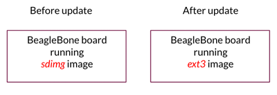
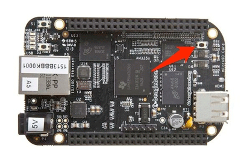

This page will show you how to deploy an image update onto a BeagleBone board and verify that the update was successful after reboot. We will use pre-made images, so you don't have to compile or build Mender.



## Prerequisuites

A machine on the same network as the BeagleBone.

##1. Download and unpack pre-made images 
Download our automatic builds which will contain the neccessary images for this exercise.

On your machine type:

```
$ wget https://goo.gl/mmJoxs
```

Unpack the files from the download above

```
$ tar -zxvf mmJoxs
```

##2. Install first *sdimg* image on BeagleBone
The sdimg image is is a partitioned image that can be stored directly into the SD card. For more information about the exact content of the image and detailed information about partitions layout please see [sdimg](https://github.com/mendersoftware/meta-mender/blob/master/classes/sdimg.bbclass?target=_blank) class documentation</a>.

Assuming you are in the same directory as when you downloaded the above images, you can copy the sd image to SD card you can use following commands:

```
$ cd beaglebone
```

```
$ sudo dd if=./tmp/deploy/images/beaglebone/core-image-base-beaglebone.sdimg of=<DEVICE> bs=1M
```

&lt;DEVICE&gt; depends on where your SD card is placed. Normally this would be something like ***dev/mmcblk0*** or ***dev/sdb***. IF YOU POINT TO THE WRONG DEVICE YOU RISK TO OVERWRITE YOUR MACHINE DISK OR OTHER CONNECTED DISKS!!

If you are unsure how to find you correct /dev, the Raspberry PI Foundation provide some nice references that can help you: [Linux](https://www.raspberrypi.org/documentation/installation/installing-images/linux.md?target=_blank), [Mac OSX](https://www.raspberrypi.org/documentation/installation/installing-images/mac.md?target=_blank), [Windows](https://www.raspberrypi.org/documentation/installation/installing-images/windows.md?target=_blank).

Once writing of the sdimg image has completed, take out the SD card and insert it into BeagleBone.

You can verify the success by trying to turn on the BeagleBone:

****MPORTANT***: The standard BeagleBone booting process will cause that the bootloader from internal flash storage will be used. In order to use the bootloader from SD card make sure that S2 (boot) button is pressed while powering on your BeagleBone (see image below).



This will take you to the login prompt. Above the prompt you should see a welcome message like:

*Poky (Yocto Project Reference Distro) 2.0.1 beaglebone...*

You can login with user *root*. No password is required. 


##3. Make new *ext3* image available for BeagleBone

To be able to deploy a new update to BeagleBone, we need to serve it with the new image. Go to your local machine where you downloaded all the images above. Find and copy the ip-address:

```
$ ifconfig
```

While you are still in the *beaglebone* directory on the local machine start a simple Python webserver that will serve your new image to the BeagleBone.

```
$ python -m SimpleHTTPServer
```

##4. Deploy *ext3* image update to BeagleBone
To deploy the new image to BeagleBone, go to BeagleBone and run the following Mender command where &lt;ip-adress&gt; is the one you found previously:


```
$ mender -rootfs <ip-address>:8000/core-image-full-cmdline-vexpress-qemu.ext3
```

This will download the new image and tell the bootloader to boot into it on the next reboot. Once the download is complete, reboot the BeagleBone (no need to hold down S2-button):

```
$ reboot
```

Your device should boot into the updated image, and a welcome message like this should greet you:

*This system has been updated by Mender build 294 compiled on ......*

***Congratulations!*** You have just deployed your first image based update with Mender! If you are happy with the new update, you can make it permanent by logging in to BeagleBone, as *root*, and type:


```
$ mender commit
```

From now on, every time you boot BeagleBone, it will boot into your updated ext3 image.
