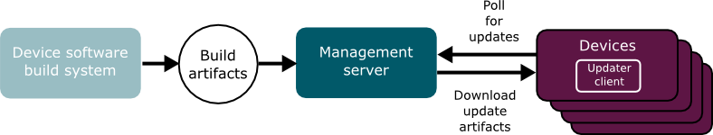
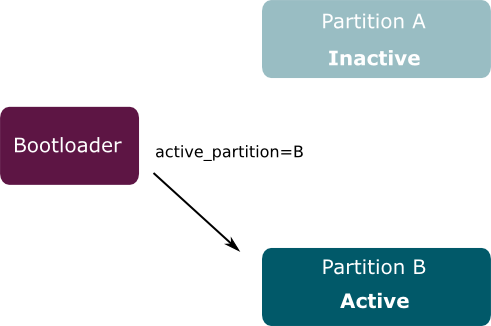

The following diagram shows the high level flow of data involved in deploying software updates.

The process begins with the **software build system** generating a new version of software for a device.
The software build system is a standard component, such as Yocto Project.
It creates **build artifacts** in the format required by the target device.
There will be different build artifacts for each type of device being managed.

The build artifacts are passed to the Mender **Management Server**, which is the central point for deploying updates to a population of devices.
Among other things, it monitors the current software version that is installed on each device and schedules the rollout of new releases.

Finally, each **Device** runs a copy of the Mender **update client**, which polls the Management Server from time to time to report its status and to discover if there is a software update waiting.
If there is, the update client downloads and installs it.

In the current implementation, only devices running embedded Linux are supported.
Other operating systems will be added later on.

## Modes of operation

It is possible to run the Mender update client in standalone or managed mode.

When run in standalone mode, the deployments are triggered (`mender -rootfs`), rebooted into (`reboot`) and made persistent (`mender -commit`) from the command line at the device or through some custom integration like a script. Any http(s) server or file path (e.g. USB stick or NFS share) can be used to serve the Artifacts; the URI is given to the `mender -rootfs` option. If you wish to run Mender in standalone mode, you can [disable Mender as a system service](../../Artifacts/Image-configuration#disabling-mender-as-a-system-service).

When running Mender in managed mode, the Mender client runs as a daemon and will regularly poll the server, automatically apply updates, reboot, report and commit the update. This is the best way to run Mender for most large-scale deployments, as the deployments are centrally managed across many devices, but it requires to set up and connect clients to the Mender server.

## Types of artifacts

Embedded devices almost universally use flash memory for storage.
Flash memory can be divided into partitions in a way similar to hard disks.
In the case of a device running Linux, components such as the Linux kernel, device tree binary and ramdisk may each be stored in a separate partition, but it is more common for them all to be stored together in the root file system.
A file system has a format, such as UBIFS or ext4, and is contained within a partition. 

The simplest and most robust way to update the device is to write a new file system image directly to the flash partition.
This is the mechanism supported by the current versions of Mender.
Other update mechanisms are possible, for example through the use of a package manager such as RPM, and they will be added later on.

Please see [Mender Artifacts](../mender-artifacts) for more details on the Mender Artifact format.

## Robust updates

One of the prime requirements of an updater is that it should be robust.
It must be possible to recover from an update that fails for any reason, including through loss of power or network connectivity.
In order to make updates to file system images reliable, Mender employs a dual redundant scheme, where each updatable partition is backed up with a duplicate.
The one currently in use is called the **active partition** and the backup is called the **inactive partition**.
When Linux boots, it will be told by the bootloader which partitions to use.

When an image is updated, the new version it is written to the inactive partition.
When complete, the checksum is verified. If all is well, a flag is set in the bootloader that will cause it to to flip the active and inactive partitions around on next reboot.
Then the system reboots.

## Commit and rollback

On the first boot into Linux following an update, the update client will **commit** the update. This sets a flag in the bootloader that indicates that the operating system booted correctly.

If something causes the device to reboot before committing the update, the bootloader knows that something went wrong, and will **roll back** to the previous version by flipping the active and inactive partitions back again.

## Stateless file systems

One consequence of image update is that the update will replace all the files in a filesystem with new versions, thereby deleting any new or changed files that had been placed there. In other words, to be updatable a file system needs to be **stateless**.

All files that are modified by the device need to be stored in a separate partition. Things that may need to be stored include network parameters, user configuration changes and so on. See [Partition layout](../../Devices/Partition-layout) for more information.
