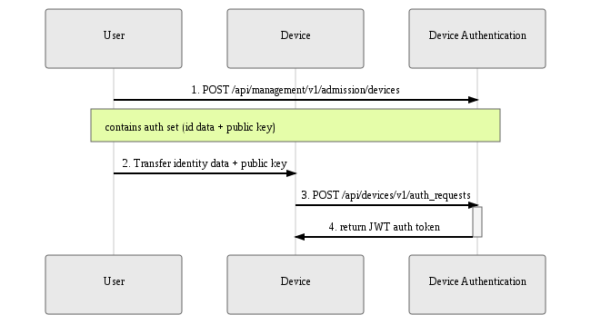
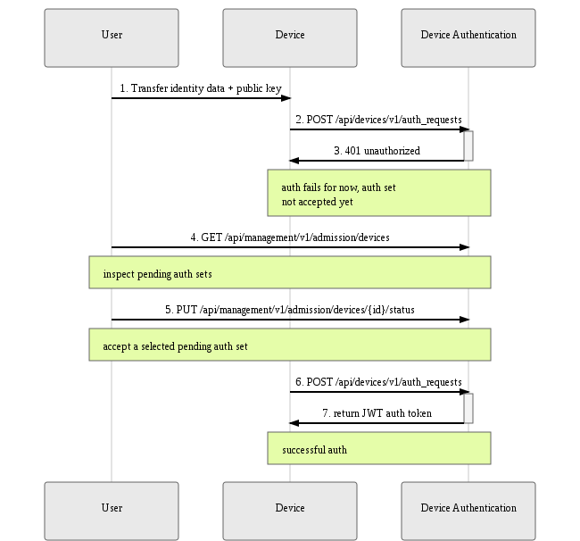

Device admission requires explicit consent by the user to grant authentication to a given device (identified by a set
of [identity attributes](../../client-configuration/identity)) when it requests access to the Mender server.

This section describes in detail the components and workflows relevant to admission and authentication,
and provides practical tips on navigating our APIs to successfully admit devices, monitor admission status,
and troubleshoot related issues.

## Admission & Authentication Components
The two services implementing admission and authentication are:
* [Device Admission](https://github.com/mendersoftware/deviceadm?target=_blank)
* [Device Authentication](https://github.com/mendersoftware/deviceauth?target=_blank)

Although they work closely together, they have distinct responsibilities.

**Device Authentication** for the most part interfaces with devices, accepts their authentication requests, and
issues and keeps track of authentication tokens ([JSON Web Token](https://jwt.io?target=_blank)).

Whether authentication will in fact be granted is driven by the user-facing **Device Admission** service. The user
indicates via its API which devices should be accepted by the system, and the service syncs with Device Authentication
which will in turn authenticate the device successfully.

This can happen in either of two modes, or workflows, which will be described in full in the following section:
* **preauthorization**, where a user adds the device a priori, before it ever submits an authentication request
* **admit-on-request**, where a device unknown to the system presents its authentication data set, and the user
can inspect it and manually grant it authentication

!!! Both admission scenarios can be automated via integration with Mender server APIs, e.g. through a 3rd party script.

### Terminology: Device, Identity Attributes, Authentication Set
It is important to clear up some terminology used throughout this documentation and various APIs.

A **device** represents, intuitively, a particular piece of hardware. It is uniquely identified by a
set of **identity attributes** (MAC addresses, user-defined UIDs, etc.); think of it as an extension of a unique identifier into a multi-attribute structure (see [Identity](../../client-configuration/identity)).

To obtain an auth token, the device sends an **authentication request** containing the identity attributes and its current
**public key**. The request is signed with the respective private key (kept secret on the device), and the server uses
the public key to verify the signature.

The combination of **identity attributes** and **public key** is termed an **authentication set**, or 'auth set' in short. The concept
was introduced when considering device key rotation - a single device may over time present different keys, and it's
important to track those, and allow the user to admit or reject a particular identity/key combination.

Mender keeps tracks both of a **device**, as a single real-world entity, and its multiple  **authentication sets**. In context of backend
APIs, both of these concepts are resources, identified by a unique IDs assigned by the server.

! It is important to note that service APIs, during their evolution, became slightly inconsistent and are not exactly true to these concepts. The issue lies with URL conventions used in Device Authentication vs Device Admission, which might be confusing; sometimes the term **device** is used to actually mean an **authentication set**. These inconsistencies will be resolved in upcoming releases of Mender, but for now need to be kept in mind.

## Admission Flows
There are two possible admission flows - both involve a user's explicit consent to accept a device into the system via
the Device Admission API, but they differ in the order of events and intended use cases. Below is a detailed breakdown
of each of them.

### Preauthorization Flow
Preauthorization is the idea of admitting a device before it ever connects to the server for the first time. This is the intuitive
model analogous to creating an account before logging in to an online service.

Preauthorization can be performed before a particular device is even released - or in fact, assembled - just yet. It is enough for
the user to submit a pre-assigned authentication set to Device Admission, which will in turn propagate it to Device Authentication. At
some point in the future, a device with corresponding identity attributes and public key will request authentication and be granted it
immediately, without further user intervention.

This flow is therefore best suited to a typical production use case, where a release of a potentially large batch of devices is planned:
* device identity attributes/keys are pre-assigned and tracked outside of Mender
* the preauthorization API of Device Admission is used to admit the devices a priori (possibly via a script)
* during the release process, identities and keys are transferred to physical devices
* upon the first authentication request, each device is authenticated and gains access to all Mender APIs

The sequence diagram below describes the API interactions between the user, Device Admission and Device Authentication within this flow:
1. The user first submits a preauthorized auth set to Device Admission
2. The auth set is automatically propagated to Device Authentication
3. The user makes sure the physical device contains the corresponding identity attributes and public key
4. The device, when activated, submits an authentication request containing the identity attributes and key
5. Device Authentication returns a valid authentication token

|  |
|:--:|
|*Preauthorization flow*|

! It is important to note that the Device Authentication API used here, although exposed as a *management API*, is not meant to be called directly by the user at any time. It is strictly internal and will be hidden in upcoming releases of Mender.

For details of API calls please consult the API documentation:

* [Device Admission Management API](../../apis/management-apis/device-admission)
* [Device Authentication Device API](../../apis/device-apis/device-authentication)
* [Device Authentication Management API](../../apis/management-apis/device-authentication)

### Admit-on-request Flow
An alternate flow, suitable mostly for quick prototyping and testing, is the admit-on-request flow.

It is not required for the user to preauthorize a device - instead, when the device first submits an auth request, it will
be recorded for future inspection by the user. The auth set can then be accepted via the Device Admission API whenever the
user sees fit; a subsequent auth request from the device will be successful and a valid auth token will be returned.

The admit-on-request flow therefore requires the user to accept authentication sets one-by-one, as devices connect to the server.
As such it is not ideal for scenarios where a large number of devices is being managed; it is recommended for smaller or non-production
installations instead.

The sequence diagram below describes the API interactions between the user, Device Admission and Device Authentication within this flow:
1. The user provides the device the device with some identity attributes and a public key
2. The device tries to authenticate, retries in a loop according to the Mender client's configured interval
3. The auth set is unknown to the system, so it's recorded for future user inspection via Device Admission
4. For the time being, authentication attempt fails
5. The user inspects pending authentication sets
6. The user accepts the submitted auth request
! API URL uses the *devices* naming convention, but both APIs actually deal with **authentication sets**!
7. Device Admission automatically propagates auth set status update to Device Authentication
8. The device applies for an auth token again
9. Device Authentication returns a valid authentication token

|  |
|:--:|
|*Admit-on-request flow*|

For details of API calls please consult the API documentation:

* [Device Admission Management API](../../apis/management-apis/device-admission)
* [Device Authentication Device API](../../apis/device-apis/device-authentication)
* [Device Authentication Management API](../../apis/management-apis/device-authentication)

## Authentication Token
After a device is successfully admitted, its next authentication request to Device Authentication results
in obtaining an **authentication token**. The Mender client will record it and attach it to every API call under
the HTTP `Authorization` header.

The token does have an **expiry date** (one week period), but the Mender client will obtain a fresh token automatically;
the process is transparent to the user. The only prerequisite is that the device's authentication set has not been
explicitly rejected in the meantime via the Device Admission API.

For details on the token format please see the relevant [documentation on submitting an authentication request](../../apis/device-apis/device-authentication)

## Viewing devices and auth sets
Two APIs can be used to review the admission status of your devices.

The more convenient one is Device Authentication's `GET /api/management/v1/devauth/devices`. It is device-oriented, and returns a
list of all known devices; each device structure contains a nested list of its recorded authentication sets and their statuses.

The other API is Device Admissions `GET /api/management/v1/admission/devices`. Contrary to what the URL convention suggests, it
returns a flat list of all recorded **authentication sets**. This means a single device can actually have several entries in this list;
 each has a **device_id** attribute which ties it to an actual physical device (note that the **id** attribute identifies the authentication set itself).

 This API is important when working with authentication sets - accepting or rejecting is done via the Device Admission's
`PUT /api/management/v1/admission/devices/{id}/status`, where the **id** identifies the auth set obtained via the `GET` request.
