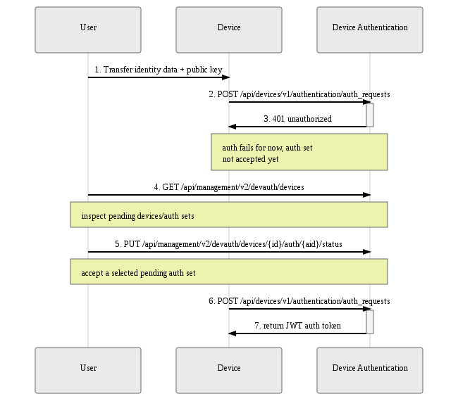

Devices, identified by a set of [identity attributes](../../client-configuration/identity), must be explicitly authorized
by the user before they can authenticate with the Mender server.

This section describes in detail the components and workflows relevant to device authentication,
and provides practical tips on navigating our APIs to successfully authorize devices, monitor authorization status,
and troubleshoot related issues.

## Authentication Components
Device authentication is implemented by a single service:
* [Device Authentication](https://github.com/mendersoftware/deviceauth?target=_blank)

The service exposes APIs for:
* device authorization, i.e. granting access to selected devices
* issuing and keeping track of authentication tokens ([JSON Web Token](https://jwt.io?target=_blank))
* inspecting and managing devices and their authentication credentials

Device authorization can be performed in either of two modes, or workflows, which will be described in full in the following section:
* **preauthorization**, where a user adds the device a priori, before it ever submits an authentication request
* **accept-on-request**, where a device unknown to the system presents its authentication data set, and the user
can inspect it and manually authorize it

### Terminology: Device, Identity Attributes, Authentication Set
It is important to clear up some terminology used throughout this documentation and various APIs.

A **device** represents, intuitively, a particular piece of hardware. It is uniquely identified by a
set of **identity attributes** (MAC addresses, user-defined UIDs, etc.); think of it as an extension of a unique identifier into a multi-attribute structure (see [Identity](../../client-configuration/identity)).

To obtain an auth token, the device sends an **authentication request** containing the identity attributes and its current
**public key**. The request is signed with the respective private key (kept secret on the device), and the server uses
the public key to verify the signature.

The combination of **identity attributes** and **public key** is termed an **authentication set**, or 'auth set' in short. The concept
was introduced when considering device key rotation - a single device may over time present different keys, and it's
important to track those, and allow the user to accept(i.e. authorize) or reject a particular identity/key combination.

Mender keeps tracks both of a **device**, as a single real-world entity, and its multiple  **authentication sets** (one-to-many relation).

## Authorization Flows
There are two possible authorization flows - both involve a user's explicit consent to authorize a device via
the Device Authentication API, but they differ in the order of events and intended use cases. Below is a detailed breakdown
of each of them.

### Preauthorization Flow
Preauthorization is the idea of authorizing a device before it ever connects to the server for the first time. This is the intuitive
model analogous to creating an account before logging in to an online service.

Preauthorization can be performed before a particular device is even released - or in fact, assembled - just yet. It is enough for
the user to submit a pre-assigned authentication set to Device Authentication. At
some point in the future, a device with corresponding identity attributes and public key will request authentication and be granted it
immediately, without further user intervention.

This flow is therefore best suited to a typical production use case, where a release of a potentially large batch of devices is planned:
* device identity attributes/keys are pre-assigned and tracked outside of Mender
* the preauthorization API of Device Authentication is used to authorize the devices a priori (possibly via a script)
* during the release process, identities and keys are transferred to physical devices
* upon the first authentication request, each device is authenticated and gains access to all Mender APIs

The sequence diagram below describes the API interactions between the user and Device Authentication within this flow:
1. The user first submits a preauthorized auth set to Device Authentication
2. The user makes sure the physical device contains the corresponding identity attributes and public key
3. The device, when activated, submits an authentication request containing the identity attributes and key
4. Device Authentication returns a valid authentication token

|  |
|:--:|
|*Preauthorization flow*|

For details of API calls please consult the API documentation:

* [Device Authentication Device API](../../apis/device-apis/device-authentication)
* [Device Authentication Management API](../../apis/management-apis/device-authentication)

### Accept-on-request Flow
An alternate flow, suitable mostly for quick prototyping and testing, is the accept-on-request flow.

It is not required for the user to preauthorize a device - instead, when the device first submits an auth request, it will
be recorded for future inspection by the user. The auth set can then be accepted via the Device Authentication API whenever the
user sees fit; a subsequent auth request from the device will be successful and a valid auth token will be returned.

The authorize-on-request flow therefore requires the user to accept authentication sets one-by-one, as devices connect to the server.
As such it is not ideal for scenarios where a large number of devices is being managed; it is recommended for smaller or non-production
installations instead.

The sequence diagram below describes the API interactions between the user, Device, and Device Authentication within this flow:
1. The user provides the device the device with some identity attributes and a public key
2. The device tries to authenticate, retries in a loop according to the Mender client's configured interval
3. For the time being, authentication attempt fails, but the auth set is recorded for future inspection
4. The user inspects pending authentication sets
5. The user accepts the submitted auth set
6. The device applies for an auth token again
7. Device Authentication returns a valid authentication token

|  |
|:--:|
|*Accept-on-request flow*|

For details of API calls please consult the API documentation:

* [Device Authentication Device API](../../apis/device-apis/device-authentication)
* [Device Authentication Management API](../../apis/management-apis/device-authentication)

## Authentication Token
After a device is authorized, its next authentication request to Device Authentication results
in obtaining an **authentication token**. The Mender client will record it and attach it to every API call under
the HTTP `Authorization` header.

The token does have an **expiry date** (one week period), but the Mender client will obtain a fresh token automatically;
the process is transparent to the user. The only prerequisite is that the device's authentication set has not been
explicitly rejected in the meantime via the Device Authentication API.

For details on the token format please see the relevant [documentation on submitting an authentication request](../../apis/device-apis/device-authentication)

## Viewing devices and auth sets
To view available devices and their authentication sets, use the `GET /api/management/v2/authentication/devices` endpoint of the
[Device Authentication Management API](../../apis/management-apis/device-authentication).
