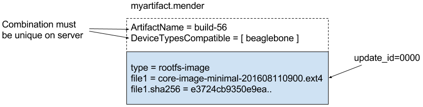

As described in the [architecture overview](../overview) Mender uses the output
from a build system and deploys this to remote devices.

In order to ensure a robust update process, Mender needs *additional metadata*
alongside the raw bits of the file system. Depending on the version of the artifact usesd 
the metadata might be different but must contain among the others:

* *Name* of the software build, so that software is not redeployed if it is already installed at the device.
* Device types the software is *compatible* with, so that software is not deployed to incompatible hardware (e.g. CPU architecture, hardware floating point support, peripheral drivers).
* *Checksum* of the root file system, so that software is not run if it gets corrupted during transit or storage.

Furthermore, as new use cases and platforms are supported in the future, even
more metadata and files are expected to be needed as part of the Mender deployment process.
The file system image itself can not contain this information, so additional logic is required.

## The Mender Artifact file format

To handle the requirements mentioned above, Mender defines and uses a
specific file format, identified by its `.mender` suffix. A file in this format
is referred to as a **Mender Artifact**, or simply *an Artifact*.
All relevant components of Mender, such as the client and server, understand
and use (only) this specific file format when working with software deployments.

Internally, a Mender Artifact is simply a file archive in the [tarball format](https://en.wikipedia.org/wiki/Tar_(computing)?target=_blank).
It contains several files for incorporating versioning, extensions and metadata,
as well as the main file: the root file system.

The diagram below shows an example of the main attributes and structure of a
Mender Artifact file. Please note that the exact format of the artifact may vary between versions.

## Versions

Since the beginning of development Mender evolved to adapt to the needs of the users. This caused adding new features to the project and thus 
introducing new versions of the Mender Artifact. At the moment we are supporting two different versions of the Mender Artifact.

In addition to what is included in version 1, version 2 is adding support for image signing and verification. 
Among the other metadata it contains *manifest* and *manifest.sig* files, which
are the collection of the file checksums and the signature of the manifest respectively. More details about the exact format
of the Mender Artifact can be found in the 
[Mender Artifact file doccumentation](https://github.com/mendersoftware/mender-artifact/blob/2.0.x/Documentation/artifact-format.md).

## Streaming and compression

The tar format supports streaming, which Mender takes advantage of. As a Mender
Artifact is downloaded from the Mender server or external storage, the Mender
client streams the root file system within it directly to the inactive partition,
without needing any temporary storage for unpacking it before it is written.
This drastically reduces storage requirements for the update process,
improves performance and reduces flash wear.

To enable streaming and control based on metadata, like aborting the download
if the Artifact is not compatible with the device, the Mender Artifact itself
is not compressed. Instead, the root file systems within Artifacts are
compressed, currently with the [gzip compression algorithm](https://en.wikipedia.org/wiki/gzip?target=_blank).

## Signing and verification

To verify that the atrifact commes form a known source, Mender Artifact supports 
image signing and verification. In order to create a signed Artifact which can be verified by the Mender Client
during the update process please follow the instructions at [Signing and verifying Mender Artifact](../../artifacts/signing-and-verifying).

## Working with Mender Artifacts

The easiest and most common way to generate Mender Artifacts is by
adding the [meta-mender](https://github.com/mendersoftware/meta-mender?target=_blank)
layer to your Yocto Project build environment. There is more information
on how to do this as part of the tutorial [Building a Mender Yocto Project image](../../artifacts/building-mender-yocto-image).

Although it is possible to use a tar utility to extract, modify and package
Mender Artifacts, this is error-prone due to the amount of details
that need to be handled, like the ordering of the files, contents of
metadata and checksum computation.
For this reason, it is recommended to use the Mender Artifact utility or Go library
when you need to work with Mender Artifacts. The Mender Artifacts library and utility
is available as open source in the [Mender Artifacts repository](https://github.com/mendersoftware/mender-artifact?target=_blank)
and there is a tutorial using the utility at [Modifying a Mender Artifact](../../artifacts/modifying-a-mender-artifact).
