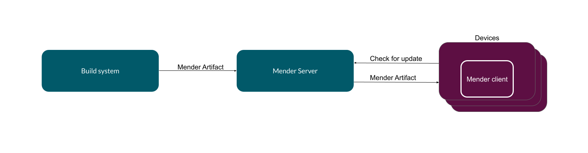
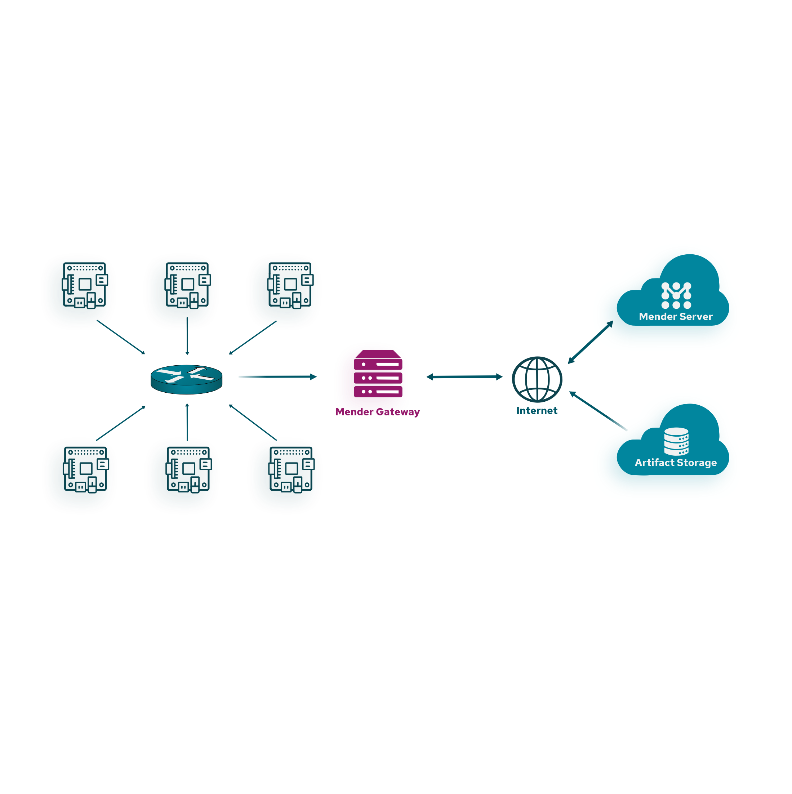
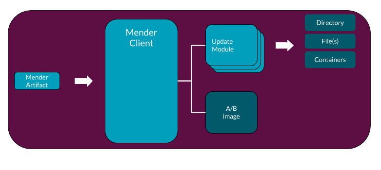
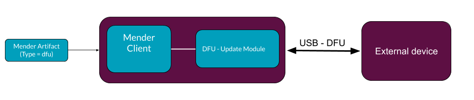
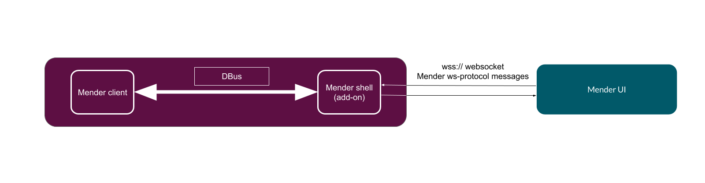

Mender is a secure and robust software update system designed to handle
a large number of devices. It has a simple client/server
architecture allowing central management of deployments to all devices.

Mender also supports powerful extensions in the form of
[add-ons](../../11.Add-ons/00.Overview/docs.md) that
enable features like Remote Terminal, Port Forward, File Transfer,
and Device Configuration, together with the ability to monitor
and alert with the Monitor add-on.

## The architecture of a software update

The following diagram shows the high level flow of data involved in deploying
software updates.

The process begins with the **build system** generating a new software version for
a device. The build system can be a workstation creating a simple
application update or a more standard component, such as Jenkins and Yocto
Project. It creates **Mender Artifacts** in the format required by the target
device. There will be different Mender Artifacts for each type of device that
Mender manages.

You upload the Mender Artifacts to the Mender Server, which is the central point
for deploying updates to a fleet of devices. Among other things, it monitors the
current software version present on each device and schedules the roll out of
new releases.

Finally, each **Device** runs the Mender Client, which polls the Mender Server
periodically to report its status and to discover if there is a software update
waiting. If there is, the update client downloads the artifact and performs the
installation.

The current Mender Client supports devices running embedded Linux, and other
clients exist for other OSes and hardware, such as microcontrollers.

## Client modes of operation

You can run the Mender Client in a _standalone_ or _managed_ mode.

In _managed_ mode, the Mender Client runs as a daemon and will regularly poll the
server, automatically apply updates, reboot, report, and commit the update. This
is the best way to run Mender for most large-scale deployments, as the
deployments are centrally managed across many devices, but it requires to set up
and connect clients to the Mender Server.

In _standalone_ mode, you initiate the updates locally on the device instead of
connecting the Mender Client to a Mender Server. A common use-case is to perform
updates from e.g., a USB flash drive. To learn more visit
[Standalone deployments](../../08.Artifact-creation/08.Standalone-deployment/docs.md)

### Mender Gateway

For devices running in isolated networks, but still want to leverage the
flexibility of _managed_ mode, the _Mender Gateway_ offers the ability for
devices to securely contact the Mender Server through your gateway device. Visit
[Mender Gateway](../../10.Server-integration/04.Mender-Gateway/docs.md) to
learn more.

## Update types

### Robust Operating System updates

One of the primary requirements of any update system is that it should be robust.
It must be able to recover from an update that fails, including loss of power
or network connectivity during the update process.

The simplest and most robust way to update a device is to write a new file
system image directly to the flash partition. Mender comes with built-in support
for a dual redundant scheme (also known as A/B scheme), ensuring that the
device always returns to a working state on failure.

During the Operating System update, the client writes the new version to the inactive
partition. When complete, the client verifies the checksum. If all is well, it
sets a flag in the bootloader that will cause it to flip the active and inactive
partitions around on the next reboot. Then the system reboots.

On the first boot following an update, the Mender Client will **commit** the
update. This sets a flag in the bootloader that indicates that the update was
applied successfully.

If something causes the device to reboot before committing the update, the
bootloader knows that something went wrong and will **roll back** to the
previous version by flipping the active and inactive partitions back again.

One consequence of the Operating System update is that the update will replace all the
files in a filesystem, thereby deleting any new or changed files that had been
placed there. In other words, to be updatable, a filesystem needs to be
**stateless**.

You have to store all files that you modify on the devices in a separate
partition. It may include network parameters, user configuration changes, etc.

### Application updates

The definition of an application update can vary depending on specific user
requirements, e.g an application can be a single file, directory or even a
container image. For this reason it is difficult to enforce **one** way of
deploying application updates.

To support application updates in a generic way, Mender provides the [Update Module](../../08.Artifact-creation/10.Create-a-custom-Update-Module/docs.md) framework.

### Combining Operating System and Application updates

A common requirement when performing software updates on connected devices
is combining Operating System and Application updates. Operating System updates
represent the only secure and robust way to upgrade the kernel, the operating system,
and related libraries, avoiding the risk of bricking the device. However,
they come with the price of the downtime caused by the system reboot and,
when delta updates are not in use, the higher amount of data usage because
of the need to transfer an artifact containing the full rootfs image.

In contrast, application updates implemented through the
[Update Module](../../08.Artifact-creation/10.Create-a-custom-Update-Module/docs.md)
framework are more flexible when the update scenario requires the replacement
of a subset of the files on the device's firmware and doesn't require
a complete device reboot cycle to apply the changes.

Mender allows combining Operating System and Application updates on the same device
to achieve the best flexibility without compromising the specific advantages
of the two approaches. When generating the Mender Artifacts, you can customize
the [Software Versioning](../../08.Artifact-creation/11.Software-versioning/docs.md)
values, as well as [*Depends* and *Provides* entries](../03.Artifact/docs.md#provides-and-depends)
in the Artifacts to define dependencies between the different kinds of updates.

You can find more information about the strategies and best practices to 
combine Operating System and Application updates in the
[Combining system and application updates](../../08.Artifact-creation/03.Combining-system-and-application-updates/docs.md) chapter.

!!! Please note that in this context, while it is technically possible
!!! to use the Update Module API to implement Operating System updates, we
!!! refer to application updates as non-rootfs ones.

### Proxy deployments

Using the [Update Module](../../08.Artifact-creation/10.Create-a-custom-Update-Module/docs.md) framework
it is also possible to deploy updates to peripheral devices, e.g
microcontrollers or sensors connected to a device running Linux.

Example using the Device Firmware Upgrade (DFU) protocol to update an external
microcontroller:

You can find more information on above example in the
[How to do a proxy deployment to an FRDM-K64F](https://hub.mender.io/t/how-to-do-a-proxy-deployment-to-an-frdm-k64f-device-connected-to-a-raspberry-pi-3/1619?target=_blank) tutorial.

## The architecture of a Mender add-on

Mender supports add-ons mainly via the Mender Connect daemon running on a device.
It is exchanging messages with the client over [DBus](https://dbus.freedesktop.org/doc/api/html/).
The below picture shows the architecture of the solution.

Please refer to the [Add-ons section](../../11.Add-ons/00.Overview/docs.md) for more details.
