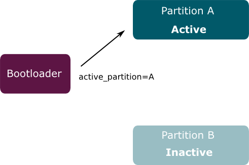

## Mender

Mender is a secure and robust software update system. We designed it to handle
thousands of devices as easily as a single device. It consists of the web UI,
update client (Mender client), and management server (Mender server). From
the very beginning the following items were our prime objectives and today they
are the key features of Mender: 
* Security
  * Mender encrypts all communication channels.
  * Devices running Mender sign every request; the server checks their authenticity.
  * The client verifies the server authenticity using the server certificate.
  * There are no open ports on the device.
* Robustness
  * Mender provides reliable updates to the file system.
  * The failed updates result in the automatic recovery and rollback to the last
    working state.
* Update fleets of devices
  * You can schedule an update of thousands of devices in phases and divided
    into groups of your own design.
  * The Mender server provides a central point of management of any deployment
    you ever made or will make, your devices, and users.
* Ease of use and flexibility
  * You can access every feature and use every functionality that Mender provides
    via API calls.
  * The web application provides a graphical interface to all API calls, presents
    reports, graphs, and summaries.
  * Mender includes also a command line interface.
  * There are vast, documented possibilities to customize the system. 
* Use of well-known and open standards
 * We use the well-defined and open standards, we do not have proprietary protocols
   or not publicly available algorithms.
* Open source
 * Mender is an open source project; apart from the closed enterprise features,
   you have access to the whole code of the system.

In the following sections we present the Mender approach to the software updates.

## The architecture of a software update

The following diagram shows the high level flow of data involved in deploying software updates.

The process begins with the **software build system** generating a new version of software for a device.
The software build system is a standard component, such as Yocto Project.
It creates **build artifacts** in the format required by the target device.
There will be different build artifacts for each type of device that Mender manages.

You pass the build artifacts to the Mender server, which is the
central point for deploying updates to a fleet of devices.
Among other things, it monitors the current software version present on each
device and schedules the roll out of new releases.

Finally, each **Device** runs a copy of the Mender client, which polls
the Management Server periodically to report its status and to discover
if there is a software update waiting.
If there is, the update client downloads the artifact and performs the installation.

The current implementation supports only devices running embedded Linux.
Mender will support other operating systems soon.

## Modes of operation

You can run the Mender client in a _standalone_ or _managed_ mode.

It is best to run Mender in the managed mode for large-scale deployments, or if
you want to try it out. In that mode, the client runs as a daemon and connects
to the Mender server ([hosted.mender.io](https://hosted.mender.io)), which provides the central
management point of the deployments across many devices. The Mender client will
regularly poll the server, automatically apply updates, reboot, report and commit
the update. Please note, that you can also run the server yourself.

In the standalone mode, you trigger the deployments (`mender -install`), reboot 
into the new version (`reboot`) and make it persistent (`mender -commit`) from
the command line at the device or through some custom integration executing these commands.
Any http(s) server or file path (e.g. USB stick or NFS share) can be used to serve
the Artifacts; the URI is given to the `mender -install` option. If you wish
to run Mender in the standalone mode, you can [disable Mender as a system service](../../04.Artifacts/10.Yocto-project/02.Image-configuration/docs.md#disabling-mender-as-a-system-service).

## Types of artifacts

Embedded devices almost universally use flash memory for storage.
You can divide flash memory into partitions in a way similar to hard disks.
In case of a device running Linux, it is possible to store components such
as the Linux kernel, device tree binary and RAM disk in a separate partition,
but it is more common to store them all together in the root file system.

The simplest and most robust way to update a device is to write a new file system
image directly to the flash partition, and this is the mechanism that Mender
supports currently. The other possible update mechanisms, for example through
the use of a package manager such as RPM, are on our roadmap.

Please see [Mender Artifacts](../03.Artifact/docs.md) for more details on the Mender Artifact format.

## Robust updates

One of the prime requirements of an updater is that it should be robust.
It must recover from an update that fails for any reason, including
loss of power or network connectivity.
In order to make updates to file system images reliable, Mender employs a dual redundant
scheme, where each updatable partition has a backup duplicate.
We call the one currently in use the **active partition**, and the backup
the **inactive partition**.
When Linux boots, the bootloader tells which partitions to use.

On image update, the client writes the new version to the inactive partition.
When complete, the client verifies the checksum. If all is well, it sets a flag
in the bootloader that will cause it to flip the active and inactive
partitions around on the next reboot. Then the system reboots.

## Commit and rollback

On the first boot into Linux following an update, the Mender client will **commit** the update. This sets a flag in the bootloader that indicates that the operating system booted correctly.

If something causes the device to reboot before committing the update, the bootloader knows that something went wrong, and will **roll back** to the previous version by flipping the active and inactive partitions back again.

## Stateless file systems

One consequence of the image update is that the update will replace all
the files in a filesystem, thereby deleting any new or changed files that had been placed there. In other words, to be updatable a file system needs to be **stateless**.

You have to store all files that you modify on the devices in a separate partition.
It may include network parameters, user configuration changes and so on.
See [Partition layout](../../03.Devices/01.General-system-requirements/docs.md#partition-layout) for more information.

## Wait, there's more!

There is much more to Mender, as you can discover continuing into the following
sections which provide an overview of each subsystem. The fact that Mender 
provides API calls for everything, combined with the high possibilities
of customization, and the availability of the code, makes 
it virtually impossible not to fit your need. You may require to do some work
with board integration, or in some cases you may need additional code in form
of scripts, but for Mender there are no intrinsic blockades to apply to any
use case.

It does not matter if you want to update one or one thousand devices;
with Mender you can easily manage the software updates regardless of the size
of your fleet.
