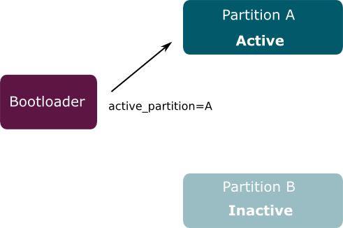
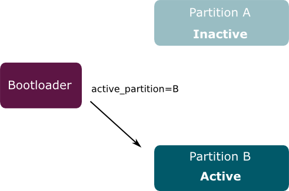

The diagram below shows the high-level flow of data when deploying OTA software
updates using Mender.

First the **software build system** generates a new version of the distributed
software for the device.

To begin the process, the **software build system** generates a new version of
the device software for the device. It is responsible for creating an image for
your device(s), and simplifies tasks such as cross-compiling and packaging the
image into the distribution format required by the device. Embedded Linux has
some well known build systems such as the [Yocto
Project](https://www.yoctoproject.org/) and [Buildroot](https://buildroot.org/).

Next, the **build Artifacts** get uploaded to the Mender **Management Server**.
The responsibility of which is to deploy the updates to the selected devices at
the selected time, and in the selected order, as well as keeping track of the
currently installed software, and hardware statistics of each device.

The **Device** runs a daemon (the Mender client), which periodically polls the
**Management Server** for updates, and uploads the software and hardware
information the server requires. If the server reports that an update is
available, the client is then responsible for downloading and installing it
safely on the device - even in the face of unforseen circumstances, such as a
power loss, or user interference.

## Modes of operation

### **Managed mode** 

The default mode for Mender is _Managed Mode_, and is the most common way to use
Mender. When running Mender in managed mode, the Mender client runs as a daemon
and will regularly poll the server, automatically apply updates, reboot, report
and commit the update. All of these actions can be further customized through
the [state-script](../State-scripts) extensions available in the client. This is
the best way to run Mender for most large-scale deployments, as the deployments
are centrally managed across many devices.

### **Standalone mode**

 Standalone mode gives the opportunity to manually run the Mender client from
 the CLI, as opposed to having a daemon running in the background. This is
 useful, for instance, if the client has no network connectivity, or if you are
 going to manually update from a USB stick, or other forms of removable memory.
 It is also used by some customers to manage a custom workflow on the device, in
 order to control the updates explicitly.

1. Downloading and writing the update to the passive partition through `mender
-install <URL|file://local-artifact>`
2. Reboot into the passive partition which now holds the new software install
through the system's `reboot` command.
3. If the newly updated software meets all the expected criteria, mark the new
update as persistent through `mender -commit`.

The Mender client is implicitly running in standalone mode when it is not
running as a daemon. To achieve this simply update the systemd service. If you
are using Yocto Project, you can follow [disabling Mender as a system service in
Yocto Project](TODO) to enable standalone mode. To read more about standalone
mode, have a look at the [documentation](../09.Standalone-deployment).

## Types of Artifacts

### **rootfs-image payload (full system updates)** 

Rootfs-image Artifacts contain a rootfs image payload. This is then written to
the passive partition during a full system update. This is the standard update
flow for Mender enabled devices, and is the safest, and most robust way of doing
software updates. This takes advantage of the dual partition scheme to make sure
that the device will recover, in case of an error during the update process, or
in the case of faulty software.

### **Update Module payload (partial system updates)**

Update module Artifacts can contain custom update payloads, such as application
updates, single files or scripts. Many update modules have [already been created
and shared](https://hub.mender.io/c/update-modules/13) by the Mender community.
These include use-cases such as:

* Updating the rootfs file system using delta updates
* Updating a Docker container
* Updating a directory
* Running a script
* Updating Device Firmware
* Updating a single file
* Updating packages, such as deb or rpm

And best of all, it is possible to write your own custom update modules to fit
your exact use case. For more information have a look at the [update
module](../07.Mender-Update-Module) section of the documentation.

A full description of the Mender Artfiact format can is here: [Mender
Artifacts](../06.Mender-Artifact).

## Robust updates

Providing a robust update mechanism implies that the targeted device can be
recovered in the case of issues during the update process. These events include
things like: loss of power, or an unstable power-supply, unstable, or complete
loss of network connectivity. The Mender client handles this out of the box
through a A/B (rootfs-image) update partition scheme (or a dual-redundant
scheme). This means that the device will have two partitions in non-volatile
memory, where one is **active**, and one is **inactive**. The bootloader then
switches between them as required.

Upon receiving an update, the Mender client writes the payload to the inactive
partition. At the end of writing the new update-image to the passive partition,
the checksum gets verified against the expected checksum in the update Artifact
to ensure the integrity of the update. If all is well, the bootloader marks the
passive partition as the new active partition, the device reboots, and the
bootloader starts the device on the newly installed software running in the
B-partition of your device.

Update modules also support a robust update scheme, where the update rolls back
in the case of an error. However, due to the custom nature of update modules,
the update-module itself needs to handle the reversion of the applied update in
response to an error reported by the Mender client.

## Update verification, and error handling

On the first boot into Linux following an update, the update client **commits**
the update if all post-install checks pass. The client itself does some checks,
such as verifying that it can report a succesful update status to the server. As
well, as any custom sanity checks that embedded in state-scripts for the
`ArtifactCommit_Enter` state. Then, if all checks pass the client notifies the
bootloader that the new software is working as intended, and that it should mark
the partition as the standard boot partition.

If something causes the device to reboot before committing the update, the
bootloader knows that something went wrong, and will **roll back** to the
previous version by marking A as the standard boot partition yet again. Thus,
the device is not running the newly deployed software, but it is still working,
and you should go back and debug the image deployed, and/or have a close look at
the deployment logs in the Mender UI.

## Stateless file systems

One consequence of a rootfs-image update is that the update will replace all the
files in a filesystem with new versions, thereby deleting any new or changed
files placed there. In other words, to be updatable a file system needs to be
**stateless**.

All files that modified by the device gets stored in a separate partition.
Things that may need to be stored include network parameters, user configuration
changes and so on. See [Partition
layout](../../devices/general-system-requirements#partition-layout) for more
information.
