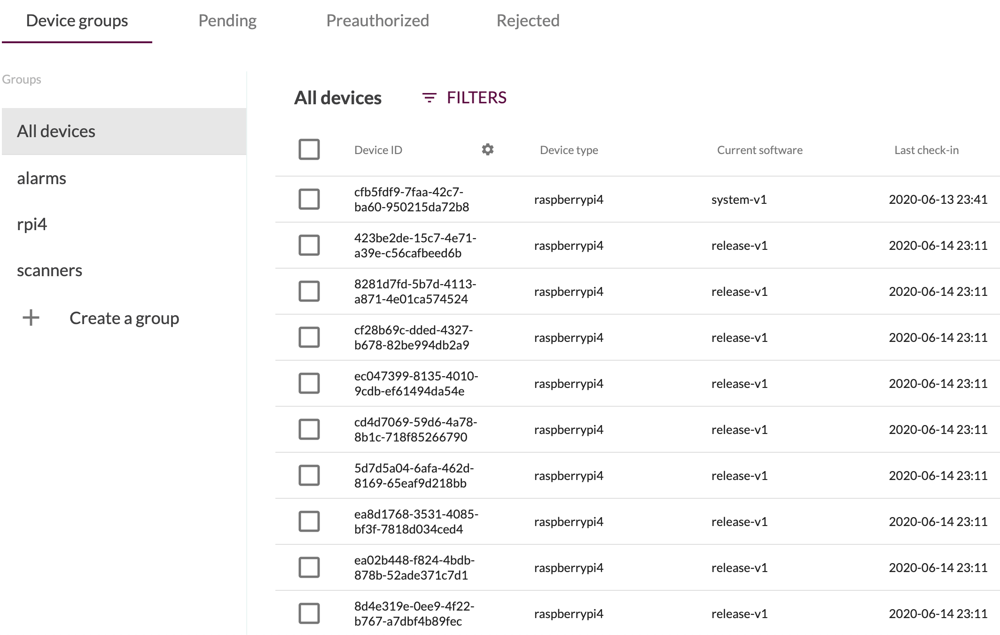

## Groups of devices in Mender

With Mender, you can manage a massive fleet of devices. It would be impractical
to do it on a single device basis; hence we introduce the concept of device grouping.
The device groups come in two flavors: static and dynamic.

## Static groups

A *static group* contains a list of Device IDs. Devices can explicitly be added or removed from a group manually in the UI, or through automation by using the APIs.

Some considerations when working with the static groups:
* Before a device can be added to or removed from a static group, it needs to exist in the Mender server.
* A device can exist only in zero or one group.
* An empty static group ceases to exist (a static group exists as long as there is at least one device in it).

The following picture shows the devices view with three static groups defined:

## Dynamic groups

A *dynamic group* does not contain a list of predefined Device IDs. It instead
contains the definition of a dynamic filter that can match one or more devices,
and the matched devices may change in the future as you accept new devices into
Mender, or device attributes change and fulfill the filter criteria.

The following picture shows the definition of a filter that you can save as a dynamic group:

## Groups and updates to devices

You can use device groups for more than just viewing purposes. Their primary function
is to serve as the target of deployments. Note that deployments to dynamic groups
behave differently than deployments to static groups, as we
describe in [deployments section](../04.Deployment/docs.md).
