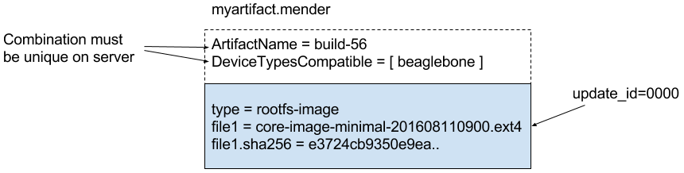

In order to ensure a secure and robust update process, Mender needs *additional metadata*
alongside the raw bits of the update payload. Depending on the version of the Artifact used,
the metadata might be different, but must contain the:

* *Name* of the software build, used to track names of Artifacts and ensures
  that the same Artifact is not deployed twice in a row.
* *Version* of the software build, used to track installed software on a given
  device.
* *Device types* the software is *compatible* with, so that software is not
  deployed to incompatible hardware (e.g. CPU architecture, hardware floating
  point support, peripheral drivers).
* *Checksum* of the payload, so that software is not run if it gets corrupted
  during transit or storage.


## The Mender Artifact file format

To handle the requirements mentioned above, Mender uses a
specific file format, identified by its `.mender` suffix which is also known as
a **Mender Artifact** or simply an **Artifact**. All relevant components of Mender,
such as the client and server, understand and use only this specific file
format when doing software deployments.

Internally, a Mender Artifact is simply a file archive in the
[tarball format](https://en.wikipedia.org/wiki/Tar_(computing)?target=_blank).
It contains several files for incorporating versioning, extensions, metadata and
the payload file(s).

Mender Artifact compresses artifact payloads by default and supports multiple
compression algorithms to do so.

The diagram below shows an example of the main attributes and structure of a
Mender Artifact file.

!!! The exact Artifact format may vary between versions.



<!--AUTOVERSION: "mender-artifact/blob/%"/mender-artifact-->
You can find more details about the Mender Artifact format in the
[Mender Artifact specification](https://github.com/mendersoftware/mender-artifact/blob/4.1.1/Documentation?target=_blank).


### *Provides* and *Depends*

In addition to *Version* information, an Artifact may contain additional
*Provides* fields which the Mender Client will store on the device during the
Artifact installation.

In addition to *Device types* information, an Artifact may contain additional
*Depends* fields. On Artifact installation, all *Depends* fields need to
match a corresponding *Provides* field on the device.

An example of this is the checksum of a read-only root filesystem. During the 
installation of a [delta Artifact](https://hub.mender.io/t/robust-delta-update-rootfs/1144?target=_blank),
the server uses the information about the existing checksum to decide which
Artifact to deploy. Take an Artifact with these fields:

```console
Provides:
    rootfs-image.checksum: 012345...
Depends:
    rootfs-image.checksum: abcdef...
```

The Artifact in the example above can only be installed on a device which has
`Provides: rootfs-image.checksum: abcdef...` stored in its database, because of
the *Depends* entry. And future Artifacts need to list `Depends:
rootfs-image.checksum: 012345...` in their dependencies to match the newly
installed Artifact.

Not all Artifacts have dependencies; if they don't, then it doesn't matter what
the *Provides* values on the device are.


### Streaming, resume and compression

The tar format supports streaming, which Mender takes advantage of. As a Mender
Artifact is downloaded from the Mender Server or external storage, the Mender
client streams the root filesystem within it directly to the inactive partition,
without needing any temporary storage for unpacking it before it is written.
This drastically reduces storage requirements for the update process,
improves performance and reduces flash wear.

In cases where Artifact downloads are interrupted, e.g. due to unreliable wireless
network connectivity, the Mender Client will resume the download from where it was
interrupted, using [HTTP range requests](https://tools.ietf.org/html/rfc7233?target=_blank).

To enable streaming and control based on metadata, like aborting the download
if the Artifact is not compatible with the device, the Mender Artifact itself
is not compressed. Instead, the root filesystems within Artifacts are
compressed, as well as some of the metadata, like headers, currently with the
[gzip compression algorithm](https://en.wikipedia.org/wiki/gzip?target=_blank)
by default.


## Artifact format versions

Mender is constantly evolving to adapt to the needs of its users, and the Mender
Artifact format has several revisions. See
[Supported releases](../../302.Release-information/01.Supported-releases/docs.md)
for an overview of which versions of the Mender Artifact format are supported
by which Mender Client versions.


## Work with Mender Artifacts

The command-line utility `mender-artifact` is the best way to work directly with
Mender Artifacts. It allows you to view, create, modify and sign all types of
Mender Artifacts. Get it in the
[Downloads section](../../12.Downloads/docs.md#mender-artifact).

Mender also has OS-level integrations for creating Operating System updates as part of
your existing OS build process. Learn more by reading the following sections:

- [Operating System updates: Debian family](../../04.Operating-System-updates-Debian-family/chapter.md)
- [Operating System updates: Yocto Project](../../05.Operating-System-updates-Yocto-Project/chapter.md)


### Sign and verify

To verify that the Artifact comes from a trusted source, the Mender Artifact
format supports end-to-end signing and verification. In order to create a
signed Artifact, please follow the instructions at
[Sign & Verify](../../08.Artifact-creation/07.Sign-and-verify/docs.md).
