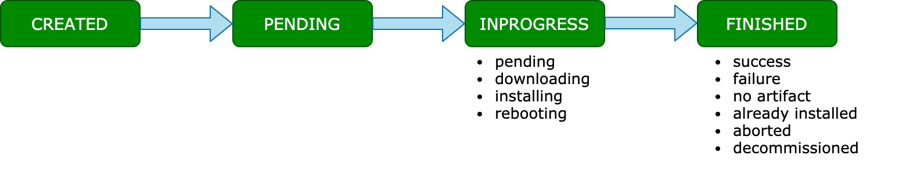

A Deployment ensures delivery of a Release to one or more devices. A Release can contain one or more Mender Artifacts, where one of the Artifacts is assigned when the device receives the update based on software and hardware compatibility.

At its basics, the definition of a Deployment includes:

* *ID*, randomly generated, unique identifier of the Deployment, assigned by Mender at creation time
* *Release*, a collection of one or more Artifacts, each being an archive containing everything Mender needs to update the targeted devices
* *Devices* targeted by the update
* *Phases* (_Professional/Enterprise only_) describing a phased and/or scheduled roll-out
* *Number of retries* (_Professional/Enterprise only_) for each device in case of a failure during the update process

Only accepted devices can be part of a Deployment, and any given device finishes the Deployment once.
Mender also maintains the order of the Deployments, so the oldest Deployment is the one a given device gets first.

## Deployment to static groups

It is possible to create a Deployment targeting one or more specific devices, both using the UI and the APIs, selecting an explicit list of Device IDs.
The Mender UI also supports the creation of a Deployment targeting a static device group, to update all the devices belonging to it.

A Deployment to a static group contains a list of devices and finishes once all the devices in the Deployment have finished.
Mender uses the group to retrieve the list of the Device IDs at
Deployment creation time, so the Deployment will not include any devices assigned to the group afterwards.

## Deployment to dynamic groups

Mender Enterprise also supports the creation of Deployments using a dynamic filter to assign a Deployment to an open, variable group of devices matching the filter criteria until the user stops the Deployment.

Deployments to a dynamic group behave very differently than Deployments to a static
group. Deployments to dynamic groups will never implicitly finish, but will stay
active until the user stops it. However, you can use the maximum number
of devices setting to ensure the Deployment finishes when the given number of devices
receive an update. Please also note that a device can only be in *one* static
group at the same time, while it can be in *multiple* dynamic groups.

## Deployment life-cycle

Once you create a Deployment, it stays in the *pending* state until one or more
devices targeted by the Deployment have requested the update.

When at least one device running the Mender client is performing the defined update, the Deployment transitions to the status *inprogress*.

When all the devices included in the Deployment to a static group finished the update, either successfully or not, the Deployment's status changes to *finished*.

Deployments to dynamic groups behave in a different way as they do not include the explicit list of devices targeted by the update. For this reason, a Deployment to dynamic groups remains in *pending* status until one of the following conditions is true:

* The user explicitly, either programmatically via API or using the Mender UI, marks the Deployment as completed.
* The number of devices updated matches the optional Deployment's parameter *maximum number of devices*.

At this point, the Deployment's status transitions to *finished*, and any other device will not use it.

The above picture shows the Deployment life-cycle with possible device Deployment statuses (see next section)
in *inprogress* and *finished* states.

### Device Deployment

Each device, while processing a Deployment and after finishing it, stores the details of the update process defined by a Deployment in a database entity called Device Deployment.

The definition of a Device Deployment includes:

* The details of the Device, Deployment, and Artifact
* Status, and optionally sub-status of the upgrade process
* Creation and completion timestamps
* Optionally, the logs generated during the update process

The list of the possible values for the status field of a Deployment *in progress* are:

* downloading
* installing
* rebooting
* pending

The values for the status field for a *finished* Deployment are:

* success
* failure
* noartifact
* already-installed
* aborted
* decommissioned

### Algorithm for selecting the Deployment for the Device

It is possible that you have chosen the device to be the target for one Deployment or more.
When the device is asking for the Deployment, the deployments service looks for
the *oldest unfinished Deployment* for the device (see the picture below).
If there is one, the Deployments service creates the instance of the Deployment for the device (Device Deployment) with a *pending* state and executes the following operations:
* checks if the Deployment has more than one phase and in case it does, checks if there is an active phase; if so, the deployments service proceeds, if not, the Deployment service returns no instructions to the device;
* tries to assign an Artifact to the device; if there is an artifact returns the Deployment instructions to the device; if not - returns no instructions and sets the device Deployment status to *no artifact*; in case the artifact installed on the device is the same as the one in the Deployment, deployments service returns no instructions and sets the device Deployment status to *already installed*.

