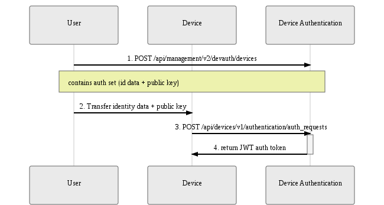
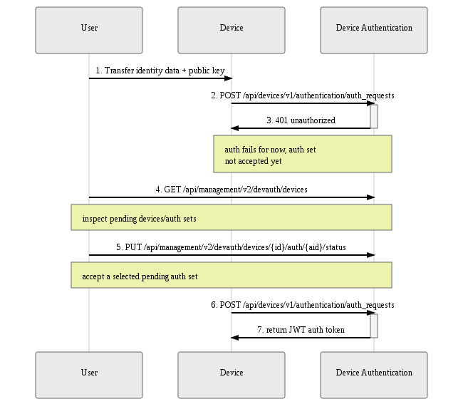

Devices, identified by a set of [identity attributes](../identity), must be
explicitly authorized by the user before they can authenticate with the Mender
server.

This section describes the components and workflows relevant to device
authentication, and provides practical tips on navigating our APIs to
successfully authorize devices, monitor authorization status, and troubleshoot
related issues.

## Authentication service

A single service implements device authentication:

* [Device
  Authentication](https://github.com/mendersoftware/deviceauth?target=_blank)

The service exposes APIs for:

* device authorization, namely granting access to selected devices
* issuing and keeping track of authentication tokens ([JSON Web
  Token](https://jwt.io?target=_blank))
* inspecting and managing devices and their authentication credentials

The following section describes them the two modes, or workflows, to perform
device authentication,

## Terminology: Device, Identity Attributes, Authentication Set

It is important to clear up some terminology used throughout this documentation
and various APIs.

A **device** represents, intuitively, a particular piece of hardware. It is
uniquely identified by a set of **identity attributes** (MAC addresses,
user-defined UIDs, etc.); think of it as an extension of a unique identifier
into a multi-attribute structure (see [Identity](../identity)).

To obtain an auth token, the device sends an **authentication request**
containing the identity attributes and its current **public key**. The request
is signed with the private key (kept secret on the device), and the server uses
the public key to verify the signature.

The combination of **identity attributes** and **public key** forms an
**authentication set**, or 'auth set' in short.

The concept takes into consideration device key rotation - a single device may
over time present different keys, and it's important to track those, and allow
the user to accept(i.e. authorize) or reject a particular identity/key
combination.

Mender keeps tracks both of a **device**, as a single real-world entity, and its
multiple  **authentication sets** (one-to-many relation).

## Authorization Flows

Mender provides two possible authorization flows. Both involve a user's explicit
consent to authorize a device via the Device Authentication API, but they differ
in the order of events and intended use cases. Below is a detailed breakdown of
each.

For details of API calls please consult the API documentation.

For open source:

* [Device Authentication Device
  API](../../apis/open-source/device-apis/device-authentication)
* [Device Authentication Management
  API](../../apis/open-source/management-apis/device-authentication)

And for Enterprise:

* [Device Authentication Device
  API](../../apis/enterprise/device-apis/device-authentication)
* [Device Authentication Management
  API](../../apis/enterprise/management-apis/device-authentication)

### Preauthorization Flow

Preauthorization is the idea of authorizing a device before it ever connects to
the server for the first time. This is the intuitive model analogous to creating
an account before logging in to an online service.

It allows to authorize a particular device before is released or even assembled.
It is sufficient for the user to submit a pre-assigned authentication set to
Device Authentication. At some point a device with corresponding identity
attributes and public key will request authentication and the Mender server will
grant access immediately, without further user intervention.

This flow is therefore best suited to a typical production use case, where a
release of a potentially large batch of devices is planned:

* device identity attributes/keys are pre-assigned and tracked outside of Mender
* Manually or via script, the user preauthorizes the devices using the Device
  Authentication API.
* during the release process, identities and keys are transferred to physical
  devices
* upon the first authentication request for each device, the Mender server
  authenticates it and the device gains access to all Mender APIs

The sequence diagram below describes the API interactions between the user and
Device Authentication within this flow:

1. The user first submits a preauthorized auth set to Device Authentication
2. The user makes sure the physical device contains the corresponding identity
   attributes and public key
3. The device, when activated, submits an authentication request containing the
   identity attributes and key
4. Device Authentication returns a valid authentication token

|  |
|:--:|
|*Preauthorization flow*|

### Accept-on-request Flow

An alternate flow, suitable mostly for quick prototyping and testing, is the
accept-on-request flow.

It is not required for the user to preauthorize a device - instead, when the
device first submits an auth request gets recorded for future inspection by the
user. The auth set can then be accepted via the Device Authentication API
whenever the user sees fit; a subsequent auth request from the device will
result in a successful authorization.

The authorize-on-request flow therefore requires the user to accept
authentication sets one-by-one, as devices connect to the server. As such it is
not ideal for scenarios with a large number of devices; it is recommended for
smaller or non-production installations instead.

The sequence diagram below describes the API interactions between the user,
Device, and Device Authentication within this flow:

1. The user provides the device the device with some identity attributes and a
   public key
2. The device tries to authenticate, retries in a loop according to the Mender
   client's configured interval
3. For the time being, authentication attempt fails, but the auth set is
   recorded for future inspection
4. The user inspects pending authentication sets
5. The user accepts the submitted auth set
6. The device applies for an auth token again
7. Device Authentication returns a valid authentication token

|  |
|:--:|
|*Accept-on-request flow*|

## Authentication Token

After the Mender server authorizes a device, a subsequent authentication request
to Device Authentication results in obtaining an **authentication token**. The
Mender client will record it and attach it to every API call under the HTTP
`Authorization` header.

The token does have an **expiry date** (one week period), but the Mender client
will obtain a fresh token automatically; the process is transparent to the user.
The only prerequisite is that the device's authentication set has not been
explicitly rejected via the Device Authentication API.

For details on the token format please see the relevant [documentation on
submitting an authentication request for Open
Source](../../apis/open-source/device-apis/device-authentication) or
[Enterprise](../../apis/enterprise/device-apis/device-authentication).

## Viewing devices and auth sets

To view available devices and their authentication sets, use the `GET
/api/management/v2/authentication/devices` endpoint of the [Device
Authentication Management API for Open
Source](../../apis/open-source/management-apis/device-authentication) or
[Enterprise](../../apis/enterprise/management-apis/device-authentication).
