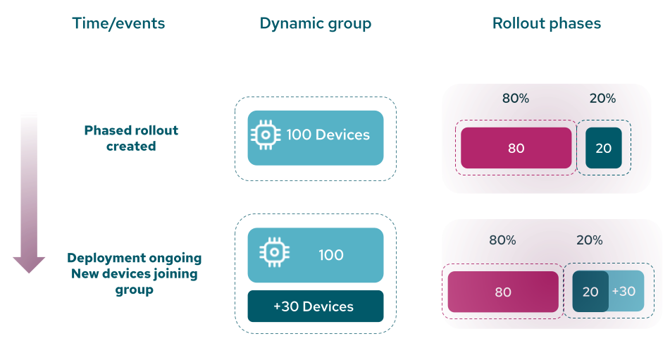
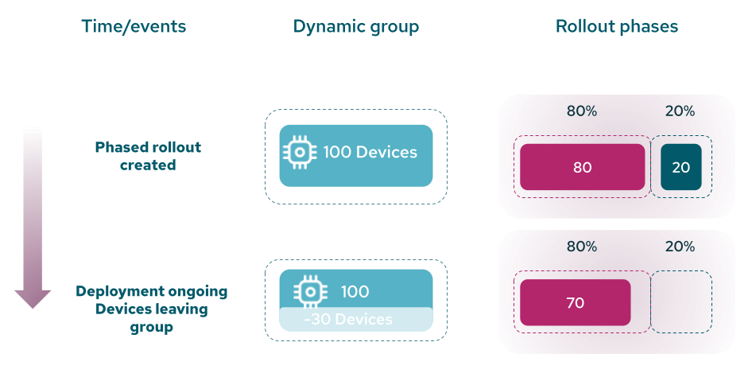
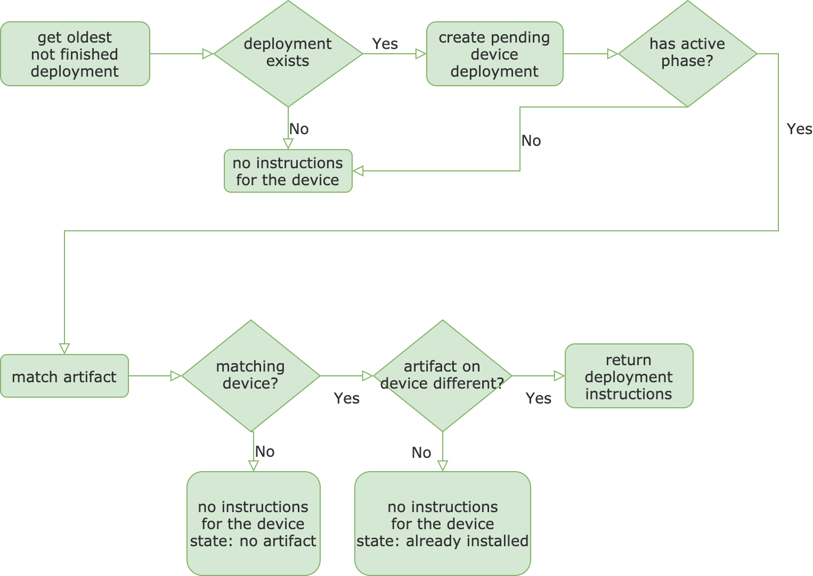

A Deployment ensures the delivery of a Release to one or more devices. A Release can contain one or more Mender Artifacts.
The Artifact is assigned to a device based on the software and hardware compatibility the device provides.
In other words, a Deployment is the server-side model which represents a device update.


The characteristics of a Deployment are:
* Only accepted devices can be part of a Deployment
* A device won't take part in the same Deployment twice
    * This can be overridden with the "Force update" option
* Deployments get applied to the device in the chronological order they are created


### Deployment to static groups

A Deployment to a static group contains a fixed list of devices and finishes once all the devices in the Deployment have the expected artifact installed.
The Mender Server translates the static group into a fixed list of Device IDs at Deployment creation time.


A Deployment to static groups will:
* Finish as soon as all devices have either reported success or failure
* Apply to a specified number of devices during the lifetime of the Deployment
    * Adding or removing devices to the static group after the Deployment creation does not affect the ongoing Deployment.


### Deployment to dynamic groups

In the Enterprise plan, Mender Server supports the creation of Deployments using a dynamic filter to assign a Deployment to an open, variable group of devices matching a filter criterion.

A Deployment to a dynamic group behaves differently than to a static group. In particular, it will:

* Never finish unless the user manually stops it or it was explicitly capped to a limited number of devices
* The number of devices taking part in the Deployment can change during the lifetime of the Deployment


**Example: Deployment order on dynamic groups**

The principle of guaranteeing a predictable order might not be intuitive in certain cases of deployments to dynamic groups.
The most common case for that is the automatic incremental updated (`v1` -> `v2` -> `v3`).

Imagine the following case of dynamic groups:

```
group-v1 - devices with v1      # an example device starts with the version v1
group-v2 - devices with v2
group-v3 - devices with v3
```

The Deployments get created in the following order:

```
(1.) Deploy v2 to group-v1
(2.) Deploy v3 to group-v2
```

The device is part of `group-v1` and the Deployment `(1.)` was created first.
It's applied to the device, the device gets updated to v2. This results in a group change so the device is now part of `group-v2`.

Deployment `(2.)` was created after Deployment `(1.)` so it can be applied to the device next and the device updates to v3.


Let's examine the same case:

```
group-v1 - devices with v1      # an example device starts with the version v1
group-v2 - devices with v2
group-v3 - devices with v3
```

But in this case the Deployment creation order is reversed:

    (1.) Deploy v3 to group-v2
    (2.) Deploy v2 to group-v1


Deployment (1.) is created first, but the device isn't part of group-v2.
Instead Deployment (2.) takes place and updates the device to v2.

The device is now part of group-v2 and and there is an ongoing Deployment (1.) to group-v2.
However Deployment (1.) **will not start** for the device to not break the guaranteed ordering rule.

From the perspective of the device Deployment (1.) has to happen before Deployment (2.),
Since Deployment (2.) already took place there is no possible way for (1.) to take place without breaking the guarantee.


### Phased rollouts and dynamic groups

The calculation for the number of devices in a phase uses the total number of devices in the dynamic group at the moment of Deployment creation.
The nature of Deployments to dynamic groups is that the total number of devices receiving the update can change during the lifetime of the Deployment.

If the number of devices in a dynamic group changes during a phased rollout the original rollout calculation won't be recalculated.
Depending of the nature of the change the following will happen:
* the number of devices in the dynamic group increases - last phase expands to contain all remaining device.
* the number of devices in the dynamic group decreases - the entire group (potentially) gets updated before all the phases end

!! The exact time a specific device receives a deployed Artifact is not determined by the server, but the concrete moment the device contacts the server following its polling cycle.
!! This means it is possible that devices which joined the group after the Deployment started, get updated as part of the first phase.

**Example: Phased rollout to a dynamic group**

```
A dynamic group has 100 devices during the creation of the Deployment.
There are two phases 80% and 20%.
They will contains 80 and 20 devices.
As new devices become part of the group the last phase gets expanded.
```


<!-- Image link: https://docs.google.com/drawings/d/15vIsUEBiFjhGJEWBzc5iGOE-7u4YVIoTlOSt9DcnOFI/edit -->



Example.
```
A dynamic group has 100 devices during the creation of the Deployment.
There are two phases 80% and 20%.
They will contains 80 and 20 devices.
As devices leave the group all devices in the group get updated in the first phase.
```

<!-- Image link: https://docs.google.com/drawings/d/1NRQ_eFAz-NQ2vT5p81wnGB2hU7E8kIXmmubFiVurvL4/edit -->



## Deployment life-cycle

Once you create a Deployment, it stays in the *pending* state until one or more
devices targeted by the Deployment have requested the update.

When at least one device running the Mender client is performing the defined update, the Deployment transitions to the status *inprogress*.

When all the devices included in the Deployment to a static group finished the update, either successfully or not, the Deployment's status changes to *finished*.

Deployments to dynamic groups behave in a different way as they do not include the explicit list of devices targeted by the update. For this reason, a Deployment to dynamic groups remains in *pending* status until one of the following conditions is true:

* The user explicitly, either programmatically via API or using the Mender UI, marks the Deployment as completed.
* The number of devices updated matches the optional Deployment's parameter *maximum number of devices*.

At this point, the Deployment's status transitions to *finished*, and any other device will not use it.


The above picture shows the Deployment life-cycle with possible device Deployment statuses (see next section)
in *inprogress* and *finished* states.


### Device Deployment

Each device, while processing a Deployment and after finishing it, stores the details of the update process defined by a Deployment in a database entity called Device Deployment.

The definition of a Device Deployment includes:

* The details of the Device, Deployment, and Artifact
* Status, and optionally sub-status of the upgrade process
* Creation and completion timestamps
* Optionally, the logs generated during the update process

The list of the possible values for the status field of a Deployment *in progress* are:

* downloading
* installing
* rebooting
* pending

The values for the status field for a *finished* Deployment are:

* success
* failure
* noartifact
* already-installed
* aborted
* decommissioned


### Algorithm for selecting the Deployment for the Device

It is possible that you have chosen the device to be the target for one Deployment or more.
When the device is asking for the Deployment, the Deployments service looks for
the *oldest unfinished Deployment* for the device (see the picture below).
If there is one, the Deployments service creates the instance of the Deployment for the device (Device Deployment) with a *pending* state and executes the following operations:
* checks if the Deployment has more than one phase and in case it does, checks if there is an active phase; if so, the Deployments service proceeds, if not, the Deployment service returns no instructions to the device;
* tries to assign an Artifact to the device; if there is an artifact returns the Deployment instructions to the device; if not - returns no instructions and sets the device Deployment status to *no artifact*; in case the artifact installed on the device is the same as the one in the Deployment, Deployments service returns no instructions and sets the device Deployment status to *already installed*.

