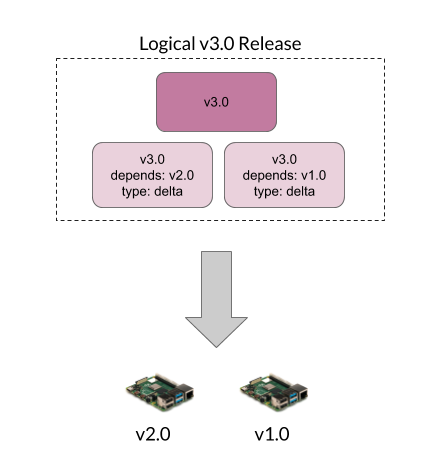

!!!!! Support for Delta updates is available in the Mender Enterprise plan and
!!!!! partially in Mender Professional. See
!!!!! [the Mender features page](https://mender.io/product/features?target=_blank)
!!!!! for an overview of all Mender plans and features.

Delta updates provide significant savings in both bandwidth and install time.
When you use Delta updates, only the difference between the new and the old root
filesystem is transmitted to the device. A Delta update can therefore be
significantly smaller than a regular update. In every other regard, this is the
same as doing a regular Operating System update, with atomicity, integrity, rollback
and signature support included.

Delta updates are faster to install, as they only write the changed blocks to
storage, as opposed to a regular update, which writes all bytes, even if they
have not changed on the storage medium.

When a device checks for an update, the Mender server will automatically assign
the right Artifact to the device based on the version the device is already
running. It selects a Delta update if available for the Release the device is
running, but also supports falling back to the full image if no Delta update is
available for a given device.

This ensures that all devices get updated and minimizes the bandwidth needed
(based on the Delta updates that are available in the server).

To learn more about how to integrate robust Delta updates visit the
[Mender Hub - Robust delta update rootfs](https://hub.mender.io/t/robust-delta-update-rootfs/1144?target=_blank)

