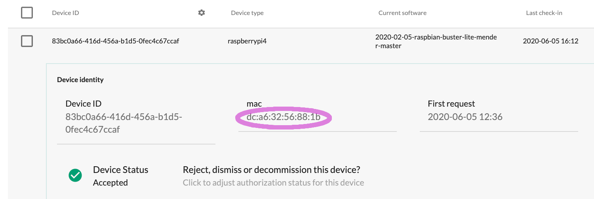

## The identity of a device

Internally the Mender Server assigns
a unique, unchangeable identifier to each Device called the *Device ID*.
The Device ID does not have a directly visible relation to any Device attributes.

To ensure devices can also be uniquely recognized by humans,
there is also a set of key-value pairs called *Device identity*.
The MAC address of a network interface controller, a serial number, the eMMC CID,
are all pieces of data that:
* do not change over the lifetime of a device
* are human-readable
* form a 1:1 relationship with the device
* you can store as key-value pairs

The Mender Client uses the MAC address as the default Identity attribute.
Once you have accepted the device, you can see it in the UI:

The Mender Client allows you to define the identity attributes, which means that Mender
can adapt to the identity scheme of any environment. However, Mender imposes the following
requirements for device identities:

* The combination of the attribute values must be *unique* to each device, so that identities are not ambiguous when deploying software.
* Identity attributes must *never change* for the lifetime of a device, so that the Mender Server can recognize them reliably.

It is important to have the ability to regenerate keys if a device gets compromised,
or as a recurring proactive security measure.
Therefore, we do not recommend using device keys as part of an identity, as it
makes the rotation or regeneration of keys over the lifetime of the device
(as it in effect changes the identity) difficult.

When a device requests [authentication](../../200.Server-side-API/?target=_blank#device-api-device-authentication),
it includes the identity attributes. The Mender Server computes the persistent
identity of the device based on these attributes.

Please refer to the [client installation section](../../03.Client-installation/03.Identity/docs.md)
to find detailed tutorial on managing Device identities.
