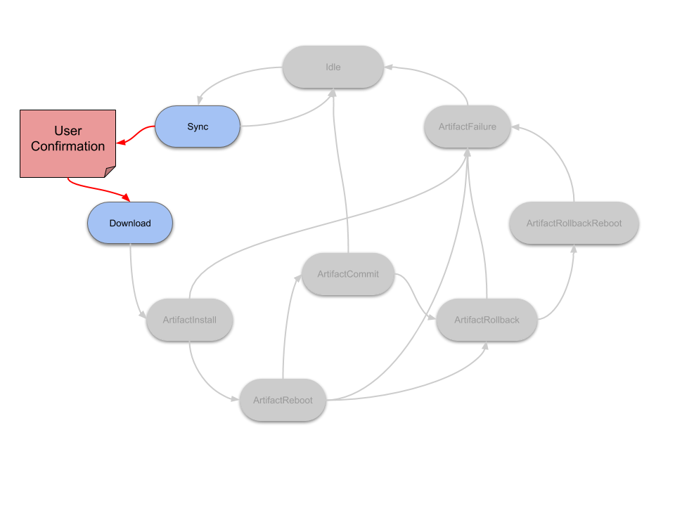

State scripts offers customization of the Mender state-machine during an update.
The Mender Client can run scripts before and after every state in the Mender
state-machine. For some examples of usage, see [example use
cases](#example-use-cases).


## The Mender client states supporting state-script customization

State scripts run as pre- and post-scripts for each state listed below:

### Managed mode

* **Idle**: The Mender client is idling, waiting for the next action to handle. At this stage, no communication with the server, or downloads are in progress.
* **Sync**: At this stage the Mender client will either send or update its inventory to the server, or check if an update is available. This requires communication with the server.
* **Download**: When an update is ready at the server side Mender downloads it (streams it) to the inactive rootfs partition.
* **ArtifactInstall**: Swap the active and inactive partitions through interaction with the bootloader.
* **ArtifactReboot**: Reboots the device. Note: the Enter scripts run prior to reboot; the Leave actions run after.
* **ArtifactCommit**: If the new image in the passive partition passes all the integrity checks, the Mender client will mark the update as successful and continue running from this partition. The commit makes the update persistent. A pre-script here can add custom integrity checks beyond what the Mender client provides out of the box.
* **ArtifactRollback**: If the new update fails any of the above mentioned integrity checks, the Mender client will revert the update payload. At this point, scripts in this state can help revert migrations done as a part of the update.
* **ArtifactRollbackReboot**: Some update types - most notably rootfs images - require a reboot, if any of the integrity checks fail. This state runs right before the client reboots back (i.e., rollback) into the old image partition.
* **ArtifactFailure**: if any of the States with an "Artifact" prefix fail, execute this state. Note: this state always runs after the ArtifactRollback and the ArtifactRollbackReboot states.


### Standalone mode

Mender in standalone mode omits some states from execution because Mender is not
running as a daemon. Standalone mode executes these states:

* **Download**
* **ArtifactInstall**
* **ArtifactCommit**
* **ArtifactRollback**
* **ArtifactFailure**


Most of the states also have an "Error" transition which runs when some error
occurs while executing any action inside the given state (including execution of
Enter and Leave scripts).


## Root file system and Artifact scripts

There are two types of the state scripts:

* **Root file system scripts**: These are not a part of an update, but scripts
which are already present on a device, stored as a part of the current root file
system. The default location is `/etc/mender/scripts`.

* **Artifact scripts**: Are part of an update. Scripts can thereby customize
  actions of the Mender state machine, as described [above](#The Mender client
  states supporting state-script customization) during an update installation.
  Artifact scripts are easy to distinguish from root file system scripts, as
  they are prefixed with `Artifact`.
  
`Root file system` and `Artifact` scripts serve different use-cases. Since
Mender allows some scripts to run prior to the download of the Artifact and as
such, these are not run from the Artifact which contains them. This means that
scripts with the names `Idle`, `Sync` or `Download`, get installed on the root
file system permanently after an update. Scripts starting with the name
`Artifact`, are only run during an update, and are since deleted. An example of
a `root file system script` use-case is disabling network connectivity upon
entering `Idle`, and re-enabling it upon leaving `Idle`. This distinction is
important to remember, as when deploying a new update all scripts that run up
to - and not including - the `ArtifactInstall` state are from the previous
Artifact installation - not the new one.


## Transitions and ordering

Prior to the Mender state-machine entering any of the states mentioned
[above](#The Mender client states supporting state-script customization), the
client will run the state-scripts with a name matching the following pattern:

```
<STATE_NAME>_<ACTION>_<ORDERING_NUMBER>_<OPTIONAL_DESCRIPTION>
```

An example of which is:

```
Idle_Enter_01_disable-network
```

and

```
Idle_Leave_01_enable-network
```

will run upon entering, and leaving the `Idle` state.

The naming scheme given above thus dictates the order the scripts run as a part
of the update logic, where:


```
<STATE_NAME(1)>_<ACTION(2)>_<ORDERING_NUMBER(3)>_<OPTIONAL_DESCRIPTION(4)>
```

1. The state in which the script executes. 
2. Execute it before or after entering the state. 
3. If multiple scripts exist for this state-transition, this decides the script ordering.
4. Optional description of script functionality. This has no effect on the execution of the scripts.

If the script's `ACTION(2)` is `Error`, then the script runs when an error
occurs. We refer to this as an error script.

!!! Note: `Idle`, `Sync`, `ArtifactRollback`, `ArtifactRollbackReboot` ignore
errors. This means that no error scripts are executed for errors in these
states.

**There are no arguments passed to the scripts.**


## Script return codes

* Success (0)

Successful script execution - Continue the update.

* Error (1)

Mender client marks the update as failed, aborts the update, and performs a rollback if requried.

* Retry-later (21)

Upon a `Retry-later` exit code the client sleeps for a time configured by
[StateScriptRetryIntervalSeconds](../../client-configuration/configuration-file/configuration-options/#statescriptretryintervalseconds)
before retrying the state script. Scripts are not allowed to retry for
infinitely long. Each script has a total retry window. A script retrying for
longer than
[StateScriptRetryTimeoutSeconds](../../client-configuration/configuration-file/configuration-options/#statescriptretrytimeoutseconds)
counts as an error.

This feature is useful e.g when you want user confirmation before proceeding
with the update as described in the [Update confirmation by end
user](./#update-confirmation-by-end-user) section.

!!! All other return codes are reserved for future use by Mender and are not available for use.


## Script timeout

Each script has a maximum execution time defined by
[StateScriptTimeoutSeconds](../../client-configuration/configuration-file/configuration-options/#statescripttimeoutseconds.
If a script exceeds this running time, its process group gets killed and the
Mender client marks the update as failed.

## Power loss

A power loss during an update can be a catastrophic event for an IoT device if
not dealt with properly. The Mender client has built in protections for handling
such an event. If you are using state scripts this adds some complexity to the
logic of your scripts. Take this into account when writing a custom state
script. In order to not encounter any unintended side-effects: follow the below
rules when writing your state-scripts.

* A power loss will return the Mender state-machine to the **`ArtifactFailure** state upon reboot.
* A power loss when executing an error state (i.e., ArtifactFailure, ArtifactRollback, ArtifactRollbackReboot) will cause it to repeate.
* Exceptions:
**`ArtifactReboot_Enter`** state: A power-loss is not an error.
**`ArtifactCommit_Leave`** state: A power-loss will cause this state to rerun, since after a commit, it is too late to do a rollback.

!!! Tip: Since a power loss in `ArtifactReboot_Enter` does not mark an update as a
!!! failure, this enables the user to stall the daemon in `ArtifactReboot_Enter`
!!! state forever, and thus an install is only installed on a power-cycle of
!!! the device.

Because of the possible re-execution described above, state scripts should be
idempotent. This means that re-running the script several times, even partially,
should have the same effect as running it once, as long as the last execution is
complete.

## State script logging

Mender captures the standard error (but not standard output) stream from state
scripts. The client stores the standard error stream from state scripts as part
of the Mender deployment log, so it becomes available [locally on the
client](../../troubleshooting/mender-client#deployment-log-files) as well as
reported to the server (if the deployment fails) to ease diagnostics.

Thus, write state scripts to output diagnostics information to standard error,
especially in case of a failure (exit code 1). Note that the maximum size of the
log is 10KiB per state script. The client truncates anything above this size,
before it sending it to the server to save bandwidth.

## Example use cases

It is up to you to build the state-scripts to suit your needs. Mender designed
state-scripts to put as few limitations on the end-user as possible. For
inspiration, some well-known user-cases are listed below for inspiration.

<!--AUTOVERSION: "mender/tree/%"/ignore-->
You can find the code examples in the [Mender client source
repository](https://github.com/mendersoftware/mender/tree/master/examples/state-scripts)
and if you have implemented an interesting use-case we encourage you to create a
pull request so the whole community can benefit.

#### Application data migration

When migrating application data during an update, like a user profile stored in
an SQLite database, or a user configured configuration file, state scripts is
the preferred tool. An `ArtifactInstall_Leave` (which will run after writing
the new rootfs, but before rebooting) can do the necessary migrations on the data
partition before the client brings the new version of the application up.


#### Update confirmation by the end user

For many devices with a display that interacts with an end user, it is desirable
to ask the user before applying the update. You have probably seen this on a
smartphone, where it will ask you if you want to update to the latest release of
Android or iOS and it only starts after you hit "Apply".

Mender state scripts enable this use case with a script written to create the
dialog box on the UI framework used. The script will simply wait for user input,
and Mender will wait with the update process while waiting for the script to
finish. Depending on what the user selects, the script can return `0` (proceed)
or `21` ([retry later](#retry-later)). For example, if this script runs in the
`Download_Enter` state, and can then ask the user for confirmation before the
download begins. Alternatively, run the script can in the `Download_Leave`
state, if you want the download to finish first, and the user needs only to
accept installing the update and rebooting.

Make sure to adjust
[StateScriptRetryTimeoutSeconds](../../client-configuration/configuration-file/configuration-options/#statescriptretrytimeoutseconds),
to enable this use case.



!! Maximum wait time between `Sync` and `Download` state is 24 hours, after this period the client marks the update as failed. This happens because the Mender Artifact download link is generated in `Sync` state and has an expiration time (24 hours).

#### Custom sanity checks after update installation

Mender automatically rolls back an update if it can not reach the Mender Server
after an update. This is done to ensure *another* update can be deployed
afterwards from the same image.

Scripts in `ArtifactCommit_Enter` can do additional sanity checks to make sure
that the device and applications are working as expected. For example, is the UI
application running and responding within a given amount of time? If not, then
the script can simply return 1 and Mender will roll back the update.


#### Enable network connectivity

State scripts can enable and disable network connectivity in order to save power
and/or bandwidth on the device.

A state script in `Sync_Enter` can enable network connectivity. You could also
enable more powerful network connectivity, such as Wi-Fi, with a state script in
`Download_Enter`. If the network is not brought up by default on reboot, you
should also enable the network in `Reboot_Leave`.

!!! Note that the `Sync_Enter` transition can be reached quite frequently,
!!! depending on the [polling intervals](../../client-configuration/configuration-file/polling-intervals).
!!! The Mender Client also requires network in several following states of the update
!!! process to report progress to the Mender Server.

If you want to explicitly disable the network after Mender has finished the
deployment, the only safe place to do this is in `Idle_Enter`.


## State transition ordering

You will find state transitions for common scenarios below.


#### Normal execution without errors

1. (device boot)
2. [Idle_Enter] Idle [Idle_Leave]
3. [Sync_Enter] Sync [Sync_Leave]
4. [Download_Enter] Download [Download_Leave]
5. [ArtifactInstall_Enter] ArtifactInstall [ArtifactInstall_Leave]
6. [ArtifactReboot_Enter] ArtifactReboot
7. (device reboot)
8. [ArtifactReboot_Leave]
9. [ArtifactCommit_Enter] ArtifactCommit [ArtifactCommit_Leave]
10. [Idle_Enter] Idle [Idle_Leave]

Please note that scripts in `ArtifactReboot_Leave` run *after* the device
has rebooted.


#### Error while downloading the Artifact

1. (device boot)
2. [Idle_Enter] Idle [Idle_Leave]
3. [Sync_Enter] Sync [Sync_Leave]
4. [Download_Enter] Download
5. (error while downloading)
6. [Download_Error]
7. [Idle_Enter] Idle [Idle_Leave]

Please note that no scripts in the `Download_Leave` transition run if the
download fails. Instead, the scripts in the `Download_Error` transition run.


#### Error while installing the update

1. (device boot)
2. [Idle_Enter] Idle [Idle_Leave]
3. [Sync_Enter] Sync [Sync_Leave]
4. [Download_Enter] Download [Download_Leave]
5. [ArtifactInstall_Enter] ArtifactInstall
6. (error while installing)
7. [ArtifactInstall_Error]
8. [ArtifactFailure_Enter] ArtifactFailure [ArtifactFailure_Leave]
9. [Idle_Enter] Idle [Idle_Leave]

If any of the `Artifact` scripts fail, the `ArtifactFailure` state runs and the
corresponding Enter and Leave scripts executes. Please also note that *there is
no* `ArtifactFailure_Error` state transition and if any error occurs while
executing actions inside the `ArtifactFailure` state, the scripts in the
`ArtifactFailure_Leave` transition runs and an appropriate error path executes.


#### Error while committing an update

1. (device boot)
2. [Idle_Enter] Idle [Idle_Leave]
3. [Sync_Enter] Sync [Sync_Leave]
4. [Download_Enter] Download [Download_Leave]
5. [ArtifactInstall_Enter] ArtifactInstall [ArtifactInstall_Leave]
6. [ArtifactReboot_Enter] ArtifactReboot
7. (device reboot)
8. [ArtifactReboot_Leave]
9. [ArtifactCommit_Enter] ArtifactCommit
10. (error while committing)
11. [ArtifactCommit_Error]
12. [ArtifactFailure_Enter] ArtifactFailure [ArtifactFailure_Leave]
13. [ArtifactRollback_Enter] ArtifactRollback [ArtifactRollback_Leave]
14. [ArtifactRollbackReboot_Enter] ArtifactRollbackReboot
15. (device reboot)
16. [ArtifactRollbackReboot_Leave]
17. [Idle_Enter] Idle [Idle_Leave]

Please note that similar to the `ArtifactReboot` state, scripts in the
`ArtifactRollbackReboot_Leave` transition runs after the device has rebooted.
