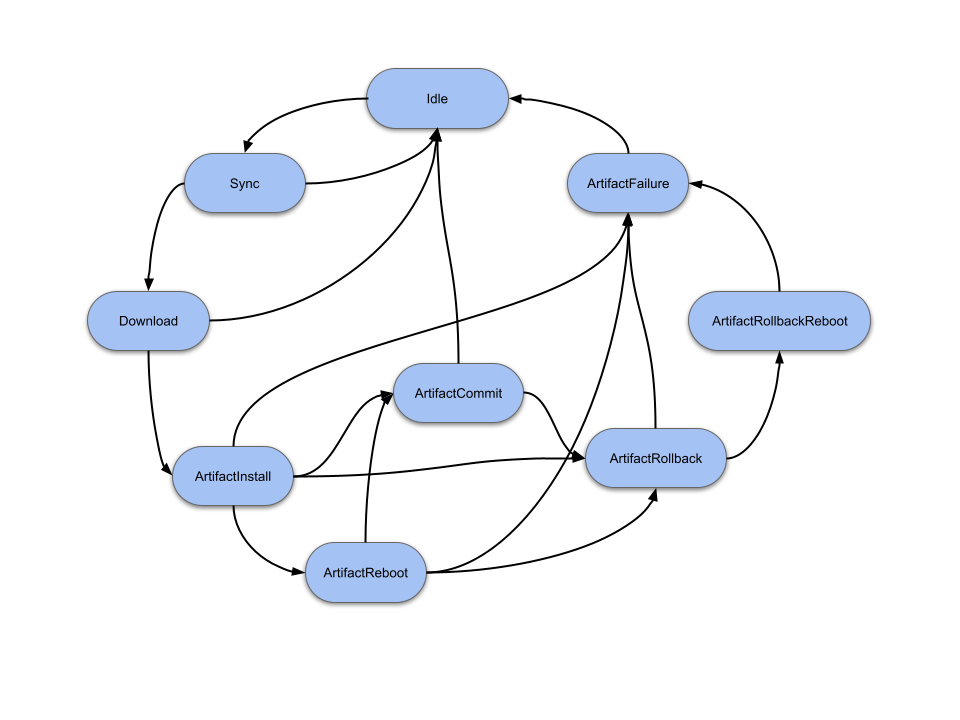
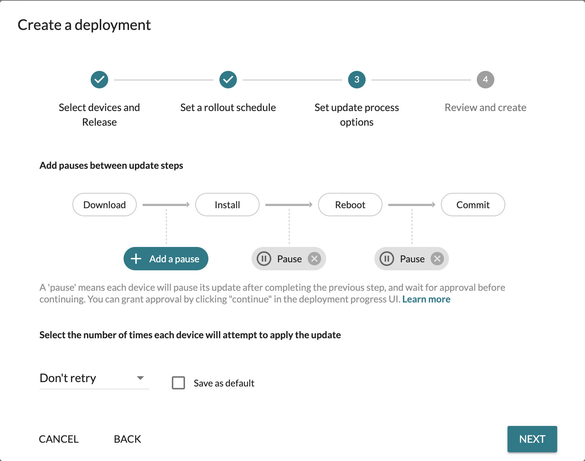

The Mender Client supports multiple ways to customize the update process:

* [State scripts](#state-scripts)
* [Synchronized updates](#synchronized-updates)

## State scripts

The Mender Client can run pre- and post-install scripts, before
and after it writes the root filesystem. However, Mender state scripts are more
general and useful than pre/post-install scripts because they run between
any state transition, not just (before/after) the install state.

Typical use cases are:

* Enable/disable network connectivity before and after checking for an update to reduce bandwidth.
* Migrate persistent data or a configuration file structure during a software update.
* User or application confirmation before a reboot. This is common in applications with a UI, or that provide critical functionality (e.g., network routers).
* Turn on wifi before downloading the update, and eventually fail if the download fails after a predefined time.
* Run additional sanity checks before committing to the update.

<!-- Source is at: https://docs.google.com/drawings/d/1UUjfflMJIp-tTPmvRuIhfUVbRecH70S1oF9UW-Rl3lI/edit -->

### States

A State script can be run before (*Enter*) or after (*Leave*) each of the following states.

* **Idle**: The Mender Client idles and waits for the next action to handle. At this stage, no communication with the server or downloads are in progress.
* **Sync**: At this stage, the Mender Client will either send or update its inventory to the server or check if an update is available. This requires communication with the server.
* **Download**: When an update is ready at the server-side Mender downloads it (streams it) to the inactive rootfs partition.
* **ArtifactInstall**: Swap the active and inactive partitions through interaction with the bootloader.
* **ArtifactReboot**: Reboots the device. Note: the _Enter_ scripts run before reboot; the _Leave_ scripts run after.
* **ArtifactCommit**: If the new image in the passive partition passes all the integrity checks, the Mender Client will mark the update as successful and continue running from this partition. The commit makes the update persistent. A pre-script here can add custom integrity checks beyond what the Mender Client provides out of the box.
* **ArtifactRollback**: If the new update fails any of the above-mentioned integrity checks, the Mender Client will revert the update payload. At this point, scripts in this state can help revert migrations done as a part of the update.
* **ArtifactRollbackReboot**: Some update types - most notably rootfs images - require a reboot if any integrity checks fail. This state runs right before the client reboots back (i.e., rollback) into the old image partition.
* **ArtifactFailure**: if any of the States with an "Artifact" prefix fail, execute this state. Note: this state always runs after the ArtifactRollback and the ArtifactRollbackReboot states.

Most of the states also have an _Error_ transition which runs if some error
occurs while executing any script for the given state.

### Execution

State scripts run as pre and post-scripts to every state in the Mender
state machine shown above. The state in which a given script runs is
determined by the script name and index.

Exit codes from a state script can control the execution of the Mender state
machine. Depending on the return code from the script, the Mender Client will:

* Move on to the next state, if successful.
* Retry this state at a later time.
* Mark the update as failed, and report the error to the server.

### Logging

The Mender Client collects logs during an update. In case of a failure, these
logs are sent to the Mender Server. The output from state scripts are included
in these logs. This is useful when troubleshooting intermittent update failures.

### Further reading

To learn more, have a look at the [tutorial on how to implement State
scripts](../../06.Artifact-creation/04.State-scripts/docs.md).

## Synchronized updates

!! This feature will be removed in Mender Client 4.0. For server-side support duration, please refer to our [blog post](https://mender.io/blog/mender-3-6-auto-generation-of-delta-updates#:~:text=Deprecation%3A%20Synchronized%20updates).

!!!!! Support for customizing the update process is available in all plans. Synchronizing
!!!!! this remotely through the Mender UI is only available on the Enterprise plan.

When creating a software deployment, it is possible to control the update from
the Mender UI or an application running locally on the device by telling the
Mender Client to wait at specific points in the deployment. The deployment
can then either continue or rollback from this point at some later time.

See the screenshot below for an example of what is possible.

Common use cases are:

* User presses *Start update* on the device to process the software update as an
  update is ready.
* Device is in use, and by default, no updates start. Once ready, the user can
  press *Enable updates* on the device.
* Synchronized updates, QA verifies all devices before they can commit the software,
  updating simultaneously.
* Synchronized reboot: Devices can download whenever they have the opportunity,
  but all devices need to reboot during the maintenance window at the same time.

## Further reading

For more information on getting started with synchronized updates attributes, see
[How to use the Device-side API](../../03.Client-installation/06.Use-the-device-side-api),
or take a look at the [Device-side API](../../201.Device-side-API) and
[Server-side API](../../200.Server-side-API) reference directly.
