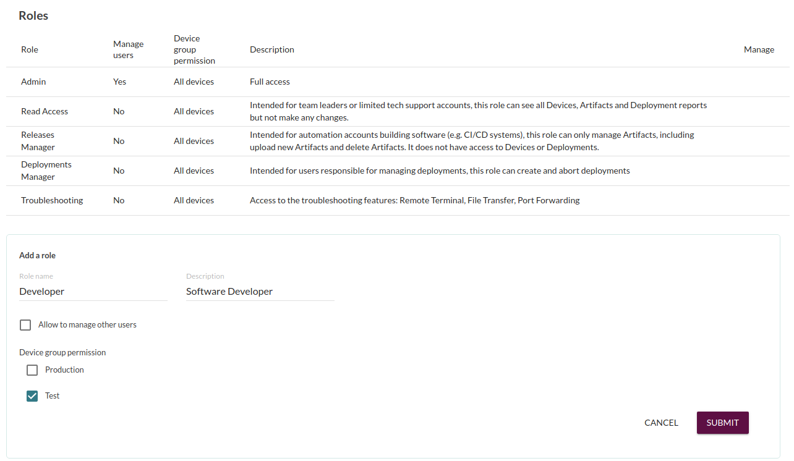

!!! Role Based Access Control is only available in the Mender Enterprise plan.
!!! See [the Mender features page](https://mender.io/plans/features?target=_blank)
!!! for an overview of all Mender plans and features.

Role Based Access Control (RBAC) significantly reduces the risk of accidental
and unauthorized deployments. Admin users of the Mender server can assign Roles
with limited access, based on the responsibility of the user and required tasks.
Role assignments reduce the risk of accidents, such as deploying beta software
to production devices. It also reduces the security impact of any compromised
Mender server user accounts (e.g. in the case of a stolen password).

Mender supports four different types of Roles:

* **Admin:** Full access

* **Read Access:** The role allows the user to see the status of devices and deployments,
but not make any modifications. This role is well suited for limited technical
support users, or team leads who need an overview of deployment status or
individual devices, but are not involved in day-to-day deployment management.

* **Release Manager:** Intended for *Continuous Integration* systems. It can only manage
Mender Artifacts, such as upload and delete Artifacts.

* **Deployments Manager:** Intended for users responsible for managing deployments.
With this role users can create and abort deployments. On it's own this role
won't make the devices visible in the UI, you must pair it with Read Access for that.

* **Troubleshooting:** User with this role assigned has access
to the troubleshooting features such as Remote Terminal, File Transfer, Port Forwarding.
On it's own this role won't make the devices visible in the UI, you must pair it
with Read Access for that.

* **Device groups:** Grants access to a *customizable* set of Device groups in
Mender. Instances of this role can be created under the *Roles* section in the
UI by choosing a name and which device groups the new role should have access
to. The most common use case is to allow developers full access to Test devices,
while only selected users have access to Production devices. Another common use
case is to segregate device access based on geographical location, e.g. Europe
vs. US.
To have a user who has full control over a particular group in the UI and nothing else,
be sure to give them the roles: Deployments Manager, Read Access and the chosen Device group role.

Users with the Admin role can manage other users, including creating and
assigning roles when creating a new user account or editing an existing user
account.

