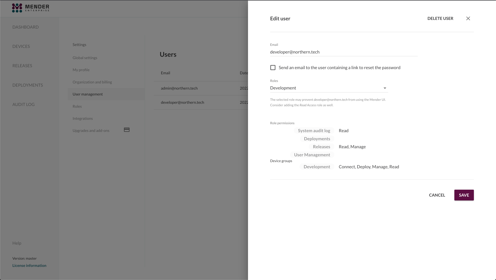

!!!!! Role-Based Access Control is only available in the Mender Enterprise plan.
!!!!! See [the Mender plans page](https://mender.io/pricing/plans?target=_blank)
!!!!! for an overview of all Mender plans and features.

Role-Based Access Control (RBAC) significantly reduces the risk of accidental
and unauthorized actions. Admin Users of the Mender Server can assign to the
other Users Roles with limited access based on the User's responsibilities
and required tasks. Role assignments reduce the risk of accidents, such as
deploying beta software to production devices. It also reduces the security
impact of any compromised Mender Server User accounts (e.g., in the case of a
stolen password).

## Roles

A Role is a named set of permissions you can assign to Users.

You can manage Roles in the "Roles" view in the Mender settings for your tenant:

## Built-in Roles

Mender's RBAC system supports five built-in Roles:

* **Admin:** Full access.

* **Read Access:** Intended for team leaders or limited tech support accounts;
this Role can see all Devices, Artifacts and Deployment reports but cannot make
any changes.

* **Release Manager:** Intended for automation accounts building software (e.g.,
CI/CD systems), this Role can only manage Artifacts, including uploading new Artifacts
and deleting existing Artifacts. It does not have access to Devices or Deployments.

* **Deployments Manager:** Intended for Users responsible for managing deployments,
this Role can create and abort deployments for all the devices.

* **Troubleshooting:** Access to the troubleshooting features for all the devices:
Remote Terminal, File Transfer, Port Forwarding.

## Custom Roles and Permissions

You can create new Roles based on your specific needs and workflows. When creating or
editing custom Roles, you can specify the Role's name, description and a set of
permissions to grant to the Users assigned to the Role.

* **User Management**: these permissions should be granted carefully, as they
allow privilege increases for any Users managed by a User with User management
permissions.
  * **Read**: read access to the User management sections.
  * **Manage**: write access to the User management sections, requires **Read**.

* **System audit log**: these permissions allow tracing changes to devices,
releases and User accounts, as well as providing information about deployments.
  * **Read**: read access to the audit log section.

* **Releases**: control access to artifacts and can limit the user to only access releases with certain tags.
  The following permissions are available for releases:
  * **Read**: read access to the releases and artifacts sections.
  * **Upload**: upload-only access to the releases and artifacts sections.
  * **Manage**: full write access to the releases and artifacts sections, requires **Read** and **Upload**.

* **Device Group Management** restrict the access a user has to devices.
  The scope of the permission can be limited to specific static groups of devices.
  * **Read**: read access to the devices.
  * **Manage**: write access to the devices, requires **Read**.
  * **Deploy**: permission to deploy software to the devices, requires **Read**.
  * **Connect**: troubleshooting devices (using [mender-connect](../../09.Add-ons/00.Overview/docs.md)), requires **Read**.
  * **Configure**: permission to get and set devices configuration, requires **Read**.

!!! Please note that the **Connect** permission gives users access to the Remote Terminal,
!!! File Transfer, and Port-forwarding features. Through these, it is possible to alter
!!! the devices locally, for example, changing the Mender Client configuration.
!!! Therefore, you can consider it a form of write access to the devices.

## Assigning Roles to Users

When creating a new User, or editing an existing User, you can assign one or more
Roles to him by selecting them from the Roles dropdown:

The permissions granted to a User are the union of all his Roles' set of permissions.

