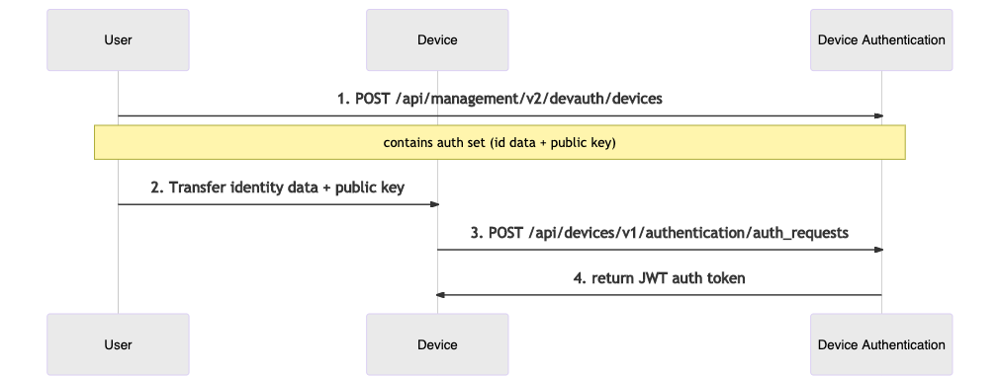

You must explicitly authorize any Device identified by a set of
[Identity attributes](../../02.Overview/07.Identity/docs.md) before it can authenticate
with the Mender server.

This section describes the components and workflows relevant to Device
authentication, and provides practical tips on navigating our APIs to
successfully authorize Devices, monitor authorization status, and troubleshoot
related issues.

## Authentication service

The [Device Authentication](https://github.com/mendersoftware/deviceauth?target=_blank)
service, a part of the Mender server, implements Device authentication.

This service exposes APIs for:

* Device authorization, namely granting access to specific Devices
* issuing and keeping track of authentication tokens ([JSON Web
  Token](https://jwt.io?target=_blank))
* inspecting and managing Devices and their authentication credentials

## Identification and authentication

Mender identifies a **Device** by a set of **Identity attributes** (MAC addresses,
user-defined UIDs, etc.); think of it as an extension of a unique identifier
into a multi-attribute structure (see [Identity](../../02.Overview/07.Identity/docs.md)).

To obtain an auth token, the Device sends an **authentication request**
containing the Identity attributes and its current **public key**. The client signs
the request with the private key (kept secret on the Device), and the server uses
the public key to verify the signature.
The combination of **Identity attributes** and **public key** forms an
**authentication set**, or 'auth set' in short.

The concept takes into consideration Device key rotation - a single Device may
over time present different keys, and it's important to track those, and allow
the user to accept (i.e. authorize) or reject a particular identity/key
combination.
Mender keeps tracks both of a **Device** as a single real-world entity, where each
Device might create multiple **Authentication sets**. Note
that maximum one Authentication set can be accepted for a specific Device at any
given time.

## Authorization Flows

Mender provides two possible authorization flows. Both involve a user's explicit
consent to authorize a Device via the UI or Device Authentication API, but they differ
in the order of events and intended use cases. Below is a detailed breakdown of
each.

For details of API calls please consult the [API documentation](../../200.API/?target=_blank#default-device-authentication).

### Authorize-on-request Flow

The simplest flow, which usually suits quick prototyping and testing best, is manual
authorization. The Mender server records every auth request for future inspection.
You can accept it via the Device Authentication API (or the UI) whenever you
see fit. When the Device sends another auth request it will result in a successful
authorization.

The authorize-on-request flow therefore requires the user to accept
Authentication sets one-by-one, as Devices connect to the server. As such it is
not ideal for scenarios with many Devices; we recommended it for
smaller or non-production installations instead.

The sequence diagram below describes the API interactions between the user,
Device, and Device Authentication within this flow:

1. The user provides the Device with some Identity attributes and a
   public key.
2. The Device tries to authenticate, retries in a loop according to the Mender
   client's configured interval.
3. For the time being, authentication attempt fails, but the Mender server
   records the auth set for future inspection.
4. The user inspects pending Authentication sets.
5. The user accepts the submitted auth set.
6. The Device applies for an auth token again.
7. Device Authentication returns a valid authentication token.

|  |
|:--:|
|*Authorize-on-request flow*|

### Preauthorization Flow

Preauthorization is the idea of authorizing a Device before it connects to
the server for the first time. This is an intuitive model analogous to creating
an account before logging in to an online service.

It allows you to authorize a particular Device before it leaves the production line
by providing a pre-assigned Authentication set to
the Device Authentication. When a Device with the corresponding Identity
attributes and public key requests authorization, the Mender server will
authorize it immediately without further user intervention.

This flow is typically better suited for a production use case, where you plan a release of a
potentially large batch of Devices:

* You assign and track Device Identity attributes/keys outside of Mender.
* Manually or via script, the user preauthorizes the Devices using the Device
  Authentication API.
* During the release process, you transfer identities and keys to physical
  Devices.
* Upon the first authentication request for each Device, the Mender server
  authenticates it, and the Device gains access to all Mender APIs.

The sequence diagram below describes the API interactions between the user and
the Device Authentication within this flow:

1. The user first submits a preauthorized auth set to the Device Authentication.
2. The user makes sure the physical Device contains the corresponding Identity
   attributes and public key.
3. When the Device activates, the client submits an authentication request containing the
   Identity attributes and key.
4. The Device Authentication service returns a valid authentication token.

|  |
|:--:|
|*Preauthorization flow*|

## Authentication Token

After the Mender server authorizes a Device, a subsequent authentication request
to the Device Authentication service returns an **authentication token**. The
Mender client will record the token and attach it to every API call under the HTTP
`Authorization` header.

The token does have an **expiry date** (one week period by default), but the Mender client
will obtain a fresh token from the Mender server automatically.

For details on the token format please see the relevant [documentation on
submitting an authentication request](../../200.API/?target=_blank#default-device-authentication).

