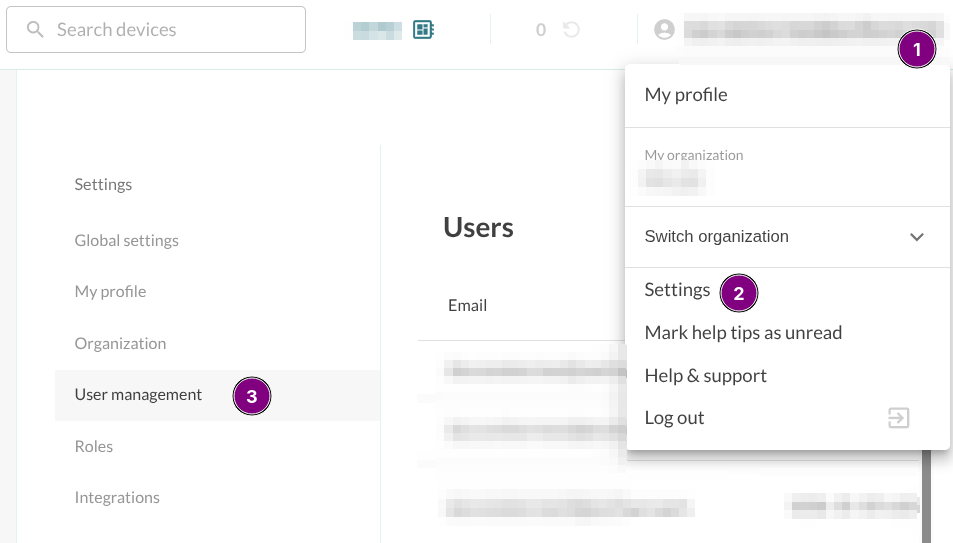
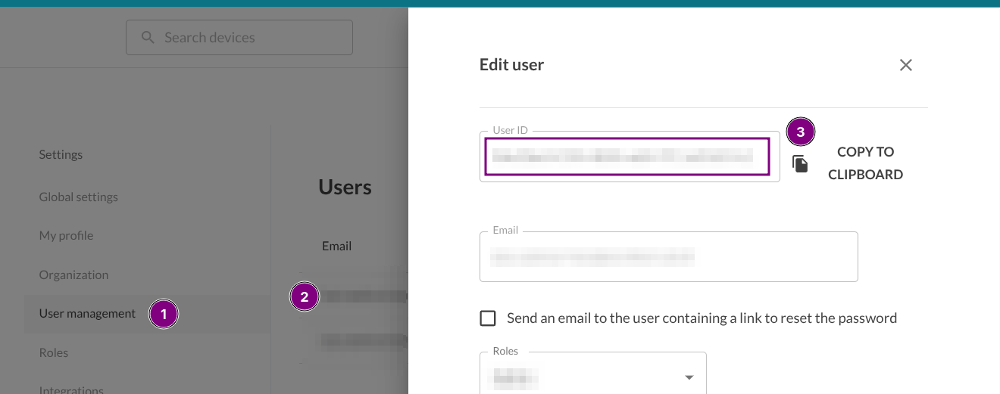
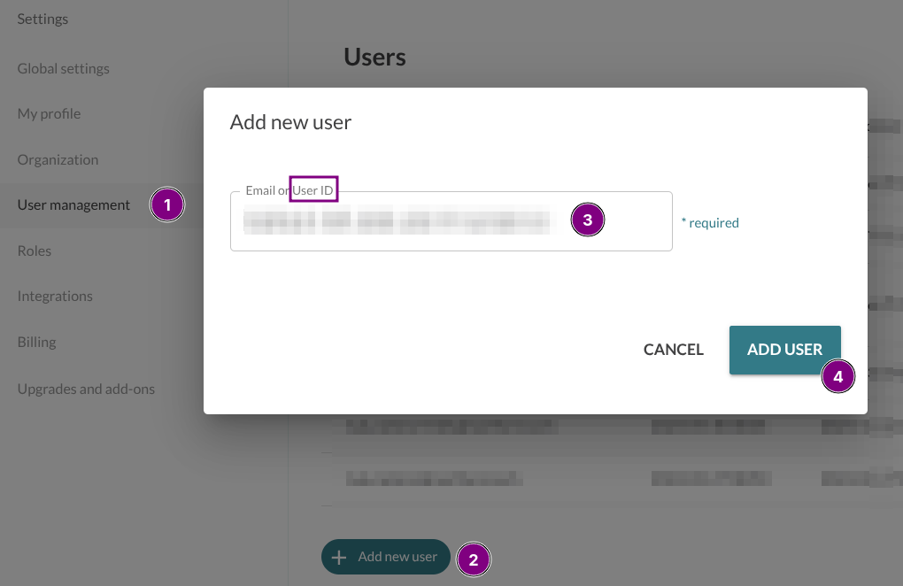

!!!!! Multi-tenancy is only available in the Mender Enterprise plan.
!!!!! See [the Mender plans page](https://mender.io/pricing/plans?target=_blank)
!!!!! for an overview of all Mender plans and features.

## Introduction

Multi-tenancy is a feature that allows multiple tenants (organizations or teams)
to share a single Mender server infrastructure while keeping their data, users, and
devices isolated from each other. This is especially useful in enterprise environments
where different departments or clients need separate management but can benefit from a
centralized deployment and update management system.


## High-level overview

Mender's multi-tenancy feature ensures that different tenants have completely separate
environments, meaning that each tenant has their own set of users, devices, and device
groups, and only the users associated with a tenant can access its data. This enables
centralized device management at scale across multiple teams or organizations without
compromising on security or data privacy.

Additionally, thanks to the single sign-on (SSO) support in Mender Enterprise, it is possible to
ensure that only users authenticated by the organization's Identity Provider (IdP) can
access any Mender tenant.


## Tenant isolation

Mender achieves multi-tenancy by logically partitioning the platform's resources so
that multiple tenants can use the same underlying infrastructure without interfering
with one another. This setup helps organizations reduce overhead and operational costs,
as they don't need to set up and maintain separate servers for each department or
customer.

Every microservice stores the information about all the tenants in a single database,
and every record includes the tenant ID. When retrieving information from the database,
the server filters the records by tenant ID and returns the data belonging to the
specific tenant the user or the device belongs to. Similarly, the Mender artifacts
are stored in a common storage account (Azure Blob Storage or AWS S3 bucket) and
prefixed by the tenant ID. It is also possible to configure a tenant specific
object store for the artifacts if needed.

Individual billing may be addressed on the tenant level: the Mender Server tracks resource
usage (such as device limits and consumption) per tenant, enabling cost management
across different clients or teams.

The Mender Server provides monitoring and audit logs capabilities at the tenant level, 
allowing each tenant to monitor its own devices and audit logs without visibility 
into other tenants' environments.


## Typical use cases for multi-tenancy in Mender

The typical use cases for this feature are:

1. *Large Enterprises with multiple divisions*: Organizations that have several
departments, subsidiaries, or teams working on different projects can use Mender
Server to isolate device management for each division. For example, an organization
with multiple business units focusing on different verticals can keep each Business
Unit and their product lines isolated.

3. *OEMs (Original Equipment Manufacturers)*: OEMs can manage a customer's
environment by adding a user into their tenant, or they can let a customer
manage their devices and OTA fully themselves, completely isolated from the OEM.

4. *Test and production environments*: Multi-tenancy can also be used internally
to separate different environments, such as test, staging, and production
environments. Each environment can have its own set of devices and updates to
ensure that no test data interferes with production systems.


## Service Provider tenants


In Mender Server Enterprise, multi-tenancy is managed by a special type of tenant
called the Service Provider tenant. 

The Service Provider tenant acts as a central point of control for all the child
tenants allowing for organisation wide definition of policies applicable to all
child tenants (i.e. SSO and features available to child tenants). 

The Service Provider tenant can:

- Create a child tenant: Admin users can create multiple tenants through the
  Mender Enterprise UI or the Management APIs. Each tenant is assigned a unique
  tenant ID, tenant token and initial administrative account.

- User management: Service Provider tenant administrators can create an initial admin for a child
  tenant which will be responsible for assigning different roles and permissions
  within the child tenant intself, ensuring proper access control. Each child
  tenant's users only have access to devices and groups within their own tenant.
  Optionally, Service Provider tenant admins can enable SSO for the child tenants inheriting
  the configuration from the Service Provider tenant and map users to specific
  tenants; this way, only users from the organization's Identity Provider can log
  in to the Mender Server accessing the correct tenant based on their needs.

- Device limit: Set and change device limit of all child tenants. Allocates a number of devices
  from the overall device limit to child tenants.


## How to enable multi-tenancy

If you are using hosted Mender Enterprise please
[contact us](https://mender.io/contact-us) for help with migration to a multi-tenant 
setup using the Service Provider tenant. For existing tenants with a
more complex configuration it may be treated as a
[Consulting project](https://mender.io/pricing/mender-extras).

For on-premise installations, you can promote an existing tenant to a Service Provider tenant with the following command:

```bash
TENANTID=your-tenant-id-here
tenantadm update-tenant --id "${TENANTID}" --service-provider
```

where `TENANTID` variable holds the ID of the tenant to promote.
Please note, you have to execute the above command from the inside of the `tenantadm`
container. For on-premise installations you can find the tenant ID by listing the tenants using the following command:

```bash
# tenantadm list-tenants  | grep -v loading | jq '.[] | { "tenant id": .id, "tenant name":.name}'
{
  "tenant id": "673a03e3c9eca7a440f2f444",
  "tenant name": "DemoOrganization"
}
{
  "tenant id": "673a0ebbe998e3d46fc010d3",
  "tenant name": "demo5"
}
```

## Service Provider tenant in the Mender UI

### Managing tenants

After you log in to the Service Provider tenant, you will see an empty tenants list: 


Starting here you can add a new tenant:


And it will appear in the list:


Now there are additional operations you can perform on it, by clicking the details link:


As you can see, the Mender UI allows the Service Provider tenant to manage the child tenants.
Every operation is recorded in the audit logs:


## User management between tenants

To move a user from an existing tenant to another one, you will need to use the User's ID instead of the email.

Either in the existing tenant or in the new one, you will need to access the `User Management` section by following these steps



To get a user ID from an existing tenant, you should to gather it from the user's view panel by following the steps below.



To add a user into the new tenant, just add its ID by following these steps below.



The new user will have Read Access only, so you may need to add more permissive Roles.
