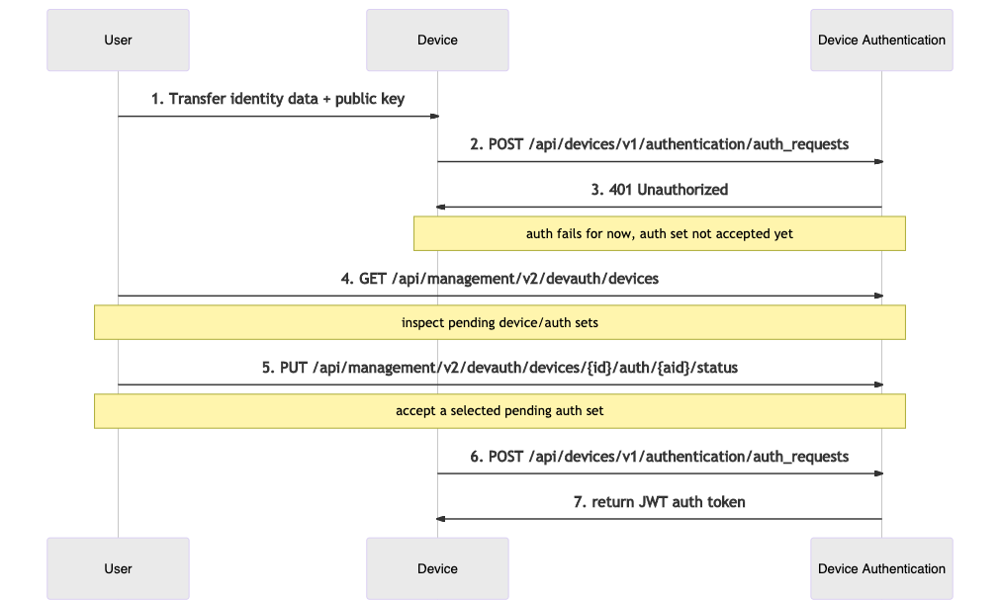
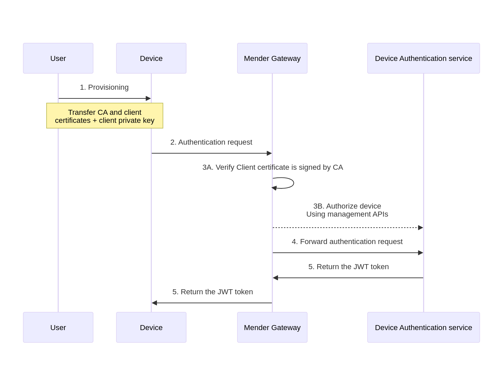

You must explicitly authorize any Device identified by a set of
[Identity attributes](../../02.Overview/07.Identity/docs.md) before it can authenticate
with the Mender Server.

This section describes the components and workflows relevant to Device
authentication, and provides practical tips on navigating our APIs to
successfully authorize Devices, monitor authorization status, and troubleshoot
related issues.

## Authentication service


The [Device Authentication](https://github.com/mendersoftware/mender-server/tree/main/backend/services/deviceauth/?target=_blank)
service, a part of the Mender Server, implements Device authentication.

This service exposes APIs for:

* Device authorization, namely granting access to specific Devices
* issuing and keeping track of authentication tokens ([JSON Web
  Token](https://jwt.io?target=_blank))
* inspecting and managing Devices and their authentication credentials

## Identification and authentication

Mender identifies a **Device** by a set of **Identity attributes** (MAC addresses,
user-defined UIDs, etc.); think of it as an extension of a unique identifier
into a multi-attribute structure (see [Identity](../../02.Overview/07.Identity/docs.md)).

To obtain an auth token, the Device sends an **authentication request**
containing the Identity attributes, its current **public key**, and its **device tier**. 
The client signs the request with the private key (kept secret on the Device), and the 
server uses the public key to verify the signature.

The combination of **Identity attributes**, **public key**, and **device tier** forms an
**authentication set**, or 'auth set' in short.

### Device tiers in authentication

The [device tier](../17.Device-tiers/docs.md) classifies the device by its capabilities:
* **standard** - Embedded Linux devices running the Mender Client
* **micro** - Microcontroller units (MCUs) running `mender-mcu`
* **system** - Devices running Mender Orchestrator for multi-component updates

The device tier is transmitted in the authentication request and stored as part of the authentication set.
This affects artifact size limits, polling intervals, and deployment restrictions.

For backward compatibility, devices that do not specify a tier are automatically assigned the **standard** tier.

### Authentication sets with device tiers

The concept takes into consideration both device key rotation and tier changes - a single device may
over time present different keys or change its tier, and it's important to track those combinations 
and allow the user to accept (i.e. authorize) or reject a particular identity/key/tier combination.

Mender keeps track of a **Device** as a single real-world entity, where each
Device might create multiple **Authentication sets**. Note
that maximum one Authentication set can be accepted for a specific Device at any
given time.

When a device changes its tier (for example, when upgrading from standard to system tier to enable
Mender Orchestrator), it creates a new authentication set that must be authorized before the device
can operate with the new tier.

## Authorization Flows

Mender provides three possible authorization flows. Two of them involve a user's explicit
consent to authorize a Device via the UI or Device Authentication API, but they differ
in the order of events and intended use cases. The third one, available as an Enterprise
feature, leverages a PKI (Public Key Infrastructure) to authorize devices based on
client certificates without the need of explicit user's actions. Below is a detailed
breakdown of each.

For details of API calls please consult the [API documentation](../../200.Server-side-API/?target=_blank#device-api-device-authentication).

### Authorize-on-request Flow

The simplest flow, which usually suits quick prototyping and testing best, is manual
authorization. The Mender Server records every auth request for future inspection.
You can accept it via the Device Authentication API (or the UI) whenever you
see fit. When the Device sends another auth request it will result in a successful
authorization.

The authorize-on-request flow therefore requires the user to accept
Authentication sets one-by-one, as Devices connect to the server. As such it is
not ideal for scenarios with many Devices; we recommended it for
smaller or non-production installations instead.

The sequence diagram below describes the API interactions between the user,
Device, and Device Authentication within this flow:

1. The user provides the Device with some Identity attributes and a
   public key.
2. The Device tries to authenticate, retries in a loop according to the Mender
   client's configured interval.
3. For the time being, authentication attempt fails, but the Mender Server
   records the auth set for future inspection.
4. The user inspects pending Authentication sets.
5. The user accepts the submitted auth set.
6. The Device applies for an auth token again.
7. Device Authentication returns a valid authentication token.

|  |
|:--:|
|*Authorize-on-request flow*|

### Preauthorization Flow

Preauthorization is the idea of authorizing a Device before it connects to
the server for the first time. This is an intuitive model analogous to creating
an account before logging in to an online service.

It allows you to authorize a particular Device before it leaves the production line
by providing a pre-assigned Authentication set to
the Device Authentication. When a Device with the corresponding Identity
attributes and public key requests authorization, the Mender Server will
authorize it immediately without further user intervention.

This flow is typically better suited for a production use case, where you plan a release of a
potentially large batch of Devices:

* You assign and track Device Identity attributes/keys outside of Mender.
* Manually or via script, the user preauthorizes the Devices using the Device
  Authentication API.
* During the release process, you transfer identities and keys to physical
  Devices.
* Upon the first authentication request for each Device, the Mender Server
  authenticates it, and the Device gains access to all Mender APIs.

The sequence diagram below describes the API interactions between the user and
the Device Authentication within this flow:

1. The user first submits a preauthorized auth set to the Device Authentication.
2. The user makes sure the physical Device contains the corresponding Identity
   attributes and public key.
3. When the Device activates, the client submits an authentication request containing the
   Identity attributes and key.
4. The Device Authentication service returns a valid authentication token.

|  |
|:--:|
|*Preauthorization flow*|

### Client certificate authentication and Mutual TLS

! Mutual TLS was previously supported by the `mtls-ambassador` server component - which has been replaced by `mender-gateway`.
! Please see the [migration guide](../../10.Server-integration/04.Mender-Gateway/10.Mutual-TLS-authentication/99.MTLS-ambassador-migration/docs.md) for steps on how to migrate from `mtls-ambassador` to `mender-gateway`.

Mender Enterprise supports setting up a reverse proxy at the edge of the network, which can authenticate using client TLS certificates.
Each client is equipped with a public certificate signed by a Certificate Authority (CA) along with the private key.
The edge proxy authenticates devices by verifying this signature.
Authenticated devices are automatically authorized in the Mender backend, and do not need manual approval.

This is in particular useful in a mass production setting because you can sign client
certificates when they are manufactured so they automatically get accepted into the
Mender Server when your customer turns them on, which might happen several months
after manufacturing.

The sequence diagram below describes the authentication of a Device using `mender-gateway`:

1. The user first provisions the device with the crypto material: client certificate (and optionally intermediate CA certificate), client private key, and root CA certificate for server verification.
2. The device sends the authorization request to the `mender-gateway` authenticating the request with the client TLS certificate.
3. The ambassador verifies the device's certificate is signed by the CA certificate, and pre-authorizes the device to the Device Authentication service.
4. At this point, the authentication request is forwarded to the Device Authentication service.
5. The Device Authentication service returns a valid authentication token, which the mTLS ambassador forwards to the Device.

|  |
|:--:|
|*Client certificate authentication flow*|

Futher communication between the Device and the Mender Server is intermediated by the `mender-gateway` which verifies the requests are authenticated with a valid client TLS certificate.

Please refer to the [Mutual TLS section](../../10.Server-integration/04.Mender-Gateway/10.Mutual-TLS-authentication/docs.md)
to find further details on the configuration of this feature.

#### Certificate Chain Architecture

Mender Gateway supports X.509 certificate chains, allowing you to implement a hierarchical PKI (Public Key Infrastructure) for flexible certificate management.

##### Architecture Comparison

| Architecture | Gateway Storage | Device Storage | Client Sends During TLS | Rotation Impact | Best For |
|--------------|----------------|----------------|-------------------------|-----------------|----------|
| **Single-Level PKI**<br/>`Root CA → Device` | Root CA cert | Device cert<br/>Device private key | Device cert only | Must update gateway and re-provision all devices | Small deployments<br/>Testing<br/>Simple PKI |
| **Two-Level PKI with Client-Side Intermediate**<br/>`Root CA → Intermediate CA → Device`<br/>*(Intermediate sent by client)* | Root CA cert only | Device cert<br/>Intermediate CA cert<br/>Device private key | Device cert +<br/>Intermediate CA cert | ✅ No gateway changes needed<br/>✅ Seamless rotation<br/>✅ Old and new coexist | Production deployments<br/>Mass manufacturing<br/>Long device lifecycles<br/>**Beneficial for rotation** |
| **Two-Level PKI with Gateway-Side Intermediate**<br/>`Root CA → Intermediate CA → Device`<br/>*(Intermediate on gateway)* | Root CA cert +<br/>Intermediate CA cert | Device cert<br/>Device private key | Device cert only | Gateway must be updated for intermediate rotation | Simpler client configuration<br/>Centralized CA management |

##### Certificate Rotation Workflow (Two-Level PKI with Client-Side Intermediate)

When the intermediate CA is sent by the client (rather than stored on the gateway), certificate rotation can be performed without gateway reconfiguration:

| Phase | Gateway Configuration | Old Devices (v1) | New Devices (v2) | Result |
|-------|----------------------|------------------|------------------|--------|
| **Initial Deployment** | Trusts: Root CA | Send: Device cert (v1) +<br/>Intermediate CA (v1) | N/A | ✅ Auth succeeds |
| **Rotation Begins** | Trusts: Root CA<br/>*(unchanged)* | Send: Device cert (v1) +<br/>Intermediate CA (v1) | Send: Device cert (v2) +<br/>Intermediate CA (v2) | ✅ Both auth succeed<br/>✅ Zero downtime |
| **Rotation Complete** | Trusts: Root CA<br/>*(unchanged)* | Decommissioned | Send: Device cert (v2) +<br/>Intermediate CA (v2) | ✅ Auth succeeds |

**Key Insight**: The gateway never changes during rotation because it only trusts the root CA, which remains constant.

## Authentication Token

After the Mender Server authorizes a Device, a subsequent authentication request to the Device
Authentication service returns an **authentication token**. The `mender-auth` component will record the
token and make it available over a DBus API. The `mender-update` component will use this
API to fetch the token and attach it to every API call under the HTTP `Authorization` header.

The token does have an **expiry date** (one week period by default), but `mender-auth`
will obtain a fresh token from the Mender Server automatically.

The authentication token is associated with the device's current tier. If the device tier changes,
a new authentication set must be created and authorized, resulting in a new authentication token.

For details on the token format please see the relevant [documentation on
submitting an authentication request](../../200.Server-side-API/?target=_blank#device-api-device-authentication).

## Device tier handling in authentication

### How device tier is transmitted

The device tier is included in the authentication request sent to the Mender Server:

1. The device sends an authentication request to `/api/devices/v1/authentication/auth_requests`
2. The request body includes the `tier` field alongside identity data and public key
3. The Mender Server validates the tier value (must be one of: `standard`, `micro`, `system`, or omitted for backward compatibility)
4. The tier is stored as part of the device's authentication set

Example authentication request payload:
```json
{
  "id_data": "{\"mac\":\"52:54:00:12:34:56\"}",
  "pubkey": "-----BEGIN PUBLIC KEY-----\n...",
  "tier": "standard"
}
```

### Where device tier is stored

The device tier is stored:
* In the **Authentication Set** record in the Device Authentication service
* Associated with the device's identity and public key combination
* Persisted in the Mender Server database alongside other authentication set data

The tier can be viewed:
* Through the Mender UI in the device details and pending devices views
* Via the Server-side Device Authentication API
* In the authentication set listing for each device

### What happens when a device changes tier

When a device needs to change its tier (for example, upgrading from standard to system tier):

1. **Update device configuration**: The device's local configuration is updated to specify the new tier
2. **New authentication request**: The device sends a new authentication request with the updated tier value
3. **New authentication set**: The Mender Server creates a new authentication set with the new tier
4. **Pending state**: The new authentication set enters the "pending" state
5. **User authorization required**: An administrator must explicitly authorize the new authentication set
6. **Transition**: Once authorized, the old authentication set is deauthorized automatically
7. **New token**: The device receives a new authentication token associated with the new tier

**Important notes:**
* Only one authentication set per device can be in "accepted" state at any time
* The tier change requires explicit user approval through the UI or API
* The device will continue using the old tier until the new authentication set is authorized
* Different tiers have different capabilities and restrictions (see [Device tiers](../17.Device-tiers/docs.md))

### Authentication set extension

The introduction of device tiers extends the existing Authentication Set data structure:

**Authentication Set components:**
* Identity attributes (unchanged)
* Public key (unchanged)
* **Device tier** (new field, optional for backward compatibility)
* State: rejected, accepted, pending, or preauthorized

This extension maintains full backward compatibility while enabling tier-based device management and
enforcement of tier-specific limits and restrictions.


## Authorize to external systems

Mender makes it possible to integrate devices with [Azure IoT Hub](../../10.Server-integration/05.Azure-IoT-Hub/docs.md).

## Authentication in the context of a System

When orchestrating updates across a System (see [Orchestrate updates](../../07.Orchestrate-updates/chapter.md)) please note that Authentication is relevant to the System device only. The Components do not directly communicate with the Mender Server, and thus are not in the scope of this functionality.