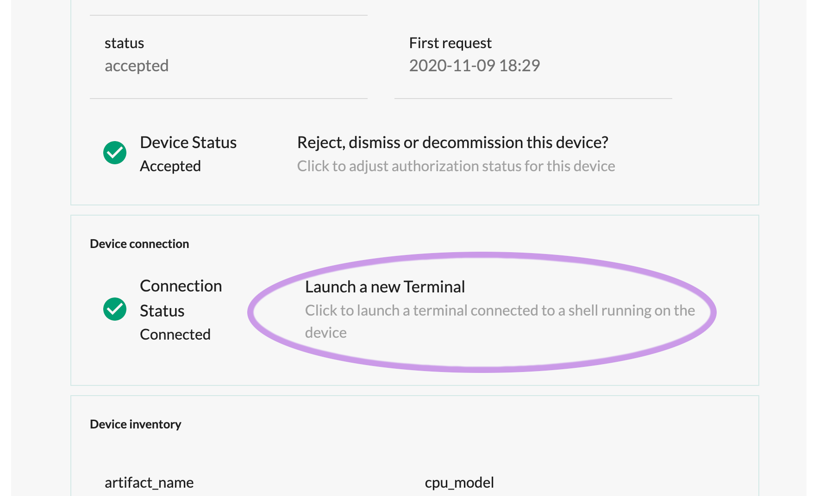
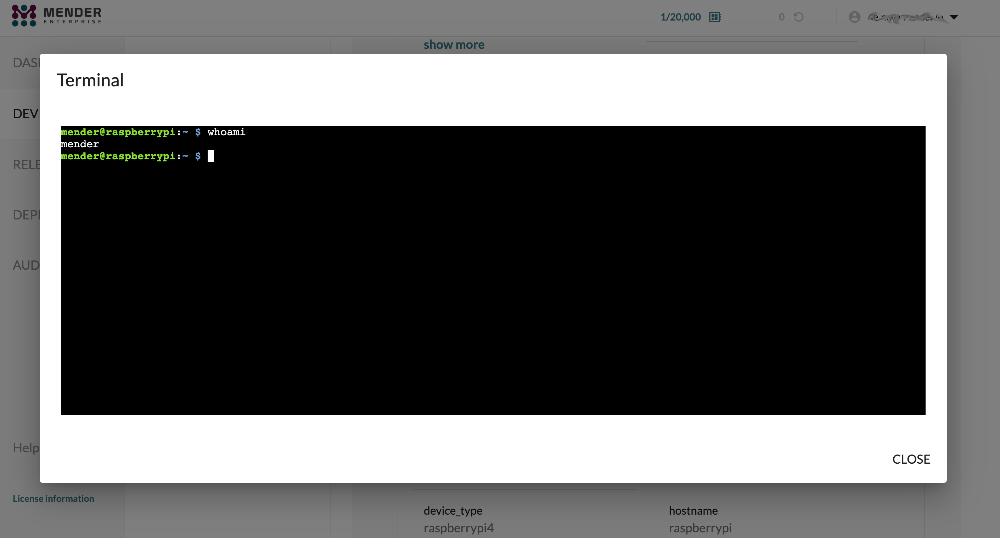

## Remote access

With Mender, you can start an interactive shell to any accepted
device by clicking "Launch a new Terminal" in the UI (see the picture
below).

All you need is 
[mender-shell](https://github.com/mendersoftware/mender-shell)
configured and running alongside the Mender Client, and you can
get a live terminal where you can freely type commands.

Every keystroke in the above popup window will go to the standard input
of a shell running on the device.

## mender-shell vs SSH

Remote Terminal by Mender passes messages of a defined protocol over
a websocket connection. The two main actors: the mender-shell and Mender UI
communicate using a well-defined open protocol over a websocket connection.
They exchange messages which carry user keystrokes, terminal output,
and control data. Therefore, there is no relation to SSH and no part
of it is either used or required. You are, however, able to run sshd or ssh
command, since you have a fully functional terminal at your disposal.
Mender does not impose any additional restrictions on the commands,
shell, or terminal. The picture below shows a simplified architecture
with a websocket, mender-shell, and a shell running in a child process
of mender-shell with allocated pseudo tty.

## mender-shell and the rest of the Mender ecosystem

The coupling between mender-shell and the rest of Mender is not tight.
Remote terminal expects a certain well-defined DBus API to be in place
on a device, and a working websocket connection endpoint; none of these
have to come from or go to Mender.
As long as you send compatible messages over the websocket, mender-shell will work.
With Mender, however, you have everything in place, and all you need
is to perform a simple configuration of the client and start mender-shell.
Additionally, you can take advantage of the Role Based Access Control
and Audit Logs, since we fully integrated mender-shell add-on into Mender.

## mender-shell and the user model

The mender-shell supports simultaneous shells from different Mender users.
On the device, you run the shell as a system user which you can set
in the configuration.

An arbitrary number of users each running an arbitrary number of sessions
can easily lead to resources exhaustion on a device. To this end, mender-shell
imposes two configurable restrictions on:
* the total number of shells
* the number of sessions per user.

On the other hand, you can imagine a scenario when you reach
both limits and lock yourself out from the remote terminal.
In order to protect against this scenario, mender-shell supports automatic termination
of idle and/or expired sessions.

## Sessions and terminals

A remote terminal session consists of a spawned shell (as a subprocess of
the mender-shell process) a unique string called a session id, and a system username.
The main responsibility of the mender-shell executable
is to read messages from the websocket, route them by session id
to the correct shell, read the output going to the terminal,
and pass it upstream over the websocket.

## Further reading

* For a detailed list of the configuration options please refer to the
[mender-shell configuration section](../../03.Client-installation/06.Configuration-file/02.Mender-shell/docs.md).
* You can find the mender-shell installation steps for Yocto-based projects,
and for Debian family,
in the [customize with Yocto](../../05.System-updates-Yocto-Project/05.Customize-Mender/docs.md),
and [customize with Debian](../../04.System-updates-Debian-family/03.Customize-Mender/docs.md) respectively.
