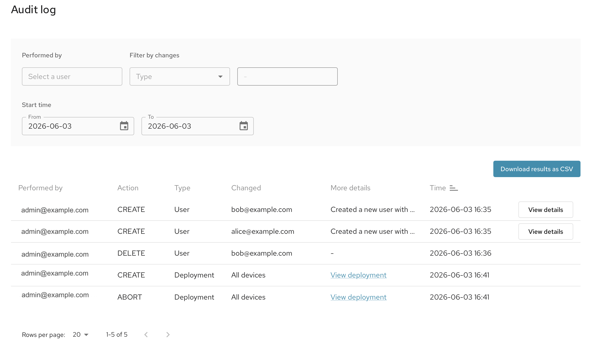

!!!!! Audit logs are only available in the Mender Enterprise plan.
!!!!! See [the Mender plans page](https://mender.io/pricing/plans?target=_blank)
!!!!! for an overview of all Mender plans and features.

Audit logs improve security by logging important events that can later be analyzed in case of security or operational incidents. The Mender Audit log creates immutable log entries when key events occur, including:

+ Deployment created
+ User created
+ User changed (e.g. role or password)
+ User removed

In all these cases, a comprehensive set of attributes are logged such as which user performed the action, what the change was, and the time it happened. 

You can filter the entries in the audit log by the user performing the actions, or the type of change, e.g. Deployment, Device or User. 

When you have chosen the appropriate filters, you can download the results as CSV, or access them through the [Get Audit Logs](https://docs.mender.io/api/get-audit-logs) and [Export Audit Logs](https://docs.mender.io/api/export-audit-logs) APIs.
