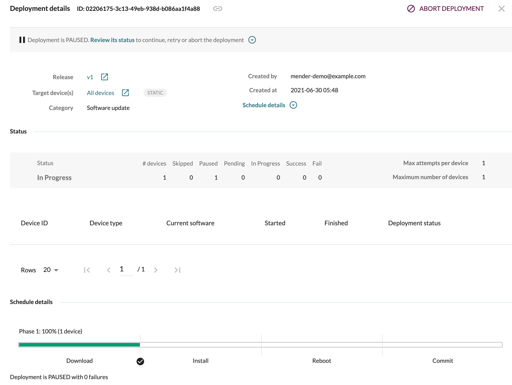

The Device-side API constitutes the only public programmatic interface of the Mender client.
It is a thin layer which receives messages over D-Bus, processes them, transmits them to the
Mender client, receives the results from the client, and transmits a response on the D-Bus.

## Synchronized updates using the Device-side API

An application running locally on the device can tell the Mender client to wait at specific
points in the deployment setting Update Control Maps in the Mender client.

Common use cases are:

* User presses *Start update* on the device to process the software update as an
  update is ready.
* Device is in use, and by default, no updates start. Once ready, the user can
  press *Enable updates* on the device.
* Device asks for user's confirmation before rebooting when applying a software
  update.

### Update Control Maps

!! This feature will be removed in Mender client 4.0. For server-side support duration, please refer to our [blog post](https://mender.io/blog/mender-3-6-auto-generation-of-delta-updates#:~:text=Deprecation%3A%20Synchronized%20updates).

Update Control Maps can specify an action for some transitions between the Mender client's
state machine. The default action for each step is **continue**. To pause the update process,
you can set **pause**.

Once *paused*, the update process can either be *resumed* or *canceled* and the whole deployment
marked as failed by updating the Update Control Map of the Mender client.

You can manage the update progress using the [Device-side APIs](../../201.Device-side-API),
updating the Mender client's Update Control Map using the *SetUpdateControlMap* method of the
*Mender Update Management API* .

Each Update Control Map is identified by a unique identifier
([UUID](https://en.wikipedia.org/wiki/Universally_unique_identifier)) and can optionally
specify a priority. Once set, the application will receive as return value a refresh
time expressed in seconds. It's the application's responsibility to refresh the Update
Control Map when this time has elapsed to ensure the Update Control Map remains
active. If twice the refresh time elapses, and no refresh has been made, the map will expire.

When multiple Update Control Maps are active, the Mender Client will merge them, considering
the priority (higher priority wins). The Mender Client then evaluates the resulting Update
Control Map.

## Example applications

A set of example applications consuming the Device-side API can be found in the
[mender-client-python-example](https://github.com/mendersoftware/mender-client-python-example)
repository.

### Update flow control

<!--AUTOVERSION: "mender-client-python-example/tree/%/examples/update_flow_control"/ignore-->
The [Update flow control](https://github.com/mendersoftware/mender-client-python-example/tree/master/examples/update_flow_control)
example application controls the update flow setting Update Control Maps in the Mender
client based on the user's input.

On Debian based systems, such as Raspberry Pi OS, you can install the example application by running
the commands below. For more detailed installation instructions, see [the
repository](https://github.com/mendersoftware/mender-client-python-example).

First install the dependencies:

```bash
sudo apt-get update
sudo apt-get install -y git python3 python3-pip
```

Then install the application:

```bash
git clone https://github.com/mendersoftware/mender-client-python-example.git
sudo pip3 install mender-client-python-example/
```

You can launch the application by running:

```bash
sudo mender-update-flow-control
```

The application displays the current Update Control Map, and provides the possibility
to update it either pausing all the states, or continuing a previously paused state:

```
Current map is:
{
	"priority": -1,
	"states": {
		"ArtifactInstall_Enter": {
			"action": "pause"
		},
		"ArtifactReboot_Enter": {
			"action": "pause"
		},
		"ArtifactCommit_Enter": {
			"action": "pause"
		}
	},
	"id": "01234567-89ab-cdef-0123-456789abcdef"
}
-----------------------
What do you want to do?
  0) Pause on all states
  1) Continue with Installing new software
  2) Continue with Rebooting
  3) Continue with Committing new software
  q) Quit
Choice?
```

When deploying an update to the device, the Mender Client will pause the processing
of the deployment waiting for input from the user to proceed:



Pressing `1`, `2` or `3`, the user can instruct the Mender Client to proceed with
the installation of the software update, the reboot (if required by the artifact)
and the commit of the update.

For example, to continue with the installation of the Artifact, you can press
`1` and the new Update Control Map will specify `continue` for the `ArtifactInstall_Enter`
state:

```
Current map is:
{
	"priority": -1,
	"states": {
		"ArtifactInstall_Enter": {
			"action": "continue"
		},
		"ArtifactReboot_Enter": {
			"action": "pause"
		},
		"ArtifactCommit_Enter": {
			"action": "pause"
		}
	},
	"id": "01234567-89ab-cdef-0123-456789abcdef"
}
-----------------------
What do you want to do?
  0) Pause on all states
  1) Continue with Installing new software
  2) Continue with Rebooting
  3) Continue with Committing new software
  q) Quit
Choice?
```

## Further reading

For more information, take a look at the [Device-side API](../../201.Device-side-API).
