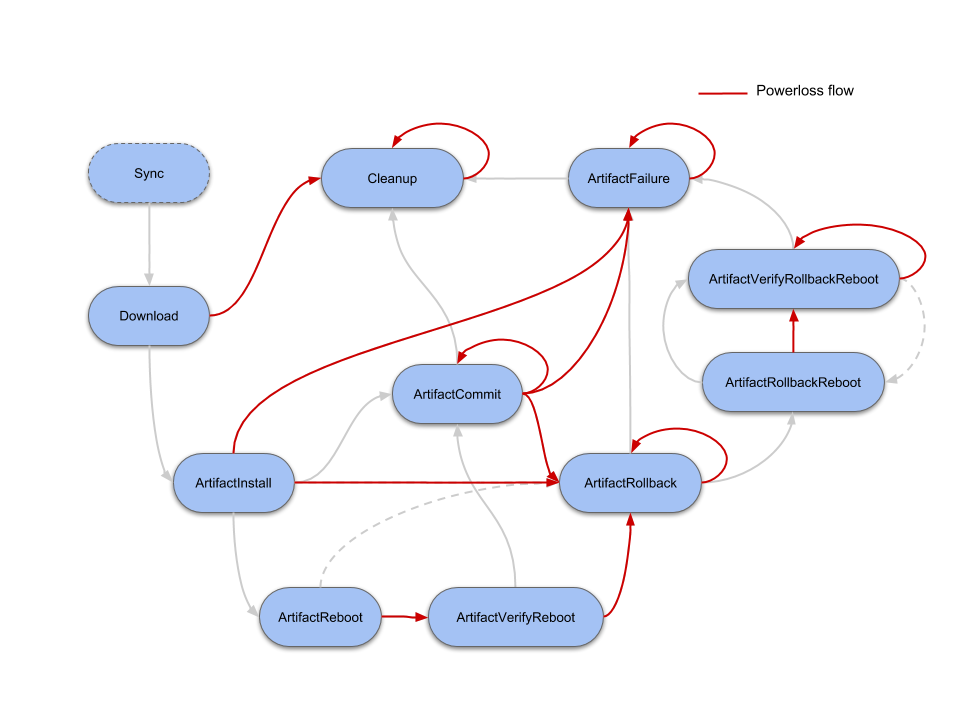

## Introduction

The built-in update mechanism in Mender is [dual rootfs updates](../../02.Overview/01.Introduction/docs.md#robust-system-updates). To do other types of updates, you will need an _Update module_ for your device.

An _Update Module_ is an extension to the Mender client for supporting a new type of software update, such as a package manager, container, bootloader or even updates of nearby microcontrollers. An Update Module can be tailored to a specific device or environment (e.g. update a proprietary bootloader), or be more general-purpose (e.g. install a set of `.deb` packages.).

General-purpose Update Modules, including support for file-based, package based and container-based updates are available and documented together with community-supported Update Modules at [Mender Hub](https://hub.mender.io?target=_blank).

This document introduces how Update Modules work, so you can develop your own Update Module that meets your specific needs.

An Update Module implements one or more of the actions that the Mender client carries out when installing an Artifact payload. The *core* action all Update Modules must implement is the Install action, which implements how an Artifact payload is installed on the device. However, there are other actions that may be implemented depending on the desired functionality and use case for an Update Module, such as Rollback.

### The state machine workflow

Update Modules are modeled after the same execution flow as [state scripts](../../04.Artifacts/50.State-scripts/docs.md). For the development of Update Modules it is important to have a basic understanding of the workflow.


The most relevant states for developing an Update Module are:

* `ArtifactInstall` state should be used to install the update into its final destination.
* `ArtifactCommit` state should be used to make the update permanent, in cases where it is still possible to roll back.
* `ArtifactRollback` state should be used to roll back to the previously known good state, normally by restoring some kind of backup.

Every state is optional for an Update Module to implement, however in practice all Update Modules would likely start with implementing the `ArtifactInstall` state.

Other states are meant for more advanced use cases:

* `ArtifactReboot` and `ArtifactVerifyReboot` states are related to the reboot procedure and verification for a given Artifact installation, if needed. They can be implemented, for instance, for a peripheral update, where some special action needs to be done before the reboot call.
* `ArtifactRollbackReboot` and `ArtifactRollbackVerifyReboot` states will need to be implemented when the Update Module requires a system reboot after a successful roll back in order to restore the previous software version.

Refer to [further reading](#further-reading) for more details.

## Prerequisites

### Mender server

You will need a Mender server if you are using [managed mode](../../02.Overview/01.Introduction/docs.md#client-modes-of-operation).

For easy setup, use [hosted Mender](https://hosted.mender.io?target=_blank) or the [on-premise demo server](../../07.Administration/02.Demo-installation/docs.md).

### Device with Mender client

You will need a device with a Mender client installed. For development purposes you also need shell access to the device (e.g. via SSH).

To install the Mender client on your device, follow the instructions in the [Installing](../../05.Client-configuration/06.Installing/docs.md) documentation.

### Workstation with mender-artifact

We will use the `mender-artifact` tool to create the payloads required for Update Modules to work.

Download the prebuilt `mender-artifact` binary for your platform following the links
in [Downloads section](../../08.Downloads/docs.md#mender-artifact).

## Basic example: File copy Update Module

In this first basic example we will create an Update Module that copies files into `/var/www` directory on the device.

### Create the Update Module script

In the device terminal, go to `/usr/share/mender/modules/v3`

```bash
cd /usr/share/mender/modules/v3
```

and create an script named `web-file` with the following content:

```bash
cat << "EOF" > web-file
#!/bin/bash

set -e

STATE="$1"
FILES="$2"

case "$STATE" in
    ArtifactInstall)
        cp "$FILES"/files/* /var/www
        ;;
esac
exit 0
EOF
```

Then add execute permission to the script:

```bash
chmod +x web-file
```

Then create the directory where the update files will be installed:
```bash
mkdir -p /var/www
```

Your Mender client is now able to handle any Artifact containing a `web-file` Update Module Artifact.

### Create an Artifact with a payload for the new Update Module

On your workstation, change directory to where you downloaded (or built) `mender-artifact` above.

First, simply create a file you want to install to the www directory:

```bash
echo 'Installed by Mender!' > hello-world
```

Set your device type:

```bash
DEVICE_TYPE="raspberrypi3"
```

!!! The command above assumes the device type is `raspberrypi3`; adjust this accordingly to match your device

Then create a new Mender Artifact with this as the only payload, for our new `web-file` Update Module:

```bash
./mender-artifact write module-image -t $DEVICE_TYPE  -o ~/Downloads/web-file-1.mender -T web-file -n web-file-1.0 -f hello-world
```
The command line options are detailed below:
* `-t` - The compatible device type of this Mender Artifact.
* `-o` - The path where to place the output Mender Artifact. This should always have a .mender suffix.
* `-T` - The update module name. The name should be same of the update module script which is present inside `/usr/share/mender/modules/v3` path.
* `-n` - The name of the Mender Artifact.
* `-f` - The path to the file(s) to be sent to the device in the update.

For more details, see `mender-artifact write module-image --help`

### Upload and deploy your Artifact in Managed Mode

Go to Artifacts in the Mender server UI and upload your newly generated Mender Artifact.

Now go to Deployments and deploy the Artifact to All devices. It should finish within a minute or so.

### Upload and deploy your Artifact in Standalone Mode

Copy your newly generated Mender Artifact to the target device.  SSH can be used for this, i.e. scp.

```bash
scp ~/Downloads/web-file-1.mender <username>@<deviceip>:
```

Then install the Mender Artifact on the target device:

```bash
mender -install web-file-1.mender
```

### Verify the deployment on the device

Once the deployment finished, you should find the payload you created and our `web-file` Update Module installed:

```bash
cat /var/www/hello-world
```

It should say `Installed by Mender!`

### Multiple files

The `mender-artifact` tool allows multiple specification of files using the `-f` flags. This means we can create an Artifact with multiple files like this:

```bash
./mender-artifact write module-image -t $DEVICE_TYPE  -o ~/Downloads/web-file-1.mender -T web-file -n web-file-1.1 -f my-file-1 -f my-file-2 -f my-file-3 ...
```
The command line options are detailed below:
* `-t` - The compatible device type of this Mender Artifact.
* `-o` - The path where to place the output Mender Artifact. This should always have a .mender suffix.
* `-T` - The update module name. The name should be same of the update module script which is present inside `/usr/share/mender/modules/v3` path.
* `-n` - The name of the Mender Artifact.
* `-f` - The path to the file(s) to be sent to the device in the update.

For more details, see `mender-artifact write module-image --help`

Deploying such an Artifact will result in the three new files installed on the target. Try it out!

## Advanced example: Update Module with Rollback

In this section we are going to be using a more advanced Update Module which supports Rollback when something during the installation does not go as expected.

For an Update Module to support Rollback, two additions are required in the script:
* Return "Yes" on `SupportsRollback` action call
* Implement a mechanism that will save a "known good state" before the installation in `ArtifactInstall`, and restore that state in `ArtifactRollback`.

See below the updated version of our `web-file` Update Module:

! The updated version of the Update Module will remove all files in `/var/www`. It is meant to showcase the usage of the feature but can be unsafe in real environments.

```bash
cat << "EOF" > web-file
#!/bin/bash

set -e

STATE="$1"
FILES="$2"

prev_files_tar="$FILES"/tmp/prev_files.tar

case "$STATE" in
    SupportsRollback)
        echo "Yes"
        ;;

    ArtifactInstall)
        (cd /var/www && find . -maxdepth 1 -type f -exec tar -rf $prev_files_tar {} \;)
        find /var/www -maxdepth 1 -type f | xargs rm
        expected_md5sums=$(md5sum "$FILES"/files/* | sort | cut -d' ' -f1)
        cp "$FILES"/files/* /var/www
        actual_md5sums=$(find /var/www -maxdepth 1 -type f | xargs md5sum | sort | cut -d' ' -f1)
        [[ "$actual_md5sums" == "$expected_md5sums" ]] || exit 1
        ;;

    ArtifactRollback)
        [[ -f $prev_files_tar ]] || exit 1
        find /var/www -maxdepth 1 -type f | xargs rm
        tar -xf $prev_files_tar -C /var/www
        ;;

esac
exit 0
EOF
```

This new version of `web-file` Update Module implements a simple mechanism to restore the previous state (i.e. files in `/var/www` before the update).

It saves a tarball with all current files in `/var/www` (only the single files, not directories) before removing them and copying the new set of files coming from the archive. After copying the files, it will check that the md5sum of all copied files is the same as the files contained in the incoming Artifact. If they differ, the script will exit with error code `1` for this `ArtifactInstall` phase. Finally, the Mender client will interpret this error code as a failure, check if our Update Module supports rollback, and then again call the module with `ArtifactRollback`option, in which the module will restore the old files.

!!! You can experiment with the rollback mechanism by forcing the update to fail. For example, creating a directory under `/var/www` with the same name as one of the files contained in the incoming Artifact will trigger an error in the `cp` command. Once this happens, the Update Module should restore the previous files.

## Power loss

If the device loses power during an update, in general Mender will transition into an error state, such as ArtifactRollback or ArtifactFailure. If already in an error state, that state will typically be repeated until it executes without being interrupted. However, the exact state execution flow depends on whether the Update Module supports rollback and whether it reboots. See the diagram below for all the possible execution flows during a powerloss:



Because of the possible re-execution described above, Update Modules, and in particular error states, should be written to be idempotent. This means that re-running the module with the same state several times, even partially, should have the same effect as running it once, as long as the last execution is a complete one.

## Further reading

<!--AUTOVERSION: "blob/%/Documentation"/mender -->
* [Update modules v3 protocol](https://github.com/mendersoftware/mender/blob/master/Documentation/update-modules-v3-file-api.md)
