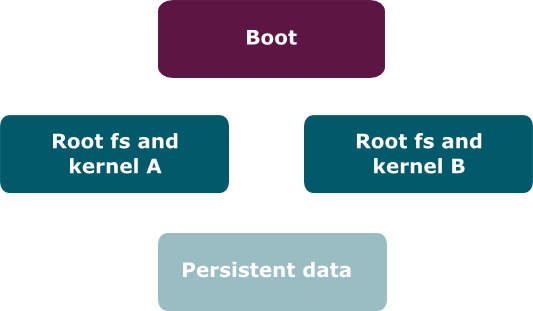

## General requirements

Below are a number of requirements that must be met in order to use Mender.

### Device capacity
The client binaries are about 7 MB in size, or about 4 MB when debug symbols are
stripped (using the `strip` tool). This includes most of the dependencies for
the client, such as the http, TLS, and JSON libraries.

The client depends on the LZMA library for Artifact compression, which is
present in most Linux distributions, including those based on the Debian family.

### Bootloader support

To support atomic rootfs rollback, Mender integrates with the bootloader of the device. Currently
Mender supports [GRUB](https://www.gnu.org/software/grub/?target=_blank) and
[U-Boot](http://www.denx.de/wiki/U-Boot?target=_blank). Some boards may require a board integration;
visit [Mender Hub](https://hub.mender.io/?target=_blank) to find board integrations that community
members have submitted. If no board integration is available for your board, it is recommended to
try without any integration, as GRUB may work without additional configuration on both ARM and x86.

### Partition layout

In order to support robust rollback, Mender requires the device to have a certain partition layout.
At least four different partitions are needed:
* one boot partition, containing the U-Boot bootloader and its environment
* two partitions for storing the root file system and kernel. The kernel image file, zImage, and any device tree binary should be stored in directory `/boot`.
* one for persistent data

One of the rootfs and kernel partitions will be marked as the *active* partition, from which the kernel and rootfs will be booted.
The other, called the *inactive* partition, will be used by the update mechanism to write the updated image.
After an update their roles are swapped.

The persistent data partition stores data that needs to be preserved through an update.

A sample partition layout is shown below:

### Correct clock

Certificate verification requires the device clock to be running correctly at all times.
Make sure to either have a reliable clock or use network time synchronization.
Note that the default setup of systemd will use network time
synchronization to maintain the clock in a running system. This may
take a few minutes to stabilize on system boot so it is possible
to have a few connection rejections from the server until this process
is complete and the time is correct. Please see [certificate troubleshooting](../../201.Troubleshooting/03.Mender-Client/docs.md#certificate-expired-or-not-yet-valid) for more information about the symptoms of this issue.

If your device does not have an active internet connection, then systemd
will be unable to configure the system time as it will be unable to connect
to the network time servers. In this case you will need to arrange other
methods to set a proper system time. Many standard Linux features can be
used for this. If your system includes a real-time clock chip, that will maintain the time
across power down situations and the network connectivity needs of systemd
will only be relevant on the system boots before the RTC is properly
initialized.

Before the time is set properly, either by systemd or the RTC, the time will
default to the [Unix Epoch](https://en.wikipedia.org/wiki/Unix_time?target=_blank).  Note
that the Mender client connections will be rejected by the server until this
situation is resolved.

### Unsupported build systems

Mender has official support for [the Yocto build system](../../System-updates-Yocto-Project) and [binary OS images based on the Debian family](../../System-updates-Debian-family). It is possible to adapt to other build systems. Please see [this community post](https://hub.mender.io/t/mender-from-scratch?target=_blank) for a concrete description.

## Mender Hub community

For help from the community, as well as links to board integrations, visit [Mender
Hub](https://hub.mender.io/?target=_blank).
